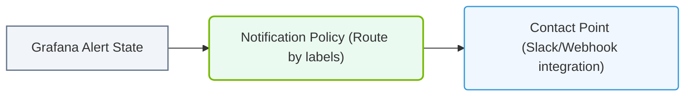

# 31.4d Alerting in Grafana: PagerDuty, Slack, and email integration for GPU faults

#### 🏷️ The Virtualization and Cloud — Extending AI Infrastructure Beyond Bare Metal > 31 Cluster-Wide Telemetry — DCGM, Prometheus, and Grafana > 31.4 Grafana — Visualizing Cluster Health

---

## 🧠 Context Introduction

When managing AI infrastructure with NVIDIA GPUs, you need to know immediately when something goes wrong — like a GPU overheating, a memory error, or a fan failure. Grafana Alerting allows you to set up automatic notifications so that when DCGM (NVIDIA Data Center GPU Manager) detects a fault, you get alerted through tools your team already uses: **PagerDuty** (for on-call escalation), **Slack** (for team chat), or **email** (for record-keeping).

This guide explains how to configure these alerting channels for GPU faults in a simple, step-by-step way.

---

## ⚙️ How Grafana Alerting Works for GPU Faults

Grafana monitors metrics collected by Prometheus from DCGM. When a metric crosses a threshold you define (e.g., GPU temperature > 85°C), Grafana fires an alert and sends a notification to your chosen contact point.

**Key components:**
- **Alert Rule** — Defines the condition (e.g., `dcgm_gpu_temp > 85`)
- **Contact Point** — Where the alert goes (PagerDuty, Slack, email)
- **Notification Policy** — Routes alerts to the right contact point

---

## 🛠️ Setting Up Contact Points

Before creating alert rules, you must configure where alerts will be sent. Each contact point uses a different integration.

### 📧 Email Integration

Email is the simplest option for basic notification.

**Steps to configure:**
1. In Grafana, go to **Alerting > Contact points**
2. Click **Add contact point**
3. Name it something like `GPU Fault Email`
4. Choose **Email** from the integration list
5. Enter the recipient email address(es)
6. Configure SMTP settings in Grafana's configuration file (if not already done)
7. Click **Test** to send a test email
8. Save the contact point

**What happens:** When a GPU fault alert fires, Grafana sends an email with the alert name, metric value, and a link to the dashboard.

---

### 💬 Slack Integration

Slack is ideal for team-wide visibility.

**Steps to configure:**
1. In Grafana, go to **Alerting > Contact points**
2. Click **Add contact point**
3. Name it like `GPU Fault Slack`
4. Choose **Slack** from the integration list
5. Enter your Slack **Webhook URL** (generated from Slack app settings)
6. Optionally set a channel name (e.g., `#gpu-alerts`)
7. Click **Test** to send a test message
8. Save the contact point

**What happens:** A message appears in your Slack channel showing the GPU fault details, including severity and a direct link to the Grafana dashboard.

---

### 🚨 PagerDuty Integration

PagerDuty is used for critical alerts that require immediate human response.

**Steps to configure:**
1. In Grafana, go to **Alerting > Contact points**
2. Click **Add contact point**
3. Name it like `GPU Critical PagerDuty`
4. Choose **PagerDuty** from the integration list
5. Enter your **PagerDuty Integration Key** (found in PagerDuty service settings)
6. Set severity mapping (e.g., Grafana alert severity to PagerDuty severity)
7. Click **Test** to send a test incident
8. Save the contact point

**What happens:** PagerDuty creates an incident, pages the on-call engineer, and escalates if not acknowledged within a set time.

---

## 📊 Comparison Table: When to Use Each Integration

| Integration  | Best For | Alert Type | Response Time |
|-------------|----------|------------|---------------|
| 📧 Email    | Record keeping, non-critical | Informational | Hours |
| 💬 Slack    | Team awareness, quick chat | Warning | Minutes |
| 🚨 PagerDuty | Critical faults, on-call | Critical | Seconds |

---

### 📊 Visual Representation: Grafana Contact Points and Notification policies
This diagram displays how Grafana alerts route through notification policies to notify target contact points.

## 🕵️ Creating an Alert Rule for GPU Faults

Once contact points are ready, create an alert rule that triggers when a GPU fault occurs.

**Simple example — GPU temperature alert:**
1. In Grafana, go to **Alerting > Alert rules**
2. Click **New alert rule**
3. Name it `High GPU Temperature`
4. For the query, use a PromQL expression like:  
   `dcgm_gpu_temp{job="dcgm-exporter"} > 85`
5. Set evaluation frequency (e.g., every 1 minute)
6. Set condition: **WHEN last() OF query (A) IS ABOVE 85**
7. Under **Contact point**, select your Slack or PagerDuty contact point
8. Add a message like: `GPU temperature exceeded 85°C on node {{ $labels.instance }}`
9. Save and enable the rule

**What happens:** Every minute, Grafana checks the GPU temperature. If it exceeds 85°C, the alert fires and sends a notification to your configured contact point.

---

## 🔄 Notification Policies — Routing Alerts

Notification policies control which contact point receives which alert. You can set up multiple policies for different severity levels.

**Example policy setup:**
- **Default policy:** Send all alerts to email
- **Override for critical:** If alert severity is `critical`, send to PagerDuty
- **Override for warnings:** If alert severity is `warning`, send to Slack

**How to configure:**
1. Go to **Alerting > Notification policies**
2. Click **New policy**
3. Set a label matcher (e.g., `severity = critical`)
4. Choose the PagerDuty contact point
5. Save
6. Repeat for other severities

---

## ✅ Best Practices for GPU Fault Alerting

- **Start with email** for testing, then add Slack for team visibility, and finally PagerDuty for critical faults
- **Set different thresholds** for warning (e.g., 80°C) and critical (e.g., 90°C)
- **Include GPU instance labels** in alert messages so you know exactly which GPU failed
- **Test each integration** by clicking the **Test** button in the contact point settings
- **Review alert history** in Grafana's **Alerting > History** to see past GPU faults

---

## 🧪 Verifying Your Setup

After configuring everything, simulate a GPU fault to confirm alerts work:

1. Use a tool like **DCGM diagnostic** to force a GPU error (or temporarily lower a threshold in your alert rule)
2. Wait for the evaluation period
3. Check your Slack channel, email inbox, or PagerDuty dashboard
4. Confirm the alert contains the GPU name, node, and metric value

If you don't see the alert, check:
- The Prometheus data source is connected and collecting DCGM metrics
- The alert rule is enabled and not in a "pending" state
- The contact point settings are correct (webhook URL, API key, etc.)

---

## 📚 Summary

| Step | Action | Tool |
|------|--------|------|
| 1 | Collect GPU metrics | DCGM + Prometheus |
| 2 | Create contact points | Grafana Alerting |
| 3 | Set up email | SMTP settings |
| 4 | Set up Slack | Webhook URL |
| 5 | Set up PagerDuty | Integration Key |
| 6 | Create alert rules | Grafana Alerting |
| 7 | Configure notification policies | Grafana Alerting |
| 8 | Test and verify | Simulate GPU fault |

With these integrations, your team will know about GPU faults immediately — whether through a Slack message, an email, or a PagerDuty page — keeping your AI infrastructure running smoothly.