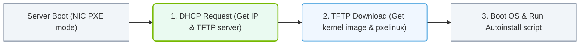

# 32.1b PXE boot and network installation: the baseline automated approach

#### 🏷️ The Virtualization and Cloud — Extending AI Infrastructure Beyond Bare Metal > 32 Enterprise Cluster Management — NVIDIA Base Command Manager > 32.1 The Challenge of Bare-Metal Cluster Provisioning at Scale

## 📖 Context Introduction

When you walk into a data center with dozens or hundreds of brand-new servers, each one is essentially a blank slate — no operating system, no drivers, no configuration. Manually installing an OS on each machine using USB drives or DVDs is impractical at scale. This is where **PXE boot** (Preboot eXecution Environment) and **network installation** come in.

Think of PXE as a way to tell a bare-metal server: *"Instead of looking for an OS on your local hard drive, look across the network for instructions on what to install and how to boot."* This is the baseline automated approach for provisioning AI infrastructure clusters.

---

## ⚙️ What is PXE Boot?

PXE boot allows a computer to start up and load an operating system directly from a network interface card (NIC), without needing any local storage or pre-installed software.

**Key components involved:**

- **DHCP Server** — Assigns an IP address to the new server and tells it where to find the next boot file.
- **TFTP Server** — A lightweight file transfer service that sends the initial boot loader (like GRUB or pxelinux) to the server.
- **NFS/HTTP Server** — Serves the actual OS installation files (ISO contents, packages, drivers).
- **PXE Client** — Built into the server's NIC firmware; it broadcasts a request for network boot instructions.

**How it works at a high level:**

1. The bare-metal server powers on and checks its BIOS/UEFI boot order — network boot is first.
2. The server sends a DHCP discovery request.
3. The DHCP server responds with an IP address and the address of the TFTP server.
4. The server downloads a boot loader from the TFTP server.
5. The boot loader then downloads a configuration file (often called a *pxelinux.cfg* file) that tells it what kernel and initrd to load.
6. The kernel and initial RAM disk are loaded, and the OS installation begins from a network-accessible repository.

---

## 🛠️ The Role of Network Installation

Once PXE boot delivers the kernel and initial filesystem, **network installation** takes over. This is the process of copying the full operating system and any additional software packages over the network to the server's local disk.

**Typical network installation flow:**

- The boot loader loads a minimal Linux environment (initrd) that contains network drivers and installation tools.
- This minimal environment mounts an installation source — usually an NFS share, HTTP server, or FTP server — that contains the full OS image.
- The installation program (like Kickstart for Red Hat/CentOS or AutoYaST for SUSE) runs an automated answer file that specifies:
  - Disk partitioning
  - Network configuration
  - Package selection
  - User accounts
  - Post-install scripts

**Why this matters for AI infrastructure:**

AI clusters require consistent, identical configurations across hundreds of nodes. Network installation with PXE ensures every node gets the exact same OS, NVIDIA drivers, CUDA toolkit, and networking stack — without manual intervention.

---

## 📊 Comparison: Manual vs. PXE-Based Provisioning

| Aspect | Manual Installation (USB/DVD) | PXE + Network Installation |
|--------|-------------------------------|----------------------------|
| **Speed** | Hours per server | Minutes per server (parallel) |
| **Consistency** | Prone to human error | Identical every time |
| **Scalability** | Impractical beyond 5–10 nodes | Works for 1,000+ nodes |
| **Recovery** | Must physically touch each server | Reboot and reinstall remotely |
| **Customization** | Requires custom USB creation | Centralized answer files |
| **Driver Updates** | Must re-burn media | Update one network repository |

---

### 📊 Visual Representation: PXE Boot network installation flow
This flowchart shows how target nodes PXE-boot over networks, loading kernel images from TFTP/DHCP servers.

## 🕵️ How NVIDIA Base Command Manager Uses PXE

NVIDIA Base Command Manager (BCM) is the enterprise cluster management tool that orchestrates large-scale AI infrastructure. It uses PXE boot and network installation as the **baseline method** for bringing new nodes into the cluster.

**BCM's automated provisioning workflow:**

- **Node discovery** — New servers boot via PXE and are automatically detected by BCM's provisioning service.
- **Profile assignment** — BCM matches the server's hardware (MAC address, chassis serial) to a pre-defined hardware profile.
- **OS deployment** — The server downloads a tailored OS image from BCM's repository, which includes NVIDIA drivers, Mellanox networking firmware, and NCCL libraries.
- **Post-install configuration** — BCM runs scripts to set hostnames, join the cluster scheduler (like Slurm or Univa Grid Engine), and mount shared storage.

**Key benefit for engineers:**

You never need to touch a server after racking it. Plug in power, plug in network, and let PXE + BCM handle the rest. If a node fails and needs a clean OS reinstall, you simply reboot it — the PXE process repeats automatically.

---

## 🔄 The Complete Automated Provisioning Cycle

Here is the end-to-end flow for a single node in a BCM-managed cluster:

1. **Power on** — Server POST completes, NIC initializes.
2. **DHCP request** — Server asks for network configuration.
3. **Boot loader download** — Server receives pxelinux.0 from TFTP.
4. **Kernel + initrd load** — Minimal Linux environment boots.
5. **Installation source mount** — NFS/HTTP repository with OS image is accessed.
6. **Automated answer file** — Kickstart or equivalent runs without prompts.
7. **OS installation** — Packages, drivers, and tools are written to local disk.
8. **First boot** — Server reboots into the newly installed OS.
9. **BCM agent activation** — The node registers itself with the cluster manager.
10. **Ready for workloads** — The node joins the GPU compute pool.

---

## ✅ Key Takeaways for New Engineers

- **PXE boot is the "network-first" boot method** — it replaces physical media with network-based booting.
- **Network installation automates OS deployment** — no manual clicking through installers.
- **Consistency is the goal** — every node in an AI cluster must be identical to ensure predictable performance.
- **NVIDIA Base Command Manager leverages PXE** as the foundation for zero-touch provisioning at scale.
- **Troubleshooting tip** — If a node fails to PXE boot, check: DHCP server scope exhaustion, TFTP file permissions, and the server's BIOS boot order (UEFI vs. Legacy).

---

## 📚 Further Learning Path

- Understand how DHCP options 66 (TFTP server) and 67 (boot file name) work.
- Explore the structure of a pxelinux.cfg configuration file.
- Learn about Kickstart or AutoYaST answer file syntax.
- Experiment with a small PXE lab using VirtualBox or VMware to simulate network booting.

PXE boot and network installation are the **foundational skills** for managing any modern AI cluster. Master this, and you unlock the ability to provision, rebuild, and recover infrastructure at enterprise scale.