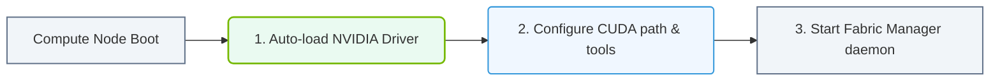

# 32.2e GPU stack deployment: driver, CUDA, container toolkit pushed cluster-wide

#### 🏷️ The Virtualization and Cloud — Extending AI Infrastructure Beyond Bare Metal > 32 Enterprise Cluster Management — NVIDIA Base Command Manager > 32.2 NVIDIA Base Command Manager (BCM) — Architecture and Components

When managing a cluster of GPU-powered nodes, one of the most critical tasks is ensuring every machine has the correct software stack to run AI workloads. This topic covers how NVIDIA Base Command Manager (BCM) can push the entire GPU software stack — including the **NVIDIA driver**, **CUDA toolkit**, and **container toolkit** — to all nodes in the cluster simultaneously. This approach eliminates manual installation on each server and ensures consistency across the environment.

---

## 🧠 Context: Why Push the GPU Stack Cluster-Wide?

In a typical AI cluster, each node needs three core components to use GPUs effectively:

- **NVIDIA Driver** — The low-level software that allows the operating system to communicate with the GPU hardware.
- **CUDA Toolkit** — A parallel computing platform and API that enables developers to use GPUs for general-purpose processing (e.g., training deep learning models).
- **NVIDIA Container Toolkit** — A set of tools that allows containers (like Docker or Podman) to access GPU resources from the host system.

Manually installing these on every node is error-prone and time-consuming. BCM solves this by treating the GPU stack as a **software package** that can be deployed, updated, or rolled back across the entire cluster with a single command.

---

## ⚙️ How BCM Pushes the GPU Stack

BCM uses a **node image** or **software profile** approach. You define a configuration that includes the exact versions of the driver, CUDA, and container toolkit. BCM then distributes this configuration to all target nodes.

### 🛠️ Key Components in the Deployment

- **Driver Version** — Specifies the NVIDIA driver version (e.g., 535.154.05). This must match the GPU model and OS kernel.
- **CUDA Version** — Defines the CUDA toolkit version (e.g., 12.2). This determines which AI frameworks (TensorFlow, PyTorch) are supported.
- **Container Toolkit Version** — Controls the version of `nvidia-container-toolkit` (e.g., 1.14.3). This enables GPU passthrough to containers.

### 📦 Deployment Workflow (Simplified)

1. **Define the software stack** — Engineers create a software profile in BCM that lists the exact versions of driver, CUDA, and container toolkit.
2. **Select target nodes** — Choose which nodes (or node groups) should receive the stack.
3. **Push the stack** — BCM distributes the packages to all selected nodes using its internal orchestration.
4. **Verify installation** — BCM checks that each node reports the correct driver, CUDA, and container toolkit versions.

---

## 🧩 Comparison: Manual vs. BCM-Driven Deployment

| Aspect | Manual Installation | BCM Cluster-Wide Push |
|--------|-------------------|------------------------|
| **Time per node** | 15–30 minutes | Seconds (once configured) |
| **Consistency** | High risk of version mismatch | Guaranteed identical stack |
| **Rollback** | Difficult (manual uninstall) | One command to revert |
| **Scalability** | Impractical beyond 5–10 nodes | Works for 1000+ nodes |
| **Error handling** | Requires manual troubleshooting | BCM logs and reports failures |

---

### 📊 Visual Representation: BCM GPU software stack bootstrap
This flowchart shows how BCM automatically installs the host GPU driver, CUDA toolkit, and fabric managers upon node boot.

## 🕵️ Verification After Deployment

After BCM pushes the GPU stack, engineers should verify that each node is ready for AI workloads. Key checks include:

- **Driver loaded** — Confirm the NVIDIA kernel module is active.
- **CUDA available** — Ensure CUDA libraries are accessible to applications.
- **Container GPU access** — Verify that containers can see and use GPUs.

### ✅ Typical Verification Steps (Without Commands)

1. **Check GPU visibility** — Run a utility that lists all GPUs on the node. Expected output shows each GPU model, memory, and driver version.
2. **Test CUDA functionality** — Execute a simple CUDA sample (like device query). Expected output confirms CUDA version and device count.
3. **Test container GPU access** — Run a container with GPU support. Expected output shows the container can detect the same GPUs as the host.

---

## 🧪 Common Pitfalls and Solutions

- **Driver/kernel mismatch** — If the driver version is incompatible with the OS kernel, BCM will fail to load the driver. Solution: ensure the driver version supports the kernel version on each node.
- **CUDA version conflicts** — Some AI frameworks require specific CUDA versions. Solution: define the CUDA version in the software profile that matches your workloads.
- **Container toolkit not found** — If containers cannot access GPUs, the container runtime may not be configured. Solution: verify that `nvidia-container-runtime` is set as the default runtime in the container engine configuration.

---

## 📌 Summary

- BCM enables **cluster-wide deployment** of the NVIDIA GPU stack (driver, CUDA, container toolkit) from a single control point.
- This approach ensures **consistency, scalability, and easy rollback** across all GPU nodes.
- Engineers define a software profile once, then push it to any number of nodes with minimal effort.
- Verification steps (GPU visibility, CUDA functionality, container GPU access) confirm successful deployment.

By using BCM to push the GPU stack cluster-wide, engineers can focus on building and running AI workloads rather than managing software installations on individual servers.