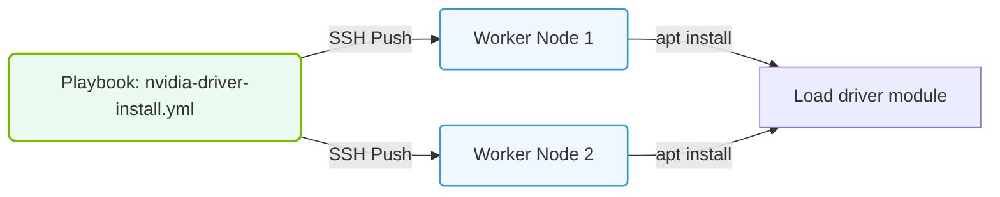

# 32.4a Ansible for GPU cluster configuration: playbooks, roles, and inventory management

#### 🏷️ The Virtualization and Cloud — Extending AI Infrastructure Beyond Bare Metal > 32 Enterprise Cluster Management — NVIDIA Base Command Manager > 32.4 Infrastructure-as-Code Approaches for AI Clusters

---

## 🧭 Context Introduction

Managing a GPU cluster manually — installing drivers, configuring networking, setting up monitoring — quickly becomes overwhelming as the cluster grows. Ansible provides a simple, agentless way to automate these tasks. Instead of SSH-ing into each GPU node individually, you write **playbooks** (automation scripts) that Ansible runs across all your nodes at once. This section introduces the three core Ansible concepts you need for GPU cluster configuration: playbooks, roles, and inventory management.

---

## ⚙️ What is Ansible in the Context of GPU Clusters?

Ansible is an **Infrastructure-as-Code (IaC)** tool that uses **YAML** files to define desired system states. For a GPU cluster, this means:

- **No agents** to install on GPU nodes — Ansible connects via SSH.
- **Idempotent** operations — running the same playbook multiple times won't break things.
- **Push-based** model — you control the automation from a central management node.

---

## 📋 Inventory Management — Defining Your GPU Cluster

The **inventory** is a file (or directory) that lists all the nodes in your cluster and groups them logically.

**Key concepts:**

- **Groups** — organize nodes by function (e.g., `gpu_nodes`, `login_nodes`, `storage_nodes`)
- **Variables** — assign node-specific settings (e.g., GPU driver version, IP addresses)
- **Host patterns** — target specific nodes or groups in your playbooks

**Example inventory structure (INI format):**

```
[gpu_nodes]
gpu-node-01 ansible_host=192.168.1.10
gpu-node-02 ansible_host=192.168.1.11
gpu-node-03 ansible_host=192.168.1.12

[login_nodes]
login-01 ansible_host=192.168.1.100

[all:vars]
ansible_user=ubuntu
gpu_driver_version=550.54.15
```

**Why it matters for GPU clusters:** You can group nodes by GPU type (A100, H100), by rack location, or by workload role (training vs. inference).

---

## 📜 Playbooks — The Automation Scripts

A **playbook** is a YAML file that defines what should happen on which nodes. Think of it as a to-do list for your cluster.

**Core components of a playbook:**

- **Hosts** — which group or node to target
- **Tasks** — individual actions (install package, copy file, start service)
- **Modules** — built-in tools for common operations (e.g., `apt`, `copy`, `service`, `command`)
- **Handlers** — special tasks that run only when notified (e.g., restart a service after config change)

**Example playbook structure (conceptual):**

```
- name: Configure GPU nodes for training
  hosts: gpu_nodes
  become: yes
  tasks:
    - Install NVIDIA drivers (using apt module)
    - Copy CUDA toolkit configuration file
    - Start nvidia-persistenced service
    - Verify GPU visibility with nvidia-smi
```

**How it works:** You run the playbook with a single command from your management node. Ansible connects to each GPU node via SSH, executes the tasks in order, and reports back success or failure.

---


### 📊 Visual Representation: Ansible Playbook GPU setup
This diagram displays how Ansible playbooks declare task states to install drivers and dependencies concurrently across node groups.




## 🧩 Roles — Reusable Building Blocks

**Roles** are like pre-packaged playbooks. They organize tasks, variables, templates, and files into a standard directory structure. This makes your automation **modular** and **reusable** across different clusters.

**Typical role directory structure:**

```
roles/
  nvidia_driver/
    tasks/
      main.yml          # Main tasks to install drivers
    vars/
      main.yml          # Driver version, download URL
    templates/
      nvidia.conf.j2    # Jinja2 template for config files
    files/
      nvidia-persistenced.service  # Static files to copy
    handlers/
      main.yml          # Restart services when needed
```

**Why roles are powerful for GPU clusters:**

- **Shareable** — use community roles from Ansible Galaxy (e.g., `nvidia.nvidia_driver`)
- **Testable** — each role can be validated independently
- **Composable** — combine roles for different cluster layers (networking, storage, GPU drivers, monitoring)

**Example playbook using roles:**

```
- name: Full GPU cluster setup
  hosts: gpu_nodes
  roles:
    - common           # Base OS configuration
    - nvidia_driver    # GPU driver installation
    - nvidia_container_toolkit  # Docker GPU support
    - monitoring_agent # Prometheus node exporter
```

---

## 🛠️ Putting It All Together — A Typical Workflow

Here's how a new engineer would use Ansible for GPU cluster configuration:

1. **Define your inventory** — list all GPU nodes and their groups
2. **Create or reuse roles** — for NVIDIA drivers, CUDA, Docker, monitoring
3. **Write a master playbook** — that calls the roles in the right order
4. **Run the playbook** — from your management node targeting the `gpu_nodes` group
5. **Verify** — check that all nodes report correct GPU count and driver version

---

## 📊 Comparison: Playbooks vs. Roles

| Feature | Playbook | Role |
|---------|----------|------|
| **Purpose** | Define a specific automation workflow | Package reusable automation logic |
| **Structure** | Single YAML file | Directory with tasks, vars, templates, handlers |
| **Reusability** | Low — tied to one scenario | High — can be shared across projects |
| **Complexity** | Simple, linear | Modular, hierarchical |
| **Best for** | Quick one-off tasks | Standardized cluster configurations |

---

## 🕵️ Key Takeaways for New Engineers

- **Ansible is agentless** — you only need SSH access to GPU nodes.
- **Inventory is your cluster map** — group nodes by GPU type, role, or location.
- **Playbooks are your automation scripts** — they define what to do and on which nodes.
- **Roles are your reusable components** — build once, use everywhere.
- **Start simple** — write a playbook that installs NVIDIA drivers on one node, then expand to roles for full cluster management.

---

## 🔗 Next Steps

- Practice writing a simple inventory file for two GPU nodes.
- Create a playbook that runs **nvidia-smi** on all GPU nodes and reports output.
- Explore the **nvidia.nvidia_driver** role on Ansible Galaxy for production-ready driver management.

> 💡 **Remember:** The goal of Ansible in GPU cluster management is **consistency** — every node should have the same driver version, same configuration, and same behavior. Automation removes human error from repetitive tasks.