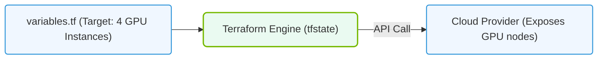

# 32.4b Terraform for cloud-based AI infrastructure: provider configurations for AWS, Azure, GCP

#### 🏷️ The Virtualization and Cloud — Extending AI Infrastructure Beyond Bare Metal > 32 Enterprise Cluster Management — NVIDIA Base Command Manager > 32.4 Infrastructure-as-Code Approaches for AI Clusters

---

## 🌐 Introduction

When building AI infrastructure in the cloud, engineers need a consistent way to define, deploy, and manage resources across different cloud providers. Terraform is an Infrastructure-as-Code (IaC) tool that allows you to describe your entire AI cluster — from virtual machines with NVIDIA GPUs to networking and storage — in human-readable configuration files. This section covers how to configure Terraform providers for the three major cloud platforms: AWS, Azure, and GCP.

---

## ⚙️ What is a Terraform Provider?

A Terraform provider is a plugin that enables Terraform to interact with a specific cloud platform's API. Each provider defines the resources and data sources available for that platform. For AI infrastructure, you will typically use providers that support GPU-accelerated instances, high-performance storage, and low-latency networking.

- **Provider configuration** tells Terraform which cloud platform to use and how to authenticate.
- **Resources** are the actual infrastructure components (e.g., virtual machines, GPUs, virtual networks).
- **Data sources** allow you to query existing infrastructure for use in your configurations.

---

## 🛠️ Provider Configuration for AWS

AWS offers a wide range of GPU-accelerated instance types (e.g., p4d, p5, g5) suitable for AI training and inference.

### Key Configuration Elements

- **Region**: Specify the AWS region where your AI infrastructure will reside (e.g., us-east-1, eu-west-2).
- **Authentication**: Use IAM roles, access keys, or environment variables.
- **Profile**: Optionally reference a named profile from your AWS credentials file.

### Example Provider Block Structure

For reference:
```
provider "aws" {
  region = "us-west-2"
  profile = "ai-admin"
}
```

**📤 Output:** No direct output — this configures the provider for subsequent resource definitions.

### Common AI Resources in AWS

- **aws_instance** with an AMI that includes NVIDIA drivers and CUDA
- **aws_ebs_volume** for high-throughput storage (gp3 or io2 types)
- **aws_placement_group** for low-latency GPU cluster communication
- **aws_security_group** to control network access to training nodes

---

## ☁️ Provider Configuration for Azure

Azure provides GPU-optimized virtual machine series like NCas, ND-series, and NV-series for AI workloads.

### Key Configuration Elements

- **Subscription ID**: Identifies your Azure subscription.
- **Tenant ID**: Your Azure Active Directory tenant.
- **Client ID and Client Secret**: Service principal credentials for authentication.
- **Features**: Optional block to enable preview features.

### Example Provider Block Structure

For reference:
```
provider "azurerm" {
  features {}
  subscription_id = "00000000-0000-0000-0000-000000000000"
  tenant_id       = "11111111-1111-1111-1111-111111111111"
  client_id       = "22222222-2222-2222-2222-222222222222"
  client_secret   = "your-client-secret-value"
}
```

**📤 Output:** No direct output — the provider is now ready to manage Azure resources.

### Common AI Resources in Azure

- **azurerm_linux_virtual_machine** with a GPU-enabled size (e.g., Standard_NC6s_v3)
- **azurerm_managed_disk** for ultra disk or premium SSD storage
- **azurerm_virtual_network** and **azurerm_subnet** for cluster networking
- **azurerm_network_interface** with accelerated networking enabled

---


### 📊 Visual Representation: Terraform Declarative state mapping
This diagram displays how Terraform deploys resources (VMs, network adapters) to match states specified in tf configurations.




## 🌍 Provider Configuration for GCP

Google Cloud Platform offers GPU-accelerated instances like A2, G2, and N1 with attached GPUs (e.g., NVIDIA A100, T4, L4).

### Key Configuration Elements

- **Project**: Your GCP project ID.
- **Region and Zone**: Where your resources will be deployed (e.g., us-central1-a).
- **Credentials**: Path to a service account JSON key file.

### Example Provider Block Structure

For reference:
```
provider "google" {
  project     = "my-ai-project-123456"
  region      = "us-central1"
  zone        = "us-central1-a"
  credentials = file("path/to/service-account-key.json")
}
```

**📤 Output:** No direct output — the provider is configured for GCP resource management.

### Common AI Resources in GCP

- **google_compute_instance** with a guest accelerator (GPU) attached
- **google_compute_disk** for persistent SSD or hyperdisk storage
- **google_compute_network** for VPC networking
- **google_compute_firewall** for controlling traffic to training nodes

---

## 📊 Comparison Table: Provider Configuration Differences

| Feature | AWS | Azure | GCP |
|---------|-----|-------|-----|
| **Provider name** | `aws` | `azurerm` | `google` |
| **Authentication method** | IAM role, access keys, profile | Service principal (client ID + secret) | Service account JSON key |
| **Region specification** | `region` | `location` in resource blocks | `region` and `zone` |
| **GPU instance naming** | p4d, p5, g5 | NCas, ND, NV series | A2, G2, N1 with GPU |
| **Common storage type** | EBS (gp3, io2) | Managed disks (premium SSD, ultra) | Persistent disks (SSD, hyperdisk) |

---

## 🕵️ Best Practices for AI Infrastructure Providers

- **Use remote state backends** — Store your Terraform state file in a shared location (e.g., S3, Azure Storage, GCS) so your team can collaborate safely.
- **Pin provider versions** — Specify a version constraint to avoid unexpected changes from provider updates.
- **Separate environments** — Use different workspaces or directories for development, staging, and production AI clusters.
- **Tag all resources** — Apply consistent tags (e.g., `Project: AI-Training`, `Environment: Production`) for cost tracking and resource management.
- **Use variables and locals** — Keep provider configurations DRY by defining common values like region or project ID in variables.

---

## 🔄 Multi-Cloud Considerations

Some organizations run AI workloads across multiple cloud providers. Terraform supports this by defining multiple provider blocks in the same configuration.

- Use **aliases** to differentiate between providers for the same cloud (e.g., two AWS regions).
- Use **different provider blocks** for different clouds (e.g., one for AWS, one for Azure).
- Manage **separate state files** per cloud provider to avoid complexity.

### Example Multi-Provider Setup

For reference:
```
# AWS provider for primary training cluster
provider "aws" {
  alias   = "primary"
  region  = "us-east-1"
  profile = "ai-prod"
}

# GCP provider for backup inference cluster
provider "google" {
  alias       = "backup"
  project     = "ai-inference-backup"
  region      = "europe-west1"
  credentials = file("gcp-backup-key.json")
}
```

**📤 Output:** Two providers are now available — referenced as `aws.primary` and `google.backup` in resource blocks.

---

## ✅ Summary

Configuring Terraform providers for AWS, Azure, and GCP is the first step toward automating AI infrastructure deployment. Each cloud platform has its own authentication method, resource naming conventions, and GPU instance offerings. By understanding these provider configurations, engineers can write portable, repeatable IaC that deploys GPU-accelerated clusters consistently across any cloud environment.

**Key takeaway:** Start with a single provider, master its configuration, then expand to multi-cloud as your AI infrastructure needs grow.