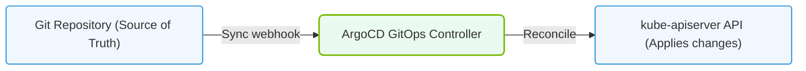

# 32.4c GitOps: managing cluster configuration as version-controlled YAML in Git repositories

#### 🏷️ The Virtualization and Cloud — Extending AI Infrastructure Beyond Bare Metal > 32 Enterprise Cluster Management — NVIDIA Base Command Manager > 32.4 Infrastructure-as-Code Approaches for AI Clusters

---

## 🌱 Context Introduction

Imagine you're managing an AI cluster with dozens of nodes, each requiring specific configurations for networking, storage, and GPU drivers. Traditionally, engineers would SSH into each node and manually tweak settings — a process that's slow, error-prone, and impossible to audit.

**GitOps** changes this entirely. It treats your entire cluster configuration as code — specifically as YAML files stored in a Git repository. Every change to your cluster (adding a node, updating a driver, changing a network policy) starts as a pull request to that Git repo. An automated tool then syncs those changes to the live cluster, ensuring your infrastructure always matches what's in Git.

For new engineers, think of GitOps as **"Git for your cluster"** — the same way you version-control your application code, you now version-control your entire AI infrastructure.

---

## ⚙️ Core Concept: The GitOps Loop

GitOps follows a simple, continuous loop:

- **📝 Declare** — You write your desired cluster state as YAML files in a Git repository.
- **🔁 Sync** — A GitOps operator (like Argo CD or Flux) continuously watches the Git repo for changes.
- **🔄 Apply** — When changes are detected, the operator automatically applies them to the cluster.
- **🕵️ Verify** — The operator checks that the live cluster matches the Git repo. If someone manually changes the cluster, the operator reverts it back to the Git-defined state.

This creates a **single source of truth** — your Git repository is the only place where cluster configuration should be changed.

---

## 📊 Key Benefits of GitOps for AI Clusters

| Benefit | What It Means for You |
|---------|----------------------|
| **🔄 Reproducibility** | Spin up an identical cluster from scratch using the same Git repo |
| **📜 Audit Trail** | Every change is tracked with a commit message, author, and timestamp |
| **🔒 Security** | No one needs direct SSH access to nodes — changes go through Git |
| **🛡️ Drift Prevention** | If someone manually changes a node, GitOps automatically corrects it |
| **👥 Collaboration** | Multiple engineers can propose changes via pull requests and code reviews |

---

## 🛠️ How It Works in Practice

### The Git Repository Structure

Your Git repo for an AI cluster typically contains YAML files organized like this:

- **Cluster-level configs** — NVIDIA Base Command Manager settings, Slurm scheduler parameters, network CIDR ranges
- **Node definitions** — GPU node specs, CPU node specs, storage node definitions
- **Software versions** — CUDA toolkit version, NVIDIA driver version, container runtime settings
- **Policies** — Resource quotas, GPU sharing policies, job priorities

### The Workflow for Engineers

1. **Clone the repo** — Get the latest cluster configuration
2. **Create a branch** — Make your changes in a new branch
3. **Edit YAML files** — Modify the desired state (e.g., add a new GPU node)
4. **Commit and push** — Save your changes with a descriptive message
5. **Open a pull request** — Request review from your team
6. **Merge to main** — After approval, merge the changes
7. **Automatic sync** — The GitOps operator detects the merge and applies changes to the live cluster

---


### 📊 Visual Representation: GitOps ArgoCD pull reconcile loop
This flowchart shows how GitOps controllers monitor Git changes and apply configurations directly to Kubernetes APIs.




## 🕵️ Real-World Example: Adding a GPU Node

Here's how a typical GitOps workflow looks when adding a new GPU node to your AI cluster:

**Step 1: You create a YAML file for the new node**

For reference:
```yaml
apiVersion: cluster.nvidia.com/v1
kind: Node
metadata:
  name: gpu-node-07
spec:
  gpuCount: 8
  gpuModel: "NVIDIA A100"
  cpuCores: 64
  memoryGB: 512
  network: "100Gbps InfiniBand"
```

**Step 2: You commit this file to your Git repo**

📤 Output: Commit message might be "Add GPU node 07 with 8x A100 for training workload"

**Step 3: The GitOps operator detects the new file**

📤 Output: Operator logs show "New node definition detected in repo/main"

**Step 4: The operator applies the configuration to the cluster**

📤 Output: "Node gpu-node-07 added to cluster. Status: Pending provisioning"

**Step 5: The operator monitors until the node is fully operational**

📤 Output: "Node gpu-node-07 ready. 8 A100 GPUs available for jobs"

---

## 🔄 GitOps vs. Traditional Cluster Management

| Aspect | Traditional Approach | GitOps Approach |
|--------|---------------------|-----------------|
| **Configuration location** | SSH into each node, edit config files | YAML files in a Git repository |
| **Change process** | Manual commands on live systems | Pull request → Review → Merge → Auto-apply |
| **Rollback** | Manually undo changes (hard to track) | Revert the Git commit → Auto-rollback |
| **Audit trail** | None or manual logs | Full Git history with every change |
| **Consistency** | Prone to drift between nodes | All nodes match Git-defined state |

---

## 🧠 Key Takeaways for New Engineers

- **GitOps is not a tool — it's a methodology.** The tools (Argo CD, Flux) implement the methodology.
- **Your YAML files ARE your cluster.** Never manually change a running cluster — always change the Git repo.
- **Pull requests are your safety net.** They allow code review, automated testing, and approval before changes hit production.
- **Drift is automatically corrected.** If someone accidentally changes a node, GitOps reverts it within minutes.
- **Start simple.** Begin with one YAML file for one node type, then expand to full cluster definitions.

---

## 📚 Next Steps for Learning

1. **Practice with a local Git repo** — Create a mock cluster configuration with YAML files
2. **Learn the GitOps operator** — NVIDIA Base Command Manager integrates with Argo CD for GitOps workflows
3. **Understand reconciliation** — How the operator compares desired state (Git) vs. actual state (cluster)
4. **Explore secrets management** — How to handle passwords and API keys in GitOps (hint: use sealed secrets or external vaults)

---

> **💡 Pro Tip:** When you're new to GitOps, remember this golden rule: **"If it's not in Git, it doesn't exist."** Every piece of your cluster configuration should be version-controlled. This discipline will save you countless hours of debugging and recovery.