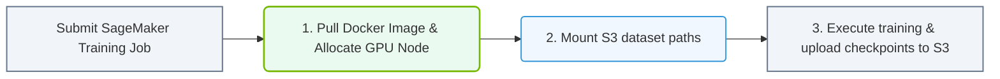

# 34.3a Amazon SageMaker: managed training jobs and endpoint deployment

#### 🏷️ The Virtualization and Cloud — Extending AI Infrastructure Beyond Bare Metal > 34 Cloud AI Infrastructure — AWS, Azure, GCP, and Oracle > 34.3 Managed AI Platforms

---

## 🌱 Context Introduction

Amazon SageMaker is a fully managed machine learning service from AWS that removes the heavy lifting of setting up and managing the underlying infrastructure. For new engineers, think of it as a "ML studio" where you can build, train, and deploy models without worrying about servers, GPUs, or storage provisioning. This section focuses on two core capabilities: **managed training jobs** (where your model learns from data) and **endpoint deployment** (where your trained model serves predictions to applications).

---

## ⚙️ What Are Managed Training Jobs?

Managed training jobs are SageMaker's way of running model training without you manually spinning up EC2 instances or configuring clusters. You simply specify:
- The training algorithm or script
- The input data location (e.g., S3 bucket)
- The compute resources (instance type and count)
- The output location for the trained model

SageMaker automatically provisions the infrastructure, runs the training, saves the model artifacts, and tears down resources when done.

### Key Characteristics:
- **Automatic scaling**: SageMaker can distribute training across multiple GPU instances (e.g., p3, p4, or g5 instances)
- **Spot instance support**: Reduce costs by using spare AWS capacity (with potential interruptions)
- **Built-in monitoring**: CloudWatch logs and metrics track training progress, resource utilization, and errors
- **Hyperparameter tuning**: SageMaker can automatically run multiple training jobs to find optimal model parameters

### Common Training Instance Types:
| Instance Family | Use Case | Example |
|----------------|----------|---------|
| ml.m5 | CPU-based training for smaller models | ml.m5.xlarge |
| ml.p3 | GPU training for deep learning | ml.p3.2xlarge |
| ml.p4d | High-performance GPU for large models | ml.p4d.24xlarge |
| ml.g5 | Cost-effective GPU for inference and training | ml.g5.xlarge |

---

## 🛠️ How to Set Up a Managed Training Job

To launch a training job, you provide a configuration that includes:

- **Algorithm source**: Either a built-in SageMaker algorithm (e.g., XGBoost, Linear Learner) or a custom Docker container with your training code
- **Input data configuration**: Path to your training and validation data in Amazon S3
- **Output configuration**: S3 path where the trained model artifacts will be saved
- **Resource configuration**: Instance type, instance count, and maximum runtime
- **Hyperparameters**: Key-value pairs passed to your training script

**Example configuration (for reference):**

```python
from sagemaker import Estimator

estimator = Estimator(
    image_uri='123456789012.dkr.ecr.us-west-2.amazonaws.com/my-custom-training:latest',
    role='arn:aws:iam::123456789012:role/SageMakerRole',
    instance_count=2,
    instance_type='ml.p3.2xlarge',
    output_path='s3://my-bucket/models/',
    hyperparameters={'epochs': 10, 'batch-size': 32}
)

estimator.fit({'training': 's3://my-bucket/training-data/'})
```

📤 **Output**: SageMaker creates a training job named like **my-training-job-2025-04-10-14-30-00** and logs progress to CloudWatch.

---

## 📊 What Is Endpoint Deployment?

After training, you need to make your model available for real-time predictions. SageMaker **endpoints** are HTTPS endpoints that host your trained model and serve inference requests. They are fully managed — SageMaker handles load balancing, scaling, and health monitoring.

### Deployment Steps:
1. **Create a model**: Register the trained model artifacts (from S3) with SageMaker
2. **Create an endpoint configuration**: Define the instance type, initial instance count, and scaling policies
3. **Create an endpoint**: SageMaker provisions the instances and deploys the model

### Endpoint Types:
| Type | Description | Use Case |
|------|-------------|----------|
| Real-time endpoint | Always-on, low-latency predictions | Chatbots, recommendation engines |
| Serverless endpoint | Auto-scales to zero when idle, pay per request | Sporadic or unpredictable traffic |
| Batch transform | Process large datasets offline | Monthly report generation |

---


### 📊 Visual Representation: Amazon SageMaker training job pipeline
This flowchart maps out SageMaker training: pulling container images, mounting S3 dataset folders, and running training runs.




## 🕵️ Monitoring and Managing Endpoints

Once deployed, endpoints require ongoing observation:

- **CloudWatch metrics**: Track latency, invocation count, error rates, and instance utilization
- **Auto Scaling**: Configure target tracking based on CPU utilization or request count
- **Model updates**: Deploy a new model version by updating the endpoint configuration (blue/green deployment)
- **A/B testing**: Route a percentage of traffic to a new model variant for testing

**Common endpoint issues to watch for:**
- **High latency**: Instance type may be underpowered or model needs optimization
- **Throttling**: Too many requests for the current instance count — scale out
- **Out-of-memory errors**: Model size exceeds instance memory — use a larger instance

---

## 📈 Comparison: Managed Training vs. Endpoint Deployment

| Aspect | Managed Training Jobs | Endpoint Deployment |
|--------|----------------------|---------------------|
| **Purpose** | Train a model using data | Serve predictions from a trained model |
| **Duration** | Temporary (minutes to hours) | Persistent (always-on or serverless) |
| **Cost model** | Pay per compute time used | Pay per hour (real-time) or per request (serverless) |
| **Scaling** | Manual (set instance count) | Automatic (based on traffic) |
| **Lifecycle** | Job runs, completes, resources released | Endpoint stays active until deleted |
| **Monitoring** | Training metrics (loss, accuracy) | Inference metrics (latency, error rate) |

---

## 🧩 Best Practices for New Engineers

1. **Start small**: Use a single **ml.m5.large** instance for initial training tests to keep costs low
2. **Use spot instances**: Enable managed spot training for up to 70% cost savings (but design for interruptions)
3. **Monitor costs**: Set up AWS Budgets alerts for SageMaker usage
4. **Version your models**: Store each trained model artifact with a unique name in S3
5. **Test endpoints locally**: Use SageMaker local mode to validate inference code before deploying
6. **Enable logging**: Turn on CloudWatch detailed metrics for both training and endpoints
7. **Use VPC**: Place SageMaker resources inside a VPC for security and network isolation

---

## 🔁 Summary

Amazon SageMaker's managed training jobs and endpoint deployment abstract away the complexity of infrastructure management. As a new engineer, you can focus on:
- Writing training scripts and tuning hyperparameters
- Deploying models with a few API calls
- Monitoring performance without managing servers

This platform enables you to move from raw data to a production-ready AI service faster than traditional infrastructure approaches. Start with small experiments, leverage built-in algorithms, and gradually explore custom containers and advanced deployment strategies.