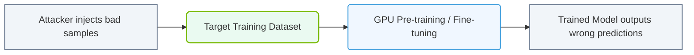

# 35.1b Data poisoning: adversarial manipulation of training datasets

#### 🏷️ The AI Infrastructure Security & Compliance > 35 Securing the AI Infrastructure Stack > 35.1 The AI-Specific Threat Landscape

---

## 🔍 Context Introduction

When you train an AI model, you feed it data — lots of data. But what if someone intentionally sneaks bad data into that training set? That's **data poisoning**. It's like teaching a student incorrect facts on purpose, so they give wrong answers later. For engineers new to AI infrastructure, understanding data poisoning is critical because it's one of the most subtle yet dangerous attacks on machine learning systems. Unlike hacking a server, data poisoning corrupts the model itself, making it behave badly even when everything else looks normal.

---

## ⚙️ What is Data Poisoning?

Data poisoning occurs when an attacker **intentionally manipulates the training dataset** to influence the model's behavior. The goal is usually one of two things:

- **Degrade overall model performance** — make the model useless or unreliable
- **Insert a backdoor** — make the model behave normally most of the time, but fail in a specific, attacker-chosen scenario

The scary part? A poisoned model can pass all standard validation checks because it still performs well on clean test data.

---

## 🕵️ Common Types of Data Poisoning Attacks

| Attack Type | Description | Example |
|-------------|-------------|---------|
| **Label Flipping** | Attacker changes the correct label of training samples | Labeling a stop sign as a speed limit sign in a self-driving car dataset |
| **Backdoor Poisoning** | Attacker inserts a specific trigger pattern that causes misclassification | Adding a small sticker to images; when the sticker appears, the model misclassifies |
| **Data Injection** | Attacker adds entirely fake, malicious samples to the training set | Injecting fake user reviews to manipulate a sentiment analysis model |
| **Gradient Manipulation** | In federated learning, attacker sends poisoned model updates | Sending corrupted weight updates from a compromised client device |

---

## 📊 How Data Poisoning Works (Simple Flow)

1. **Attacker gains access** to the training data pipeline (cloud storage, data lake, or data labeling tool)
2. **Attacker modifies or injects** malicious samples — often less than 1% of total data
3. **Model trains on poisoned data** — the corruption becomes part of the model's learned behavior
4. **Model is deployed** — it passes normal testing because most data is clean
5. **Trigger activates** — when the attacker's specific condition is met, the model fails

---


### 📊 Visual Representation: Training Data Poisoning exploit
This diagram displays data poisoning: how malicious training dataset injections degrade final model accuracy.




## 🛠️ Real-World Impact for Engineers

As an engineer managing AI infrastructure, data poisoning affects you in three key areas:

- **Data pipeline security** — You must protect where training data is stored, transferred, and labeled
- **Model validation** — Standard accuracy metrics may not catch poisoning; you need specialized detection
- **Incident response** — If poisoning is discovered post-deployment, you may need to retrain from scratch

---

## 🛡️ Defending Against Data Poisoning

Here are practical defenses you can implement:

- **Data provenance tracking** — Know exactly where every training sample came from
- **Input validation** — Check for outliers, corrupted files, or unusual patterns before training
- **Differential privacy** — Add noise during training to reduce the impact of any single poisoned sample
- **Robust aggregation** — In federated learning, use techniques like Krum or trimmed mean to filter bad updates
- **Regular model auditing** — Test models against known attack patterns and adversarial examples

---

## 🔐 Example: Detecting a Simple Label Flip

For reference, here is a Python snippet that checks for suspicious label distributions in a dataset:

```python
import pandas as pd

# Load your training dataset
df = pd.read_csv('training_data.csv')

# Check label distribution
label_counts = df['label'].value_counts()

# Flag if any label has unusually few samples
for label, count in label_counts.items():
    if count < 10:
        print(f"WARNING: Label '{label}' has only {count} samples — possible poisoning")
```

📤 Output:  
**WARNING: Label 'stop_sign' has only 3 samples — possible poisoning**

---

## ✅ Key Takeaways for New Engineers

- **Data poisoning is a supply chain attack** — it targets your training data, not your servers
- **Small changes cause big problems** — even 0.1% poisoned data can create a backdoor
- **Detection is hard** — poisoned models often pass standard accuracy tests
- **Prevention is better than cure** — secure your data pipeline from ingestion to training
- **Monitor continuously** — data poisoning can happen at any stage, even during retraining

---

## 📚 Further Learning Path

- Study **adversarial machine learning** fundamentals
- Learn about **data provenance tools** like DVC (Data Version Control)
- Explore **robust training techniques** such as TRADES or adversarial training
- Practice with **open-source poisoning datasets** (e.g., from NVIDIA or academic benchmarks)

---

*Remember: In AI infrastructure, your model is only as trustworthy as your training data. Protect the data, protect the model.*