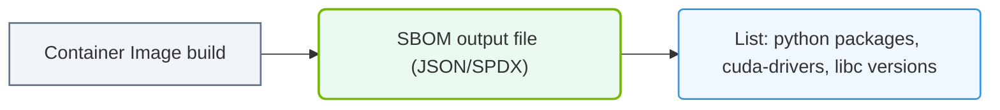

# 35.2b SBOM (Software Bill of Materials) for AI containers

#### 🏷️ The AI Infrastructure Security & Compliance > 35 Securing the AI Infrastructure Stack > 35.2 Securing The Nvidia Software Stack

---

## 📖 Context Introduction

When you work with AI containers—like NVIDIA's NGC containers for training or inference—you are essentially running a mini-operating system packed with hundreds of software components. Each component (a library, a tool, a driver) can have vulnerabilities or licensing issues. A **Software Bill of Materials (SBOM)** is simply a formal, machine-readable inventory of every piece of software inside that container. Think of it like a nutrition label for your container: it tells you exactly what's inside, what versions are used, and where each component came from.

For new engineers, understanding SBOMs is critical because AI containers are complex, and a single outdated library can introduce security risks into your entire AI pipeline.

---

## 🎯 Why SBOMs Matter for AI Containers

- **🔍 Visibility**: AI containers often bundle hundreds of open-source and proprietary packages. An SBOM reveals the full dependency tree.
- **🛡️ Vulnerability Management**: When a new Common Vulnerability and Exposure (CVE) is announced, you can quickly check if your container is affected by scanning its SBOM.
- **📜 License Compliance**: AI projects may use libraries with restrictive licenses. An SBOM helps you track and comply with legal obligations.
- **🔄 Reproducibility**: An SBOM acts as a snapshot of your container's software stack, making it easier to rebuild or audit later.

---

## 🧩 Key Components of an SBOM for AI Containers

| Component | Description | Example in an AI Container |
|-----------|-------------|----------------------------|
| **Package Name** | The name of the software component | `numpy`, `cuda-toolkit`, `tensorflow` |
| **Version** | Exact version number | `1.24.3`, `12.1.0`, `2.13.0` |
| **License** | License type (e.g., MIT, Apache 2.0, GPL) | `BSD-3-Clause`, `Apache-2.0` |
| **Supplier** | Who created or maintains the package | `NVIDIA Corporation`, `Python Software Foundation` |
| **Dependency Relationship** | How packages depend on each other | `tensorflow` depends on `numpy` |
| **Hash / Checksum** | Cryptographic fingerprint to verify integrity | `sha256:abc123...` |

---

## 🛠️ How SBOMs Are Generated for AI Containers

Engineers typically generate SBOMs using specialized tools that scan the container image. The process is:

1. **Pull the container image** from a registry (e.g., NGC, Docker Hub).
2. **Run an SBOM generator** against the image. The tool inspects the filesystem, package managers (like `apt`, `pip`, `conda`), and installed binaries.
3. **Output a standardized format** (commonly SPDX or CycloneDX) that lists all components.

**Example workflow (conceptual, no code blocks):**

- You have an NVIDIA AI container named `nvcr.io/nvidia/tensorflow:23.12-tf2-py3`.
- You run an SBOM tool against it. The tool produces a JSON file listing every package, its version, license, and dependencies.
- You store this SBOM alongside your deployment artifacts for auditing.

---

### 📊 Visual Representation: SBOM Package Inventory list
This diagram displays SBOM structures, cataloging package versions and dependencies inside images.

## 📊 Common SBOM Formats for AI Containers

| Format | Description | Typical Use Case |
|--------|-------------|------------------|
| **SPDX** (Software Package Data Exchange) | ISO standard; human-readable and machine-readable | Compliance and legal audits |
| **CycloneDX** | Lightweight, designed for security automation | Vulnerability scanning and CI/CD pipelines |
| **SWID** (Software Identification) | Tag-based format used in enterprise IT | Asset management and inventory |

For AI containers, **CycloneDX** is increasingly popular because it integrates well with vulnerability databases like the National Vulnerability Database (NVD).

---

## 🕵️ How Engineers Use SBOMs in Practice

- **🔄 Continuous Integration (CI)**: Automatically generate an SBOM every time you build a new AI container. Store it in a registry or artifact repository.
- **🔐 Pre-deployment Scanning**: Before deploying a container to production, scan its SBOM against known vulnerability databases. Block deployment if critical CVEs are found.
- **📋 Incident Response**: When a new vulnerability is disclosed (e.g., Log4j), query your SBOM database to find all containers using the affected version.
- **📝 Audit & Compliance**: Provide SBOMs to security teams or regulators to prove your AI infrastructure meets software supply chain security standards.

---

## ⚠️ Challenges Specific to AI Containers

- **🧮 Complex Dependency Trees**: AI frameworks like PyTorch or TensorFlow pull in dozens of transitive dependencies. An SBOM can become very large.
- **🔄 Frequent Updates**: AI containers are updated often (new CUDA versions, new framework releases). SBOMs must be regenerated with each update.
- **🔒 Proprietary Components**: Some NVIDIA libraries (e.g., CUDA, cuDNN) are not open-source. Their entries in an SBOM may have limited metadata.
- **📦 Mixed Package Managers**: AI containers often use `apt` (system packages), `pip` (Python packages), and `conda` (data science packages). An SBOM tool must support all of them.

---

## ✅ Best Practices for New Engineers

- **Start with a simple SBOM tool** that supports container images. Many are open-source and easy to run.
- **Always generate an SBOM** for every container you build or pull from a registry—even for development.
- **Store SBOMs in a central location** (e.g., a database or artifact repository) so they can be queried later.
- **Integrate SBOM scanning into your CI/CD pipeline** to catch vulnerabilities before deployment.
- **Use a standardized format** (SPDX or CycloneDX) to ensure compatibility with security tools.
- **Review SBOMs periodically** even for containers that are not changing—new vulnerabilities are discovered every day.

---

## 🔗 Summary

An SBOM is your container's software ingredient list. For AI containers, it helps you track dependencies, manage vulnerabilities, and stay compliant. As a new engineer, think of it as a security and transparency tool that gives you control over what's actually running in your AI infrastructure. Start small—generate an SBOM for one container, inspect its contents, and you'll quickly see why it's a foundational practice for secure AI operations.