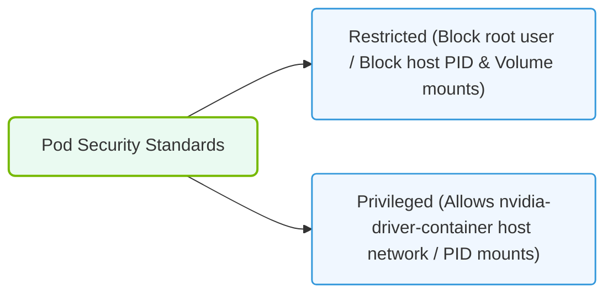

# 35.3b Pod Security Standards: restricted, baseline, and privileged policies

#### 🏷️ The AI Infrastructure Security & Compliance > 35 Securing the AI Infrastructure Stack > 35.3 Kubernetes Security for AI Clusters

---

## 📘 Context Introduction

When running AI workloads on Kubernetes, you are often dealing with containers that need special permissions—like access to NVIDIA GPUs, large memory allocations, or custom kernel modules. However, giving too many permissions can expose your cluster to security risks. Pod Security Standards (PSS) are Kubernetes policies that define three levels of security controls for pods: **Privileged**, **Baseline**, and **Restricted**. These standards help engineers enforce consistent security boundaries across AI clusters without blocking legitimate workloads.

---

## ⚙️ What Are Pod Security Standards?

Pod Security Standards are predefined security policies that control what a pod can do at the container runtime level. They replace the older Pod Security Policies (PSP) and are easier to manage. Each standard defines a set of restrictions on:

- **Privilege escalation** (e.g., running as root)
- **Host namespace sharing** (e.g., using host network or PID)
- **Linux capabilities** (e.g., `SYS_ADMIN`, `NET_ADMIN`)
- **Volume types** (e.g., hostPath volumes)
- **Seccomp and AppArmor profiles**

---

## 🛠️ The Three Standards: Privileged, Baseline, and Restricted

| Standard | Security Level | Typical Use Case | Key Restrictions |
|----------|----------------|------------------|------------------|
| 🟢 **Privileged** | Least restrictive | GPU workloads, system agents, monitoring tools | No restrictions; allows all capabilities and host access |
| 🟡 **Baseline** | Moderate | Standard AI training jobs, data pipelines | Prevents known privilege escalations; allows most common workloads |
| 🔴 **Restricted** | Most restrictive | Multi-tenant clusters, production inference services | Strong isolation; no root, no host access, limited capabilities |

---

## 🕵️ Detailed Breakdown of Each Standard

### 🟢 Privileged Policy

- **Purpose**: For pods that absolutely need full host access or special kernel features.
- **Common AI examples**: NVIDIA GPU operator pods, custom device plugins, performance monitoring agents.
- **What is allowed**:
  - Running as root
  - Using host network, host PID, or host IPC
  - Adding any Linux capability (e.g., `SYS_ADMIN`, `NET_RAW`)
  - Mounting hostPath volumes
  - Disabling seccomp or AppArmor
- **Security trade-off**: This policy offers no protection. Use only for trusted, system-level components.

### 🟡 Baseline Policy

- **Purpose**: For most AI workloads that do not need special privileges.
- **Common AI examples**: Standard PyTorch or TensorFlow training jobs, data preprocessing containers.
- **What is prevented**:
  - Privilege escalation (`allowPrivilegeEscalation: false`)
  - Running as root (unless explicitly allowed via `runAsNonRoot`)
  - Host namespace sharing (hostNetwork, hostPID, hostIPC)
  - Adding dangerous capabilities like `SYS_ADMIN` or `NET_ADMIN`
  - Using hostPath volumes
- **What is still allowed**:
  - Running as non-root user
  - Using standard Linux capabilities (e.g., `NET_BIND_SERVICE`)
  - Using emptyDir, configMap, secret, and persistentVolumeClaim volumes
- **Security trade-off**: Good balance for single-tenant AI clusters or trusted workloads.

### 🔴 Restricted Policy

- **Purpose**: For maximum security in multi-tenant or production environments.
- **Common AI examples**: Inference serving pods, user-facing APIs, shared GPU clusters.
- **What is enforced**:
  - Must run as non-root user (`runAsNonRoot: true`)
  - Must use a read-only root filesystem (`readOnlyRootFilesystem: true`)
  - No privilege escalation allowed
  - No host namespace access
  - Only a minimal set of capabilities allowed (e.g., `NET_BIND_SERVICE`, `CHOWN`)
  - Seccomp profile must be set to `RuntimeDefault` or `Localhost`
- **What is restricted**:
  - No access to host resources
  - No ability to change kernel settings
  - No mounting of sensitive volumes
- **Security trade-off**: Strongest isolation but may break AI workloads that need GPU driver access or custom kernel features.

---


### 📊 Visual Representation: Pod Security Standard levels (Privileged vs. Restricted)
This diagram displays Pod Security levels: forcing restricted profiles unless driver containers explicitly require privileged capabilities.




## 📊 Comparison Table: Key Differences

| Feature | Privileged | Baseline | Restricted |
|---------|------------|----------|------------|
| Run as root | ✅ Allowed | ❌ Denied (unless explicit) | ❌ Denied |
| Host network | ✅ Allowed | ❌ Denied | ❌ Denied |
| Host PID | ✅ Allowed | ❌ Denied | ❌ Denied |
| Privilege escalation | ✅ Allowed | ❌ Denied | ❌ Denied |
| Add `SYS_ADMIN` capability | ✅ Allowed | ❌ Denied | ❌ Denied |
| Add `NET_BIND_SERVICE` | ✅ Allowed | ✅ Allowed | ✅ Allowed |
| hostPath volumes | ✅ Allowed | ❌ Denied | ❌ Denied |
| Read-only root filesystem | ❌ Not required | ❌ Not required | ✅ Required |
| Seccomp profile | ❌ Not required | ❌ Not required | ✅ Required (`RuntimeDefault`) |

---

## 🧩 How to Apply Pod Security Standards in an AI Cluster

Pod Security Standards are enforced using **Pod Security Admission** (a built-in Kubernetes admission controller). You can apply them at the **namespace level** using labels.

### Example: Enforcing Baseline Policy on a Namespace

To apply the Baseline standard to a namespace called `ai-training`, you add the following label to the namespace:

**For reference:**
```yaml
apiVersion: v1
kind: Namespace
metadata:
  name: ai-training
  labels:
    pod-security.kubernetes.io/enforce: baseline
    pod-security.kubernetes.io/enforce-version: latest
```

📤 **Output:** Any pod created in the `ai-training` namespace that violates the Baseline policy will be rejected by the Kubernetes API server.

### Example: Enforcing Restricted Policy on a Namespace

For a production inference namespace called `ai-inference`, use:

**For reference:**
```yaml
apiVersion: v1
kind: Namespace
metadata:
  name: ai-inference
  labels:
    pod-security.kubernetes.io/enforce: restricted
    pod-security.kubernetes.io/enforce-version: latest
```

📤 **Output:** Pods in this namespace must meet all Restricted policy requirements. If a pod tries to run as root, it will be denied.

---

## 🧠 Best Practices for AI Clusters

- **Start with Baseline** for most AI training jobs. It blocks common exploits without breaking GPU workloads.
- **Use Restricted only for inference or multi-tenant namespaces** where security is critical.
- **Keep Privileged for system components only** (e.g., GPU operator, monitoring agents). Never run user workloads with Privileged.
- **Test your policies with a dry-run mode first** to avoid breaking existing workloads. You can use the `warn` or `audit` modes before `enforce`.
- **Use labels like `pod-security.kubernetes.io/warn: baseline`** to see warnings without blocking pods.

---

## ✅ Summary

- **Privileged** = No restrictions. Use only for trusted system components.
- **Baseline** = Blocks known privilege escalations. Safe for most AI workloads.
- **Restricted** = Maximum security. Best for production inference and multi-tenant clusters.

By applying these standards, engineers can secure their AI infrastructure without sacrificing the flexibility needed for GPU-accelerated workloads.