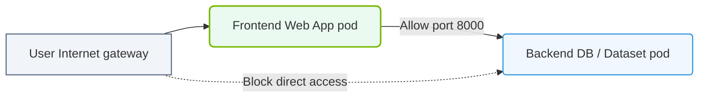

# 35.3c Network policies: restricting east-west traffic between AI namespaces

#### 🏷️ The AI Infrastructure Security & Compliance > 35 Securing the AI Infrastructure Stack > 35.3 Kubernetes Security for AI Clusters

---

## 🌐 Context Introduction

In AI clusters, workloads often run across multiple namespaces — for example, one namespace for data preprocessing, another for model training, and a third for inference serving. Without proper controls, any pod in any namespace can communicate with any other pod, creating a security risk. This is called **east-west traffic** (traffic between services inside the cluster). Restricting this traffic using Kubernetes Network Policies is essential to prevent unauthorized access, data exfiltration, or accidental interference between AI workloads.

---

## ⚙️ What Are Network Policies?

- A **NetworkPolicy** is a Kubernetes resource that acts as a firewall for pods.
- It controls **ingress** (incoming traffic) and **egress** (outgoing traffic) at the pod level.
- By default, Kubernetes allows **all** pod-to-pod communication — Network Policies are used to restrict this.
- For AI clusters, this means you can isolate training jobs from inference services, or prevent a compromised data pipeline from reaching your model registry.

---

## 🛡️ Why Restrict East-West Traffic in AI Namespaces?

| Reason | Explanation |
|--------|-------------|
| 🚫 **Data Isolation** | Prevent unauthorized access to sensitive training data across namespaces |
| 🧠 **Model Protection** | Stop a compromised pod from querying or stealing model weights |
| ⚡ **Resource Containment** | Avoid one noisy AI workload from overwhelming another namespace's network |
| 🔒 **Compliance** | Meet security requirements for multi-tenant AI environments |
| 🕵️ **Attack Surface Reduction** | Limit lateral movement if an attacker gains access to one pod |

---

## 🧱 How Network Policies Work

- **Pods are the target** — policies apply to selected pods via labels.
- **Policy types** — you can define rules for **Ingress**, **Egress**, or both.
- **Namespace isolation** — policies can allow traffic only from specific namespaces.
- **Default deny** — a common pattern is to create a default-deny policy, then explicitly allow only necessary traffic.

---

## 🛠️ Key Concepts for AI Namespace Restrictions

### 🔹 Pod Selectors
- Use labels like `app: training-job` or `role: inference` to target specific pods.
- Example: A policy selects pods with label `tier: training` in the `ai-training` namespace.

### 🔹 Namespace Selectors
- Use `namespaceSelector` to allow traffic only from specific namespaces.
- Example: Allow ingress only from pods in the `ai-ingestion` namespace.

### 🔹 IP Block Rules
- Use `ipBlock` to allow or deny traffic from specific CIDR ranges (less common for east-west, but useful for external access).

### 🔹 Policy Types
- **Ingress** — controls traffic coming into the selected pods.
- **Egress** — controls traffic leaving the selected pods.

---

## 📐 Example Scenario: Restricting AI Namespaces

Imagine you have three namespaces:

- `ai-data` — contains data ingestion pods
- `ai-training` — contains model training pods
- `ai-inference` — contains inference serving pods

**Goal:** Only allow `ai-data` pods to talk to `ai-training` pods, and only `ai-training` pods to talk to `ai-inference` pods. No other cross-namespace traffic is allowed.

---

### 📊 Visual Representation: Kubernetes Network Policy isolated namespaces
This diagram displays how Network Policies isolate backend dataset namespaces from front-end user spaces.

## 📋 Step-by-Step Implementation Approach

1. **Create a default-deny policy** in each namespace to block all ingress and egress traffic.
2. **Create an allow policy** in `ai-training` that permits ingress from `ai-data` namespace.
3. **Create an allow policy** in `ai-inference` that permits ingress from `ai-training` namespace.
4. **Create an egress policy** in `ai-data` that permits traffic only to `ai-training` namespace.
5. **Create an egress policy** in `ai-training` that permits traffic only to `ai-inference` namespace.

---

## 🧪 Verification and Testing

- Use **kubectl describe networkpolicy** to check applied rules.
- Use a temporary pod with `curl` or `wget` to test connectivity between namespaces.
- Expected behavior: pods in `ai-data` can reach `ai-training`, but not `ai-inference` directly.
- Use **kubectl get networkpolicy -A** to list all policies across namespaces.

---

## ⚠️ Common Pitfalls for New Engineers

- **Missing default-deny** — without it, your allow policies may not block unintended traffic.
- **Incorrect label matching** — if pod labels don't match the policy selector, the policy won't apply.
- **Forgetting egress rules** — restricting ingress but not egress can still allow data leaks.
- **Not considering DNS** — pods may need egress to `kube-dns` for service discovery.
- **Policy ordering** — Kubernetes applies all matching policies, so a deny rule can override an allow rule.

---

## 🔍 Monitoring and Troubleshooting

- Check **NetworkPolicy status** using `kubectl describe networkpolicy <name> -n <namespace>`.
- Look for **connection timeouts** in application logs — this often indicates a blocked policy.
- Use **kubectl exec** into a test pod to run connectivity checks.
- Review **CNI plugin logs** (e.g., Calico, Cilium) for policy enforcement details.

---

## ✅ Best Practices for AI Clusters

- **Start with a default-deny** policy in every namespace.
- **Use descriptive labels** on pods (e.g., `component: training`, `component: inference`).
- **Document each policy** with comments or annotations explaining why it exists.
- **Test policies in a staging environment** before applying to production.
- **Audit policies regularly** as AI workloads and namespaces evolve.
- **Use namespace-level policies** where possible to reduce complexity.

---

## 📚 Summary

Network Policies are a fundamental security control for AI infrastructure. By restricting east-west traffic between AI namespaces, you protect sensitive data, models, and compute resources from unauthorized access or accidental interference. Start with a default-deny approach, then carefully allow only the traffic your AI pipeline requires. Always test and monitor your policies to ensure they work as intended.