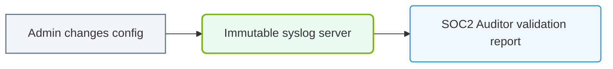

# 35.4a SOC 2 Type II: security, availability, and confidentiality controls

#### 🏷️ The AI Infrastructure Security & Compliance > 35 Securing the AI Infrastructure Stack > 35.4 Compliance Frameworks Relevant to AI Infrastructure

---

## 📘 Context Introduction

When you're building and operating AI infrastructure, you're handling sensitive data—training datasets, model weights, inference logs, and sometimes even customer information. SOC 2 Type II is a compliance framework that helps organizations demonstrate they have proper controls in place to protect that data. Think of it as a **trust report card** for service providers. For new engineers, understanding SOC 2 Type II means knowing what controls exist around **security**, **availability**, and **confidentiality**—and how those controls apply to the AI systems you manage.

---

## ⚙️ What Is SOC 2 Type II?

SOC 2 (System and Organization Controls 2) is an auditing standard developed by the American Institute of CPAs (AICPA). There are two types:
- **Type I**: A snapshot of controls at a single point in time.
- **Type II**: An evaluation of controls over a period (typically 6–12 months), proving they actually work in practice.

For AI infrastructure, **Type II** is the gold standard because it shows sustained compliance, not just a one-time setup.

---

## 🛡️ The Three Trust Service Categories (TSC) Covered

SOC 2 has five trust service categories, but your topic focuses on three. Here's what each means for AI infrastructure:

### 🔐 Security
- **What it protects**: Unauthorized access to systems and data.
- **AI-specific examples**:
  - Role-based access control (RBAC) for model training clusters.
  - Encryption of data at rest (e.g., GPUs storing model checkpoints).
  - Multi-factor authentication (MFA) for cloud console access.
- **Key controls**: Firewalls, intrusion detection, vulnerability scanning.

### 📡 Availability
- **What it protects**: Uptime and accessibility of AI services.
- **AI-specific examples**:
  - Redundant GPU clusters for failover during model training.
  - Monitoring inference endpoints for latency spikes.
  - Disaster recovery plans for model registries.
- **Key controls**: Load balancing, backup systems, incident response SLAs.

### 🤫 Confidentiality
- **What it protects**: Sensitive data from unauthorized disclosure.
- **AI-specific examples**:
  - Data masking for customer data used in training.
  - Access logs for model weights and hyperparameters.
  - Secure deletion of temporary training artifacts.
- **Key controls**: Data classification policies, encryption in transit, access reviews.

---

## 📊 Comparison Table: Security vs. Availability vs. Confidentiality

| Aspect | Security | Availability | Confidentiality |
|--------|----------|--------------|-----------------|
| **Primary goal** | Prevent breaches | Ensure uptime | Protect data secrecy |
| **AI example** | GPU cluster firewall | Model inference SLA | Encrypted training data |
| **Common control** | Access controls | Redundant hardware | Data masking |
| **Failure impact** | Data theft | Service downtime | Data leak |
| **Audit evidence** | Logs, patch records | Uptime reports | Access reviews |

---

### 📊 Visual Representation: SOC2 Type-2 audit logging
This diagram displays SOC2 auditing requirements: logging administrative changes to verify security policies.

## 🕵️ How SOC 2 Type II Applies to AI Infrastructure

As an engineer managing AI infrastructure, you'll encounter SOC 2 Type II in these areas:

- **Data pipelines**: Controls must ensure that raw data is encrypted before entering the training pipeline.
- **Model deployment**: Only authorized engineers can push models to production (security control).
- **Inference endpoints**: Must remain available within defined SLAs (availability control).
- **Model artifacts**: Weights and configurations must be stored with restricted access (confidentiality control).

---

## 🛠️ Practical Steps for Engineers

Here's how you can contribute to SOC 2 Type II compliance in your daily work:

- **Log everything**: Enable audit logging for all AI infrastructure components—training jobs, API calls, data access.
- **Document controls**: Write down how you handle GPU access, data encryption, and backup procedures.
- **Test regularly**: Run vulnerability scans on your ML pipelines and verify that backups restore correctly.
- **Review access**: Quarterly review who has access to model registries and training datasets.
- **Respond to incidents**: Have a clear process for reporting security events (e.g., unauthorized model access).

---

## ✅ Key Takeaways for New Engineers

- SOC 2 Type II is about **proving** controls work over time, not just setting them up once.
- **Security** keeps bad actors out; **availability** keeps services running; **confidentiality** keeps secrets secret.
- AI infrastructure adds complexity—GPUs, model registries, and data pipelines all need specific controls.
- Your role is to implement, monitor, and document these controls as part of your daily operations.

---

## 📚 Further Learning

- Review your organization's SOC 2 Type II report (if available) to see which controls apply to your team.
- Familiarize yourself with the AICPA's Trust Services Criteria for the full list of controls.
- Practice writing a simple control description for an AI system you manage—this builds compliance muscle.

---

*Remember: SOC 2 Type II isn't just an audit exercise—it's a framework that helps you build more reliable, secure, and trustworthy AI infrastructure.*