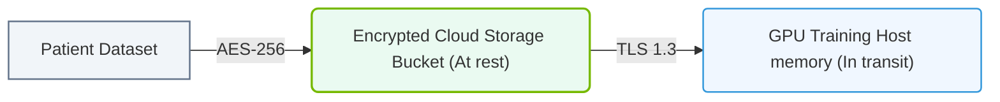

# 35.4b HIPAA: healthcare AI deployments and PHI in training data

#### 🏷️ The AI Infrastructure Security & Compliance > 35 Securing the AI Infrastructure Stack > 35.4 Compliance Frameworks Relevant to AI Infrastructure

---

## 📘 Context Introduction

When deploying AI in healthcare, you must handle **Protected Health Information (PHI)** with extreme care. The **Health Insurance Portability and Accountability Act (HIPAA)** sets the legal standard for protecting patient data in the United States. For engineers new to AI infrastructure, this means every step — from training data collection to model inference — must comply with strict privacy and security rules. This topic explains how HIPAA applies to AI workloads and what you need to know about PHI in training data.

---

## 🎯 What is HIPAA and Why Does It Matter for AI?

HIPAA is a U.S. federal law that requires safeguards for PHI. In AI deployments, PHI can appear in:
- **Training datasets** (e.g., patient records, medical images, clinical notes)
- **Model outputs** (e.g., predictions that reveal patient conditions)
- **Logs and metadata** (e.g., timestamps, IP addresses linked to patient IDs)

Key HIPAA rules that affect AI infrastructure:
- **Privacy Rule**: Controls who can access PHI and how it is used.
- **Security Rule**: Requires administrative, physical, and technical safeguards.
- **Breach Notification Rule**: Mandates reporting if PHI is exposed.

---

## ⚙️ PHI in Training Data: Key Considerations

When building AI models for healthcare, engineers must identify and protect PHI in training data. Common PHI identifiers include:

- Names, addresses, and dates (birth, admission, discharge)
- Phone numbers, fax numbers, and email addresses
- Social Security numbers and medical record numbers
- Health plan beneficiary numbers and account numbers
- Full-face photos and biometric data
- Any unique identifying number, code, or characteristic

**Important**: Even de-identified data (stripped of 18 specific identifiers) may still be considered PHI if it can be re-identified through AI model inference.

---

## 🛠️ HIPAA Compliance Steps for AI Deployments

Follow these steps to align your AI infrastructure with HIPAA requirements:

1. **🔍 Data Inventory and Classification**
   - Map all data sources that feed into AI pipelines.
   - Tag datasets containing PHI with metadata labels (e.g., "PHI: Yes").
   - Use automated scanning tools to detect PHI in unstructured text or images.

2. **🔐 Access Controls and Encryption**
   - Enforce role-based access control (RBAC) for all training data.
   - Encrypt PHI at rest (AES-256) and in transit (TLS 1.2+).
   - Use hardware security modules (HSMs) for key management.

3. **📊 Data Minimization and Anonymization**
   - Only collect PHI that is strictly necessary for the AI model.
   - Apply de-identification techniques: masking, tokenization, or differential privacy.
   - For training, use synthetic data generation to avoid using real PHI.

4. **📝 Audit Logging and Monitoring**
   - Log all access to PHI in training datasets.
   - Monitor model inference requests for potential PHI leakage.
   - Retain logs for at least 6 years (HIPAA requirement).

5. **🤝 Business Associate Agreements (BAAs)**
   - Ensure cloud providers and AI platform vendors sign a BAA.
   - A BAA legally binds them to HIPAA compliance for your data.

---

### 📊 Visual Representation: HIPAA Patient Data Encryption
This diagram displays HIPAA requirements: encrypting training datasets both in transit and at rest.

## 📊 Comparison: HIPAA vs. Other Compliance Frameworks for AI

| Feature | HIPAA (Healthcare) | GDPR (EU) | SOC 2 (General) |
|---------|--------------------|-----------|-----------------|
| **Focus** | PHI privacy and security | Personal data protection | Service organization controls |
| **PHI specific?** | Yes | No (covers all personal data) | No |
| **Data residency** | Not explicitly required | Requires data stay in EU/EEA | Depends on customer contract |
| **Breach notification** | Within 60 days | Within 72 hours | Within a reasonable time |
| **BAA required?** | Yes, for vendors | No (Data Processing Agreement) | No |
| **AI model training** | Strict limits on PHI use | Requires consent or legitimate interest | No specific AI rules |

---

## 🕵️ Common HIPAA Pitfalls in AI Deployments

Avoid these mistakes when handling PHI in training data:

- ❌ **Using production PHI in development environments** — Always use synthetic or de-identified data for testing.
- ❌ **Storing PHI in unencrypted model checkpoints** — Model weights can memorize training data.
- ❌ **Sharing model outputs without review** — A model might reveal PHI through inference attacks.
- ❌ **Ignoring cloud provider shared responsibility** — You are responsible for PHI even if the cloud is HIPAA-eligible.
- ❌ **Failing to update BAAs when adding new AI tools** — Every third-party service touching PHI needs a BAA.

---

## ✅ Quick Checklist for Engineers

Before deploying an AI model with healthcare data, verify:

- [ ] All training data is classified for PHI presence.
- [ ] Encryption is enabled for data at rest and in transit.
- [ ] Access to PHI is logged and monitored.
- [ ] A BAA is in place with all vendors handling PHI.
- [ ] De-identification or anonymization is applied where possible.
- [ ] Model outputs are tested for PHI leakage.
- [ ] Incident response plan includes HIPAA breach notification procedures.

---

## 📚 Summary

HIPAA compliance for AI infrastructure is about **protecting patient data at every layer** — from storage to training to inference. As an engineer, your role is to implement technical safeguards (encryption, access controls, logging) and ensure that PHI is never exposed unnecessarily. By following the steps and checklist above, you can build AI systems that are both powerful and compliant with healthcare regulations.