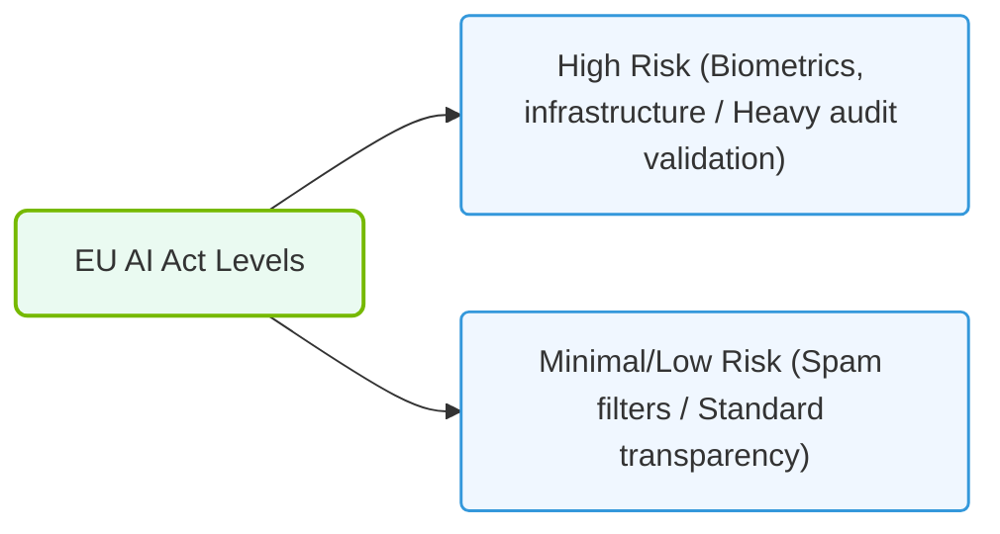

# 35.4e EU AI Act: compliance considerations for AI system operators

#### 🏷️ The AI Infrastructure Security & Compliance > 35 Securing the AI Infrastructure Stack > 35.4 Compliance Frameworks Relevant to AI Infrastructure

---

## 🌍 Context Introduction

The **EU AI Act** is the world's first comprehensive legal framework for artificial intelligence. It classifies AI systems by risk level and imposes specific obligations on **operators**—the individuals or organizations that deploy and manage AI systems in production. For engineers new to AI infrastructure, understanding these compliance considerations is essential to avoid legal penalties, ensure ethical AI use, and maintain trust with users and regulators.

This guide breaks down the key compliance requirements for AI system operators under the EU AI Act, focusing on practical steps you can take in your daily work.

---

## ⚖️ Risk Classification Overview

The EU AI Act categorizes AI systems into four risk levels. As an operator, your compliance obligations depend on which category your system falls into:

- **🔴 Unacceptable Risk** – Systems banned outright (e.g., social scoring by governments, real-time biometric surveillance in public spaces).
- **🟠 High Risk** – Systems that pose significant harm to health, safety, or fundamental rights (e.g., CV-scanning tools for hiring, credit scoring, medical devices). **Most compliance work focuses here.**
- **🟡 Limited Risk** – Systems with specific transparency obligations (e.g., chatbots must disclose they are AI, deepfakes must be labeled).
- **🟢 Minimal Risk** – No additional obligations (e.g., AI-enabled video games, spam filters).

---

## 🛠️ Key Compliance Obligations for AI System Operators

As an operator of a **high-risk AI system**, you must fulfill the following responsibilities:

### 📋 1. Human Oversight
- Ensure that a human can **review, override, or stop** the AI system's decisions at any time.
- Design interfaces that allow operators to understand the system's logic and confidence levels.
- Document how human oversight is implemented in your infrastructure.

### 📊 2. Transparency & Documentation
- Maintain a **technical documentation package** describing the system's design, training data, and performance metrics.
- Provide clear instructions for use to downstream deployers.
- Log all significant system events (e.g., model retraining, data drift alerts, manual overrides).

### 🔒 3. Data Governance
- Use only **high-quality, representative, and bias-free** training and validation datasets.
- Implement data retention policies that comply with GDPR (e.g., anonymize or delete personal data after a defined period).
- Conduct regular audits for data bias and fairness.

### 🕵️ 4. Accuracy, Robustness & Cybersecurity
- Define and test **minimum accuracy thresholds** for your AI system's intended purpose.
- Implement monitoring for **model drift** (when model performance degrades over time).
- Apply cybersecurity measures to prevent adversarial attacks (e.g., input poisoning, model inversion).

### 📝 5. Conformity Assessment
- For high-risk systems, a **conformity assessment** must be performed before deployment.
- If the system uses a **General-Purpose AI** model (e.g., a large language model), the model provider may already have a conformity assessment. You must verify this and keep the documentation.

---

### 📊 Visual Representation: EU AI Act Risk Classifications
This diagram displays EU AI Act levels, showing risk classifications that map out transparency requirements.

## 🔄 Comparison: Operator vs. Provider Responsibilities

It is important to distinguish between the **provider** (who develops the AI system) and the **operator** (who deploys and uses it). The table below clarifies key differences:

| Responsibility | 🏭 Provider (Developer) | 👷 Operator (Deployer) |
|---|---|---|
| **Risk classification** | Must classify the system and notify authorities | Must verify the classification provided by the developer |
| **Technical documentation** | Creates and maintains the full documentation | Must keep a copy and ensure it is accessible for audits |
| **Human oversight** | Designs the oversight mechanism | Implements and operates the oversight in production |
| **Data governance** | Ensures training data quality | Ensures operational data (e.g., user inputs) is handled compliantly |
| **Conformity assessment** | Obtains CE marking before market release | Must not deploy without a valid CE marking |
| **Incident reporting** | Reports serious incidents to authorities | Reports incidents to the provider and cooperates in investigations |

---

## 🧰 Practical Steps for Engineers

Here are actionable steps you can take today to align your AI infrastructure with the EU AI Act:

### ✅ Step 1: Inventory Your AI Systems
- List every AI model running in production.
- Classify each system by risk level (use the EU AI Act's Annex III as a checklist).
- Document the purpose, data sources, and decision-making logic for each system.

### ✅ Step 2: Implement Logging & Monitoring
- Enable **audit trails** for all AI decisions (input, output, confidence score, timestamp, user ID).
- Set up alerts for **data drift** and **model degradation**.
- Store logs in a tamper-proof, immutable format (e.g., append-only database).

### ✅ Step 3: Establish a Human-in-the-Loop Workflow
- For high-risk decisions (e.g., loan rejections, hiring recommendations), require a human to **confirm or override** the AI output before final action.
- Build a dashboard that shows the AI's reasoning (e.g., feature importance, similar historical cases).

### ✅ Step 4: Review Data Handling Practices
- Ensure personal data used by the AI system has a lawful basis (e.g., consent, legitimate interest).
- Implement data minimization: only collect and store data necessary for the AI's function.
- Schedule periodic **bias audits** using fairness metrics (e.g., demographic parity, equal opportunity).

### ✅ Step 5: Prepare for Regulatory Audits
- Maintain a **compliance binder** containing:
  - Risk classification documentation.
  - Technical documentation (model cards, data sheets).
  - Logs of human oversight actions.
  - Incident reports and remediation plans.
- Designate a **compliance contact** within your team to respond to regulator inquiries.

---

## 🚨 Common Pitfalls to Avoid

- ❌ **Ignoring transparency obligations** – Even limited-risk systems (e.g., chatbots) must disclose they are AI. Failure to do so can result in fines.
- ❌ **Assuming "open source" means exempt** – Open-source AI models are not automatically exempt; the operator still bears responsibility for how the system is used.
- ❌ **Neglecting documentation updates** – If you retrain a model or change its deployment environment, you must update the technical documentation and re-assess conformity if needed.
- ❌ **Overlooking third-party models** – If you deploy a model from a vendor or open-source repository, you are still the operator and must verify its compliance.

---

## 📚 Summary

The EU AI Act places significant responsibility on AI system operators to ensure their systems are **safe, transparent, and accountable**. By understanding the risk classification, implementing human oversight, maintaining robust documentation, and preparing for audits, engineers can build compliant AI infrastructure that meets regulatory standards while delivering value.

Start small: inventory your systems, enable logging, and establish a human review process. These foundational steps will put you on the right path toward full compliance.

---

*This guide is for informational purposes and does not constitute legal advice. Consult with a compliance professional for your specific use case.*