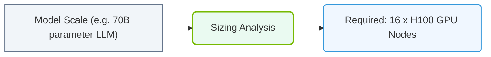

# 36.1a Domain 1 analysis: AI Infrastructure Fundamentals — coverage gaps and key concepts

#### 🏷️ The Exam Preparation & Certification Mastery > 36 NCA-AIIO Blueprint Deep Dive — Domain-by-Domain Analysis > 36.1 Official Exam Blueprint Domain Breakdown and Weightings

---

## 📘 Context Introduction

Domain 1 of the NVIDIA-Certified Associate: AI Infrastructure and Operations exam focuses on **AI Infrastructure Fundamentals**, covering the foundational building blocks engineers need to understand before deploying or managing AI workloads. This domain carries significant weight in the exam, and many new engineers find certain concepts challenging due to the rapid evolution of hardware and software in this space.

This analysis breaks down the key concepts, identifies common coverage gaps, and provides a clear path to mastering this domain.

---

## ⚙️ Domain 1 Weighting & Scope

- **Exam Weight:** Approximately 20-25% of total exam questions
- **Core Focus Areas:**
  - GPU architecture fundamentals (NVIDIA-specific)
  - AI workload characteristics and resource requirements
  - Data center considerations for AI
  - Storage and networking for AI pipelines
  - Software stack layers (drivers, containers, orchestration)

---

## 🕵️ Key Concepts You Must Know

### 🖥️ GPU Architecture Basics

- **CUDA Cores vs. Tensor Cores:** Understand that Tensor Cores accelerate matrix operations critical for deep learning, while CUDA Cores handle general-purpose parallel computing.
- **Memory Hierarchy:** GPU memory (HBM, GDDR) vs. system RAM — latency and bandwidth differences matter for large model training.
- **NVLink and NVSwitch:** High-speed interconnects that allow multiple GPUs to share memory and data without bottlenecking through the CPU.

### 📊 AI Workload Profiles

- **Training vs. Inference:** Training requires massive parallel compute and memory; inference demands low latency and often uses smaller batch sizes.
- **Data Parallelism vs. Model Parallelism:** Data parallelism splits batches across GPUs; model parallelism splits the neural network layers across GPUs.
- **Mixed Precision Training:** Using FP16 (half-precision) alongside FP32 to reduce memory usage and speed up training without significant accuracy loss.

### 🛠️ Data Center Considerations

- **Power and Cooling:** AI clusters consume 10-30 kW per rack — understand thermal design power (TDP) and liquid cooling options.
- **Rack Density:** High-density GPU servers require specialized power distribution and cooling infrastructure.
- **Network Topology:** Fat-tree or spine-leaf architectures for east-west traffic between GPUs during distributed training.

### 💾 Storage for AI Pipelines

- **Tiered Storage Model:**
  - Hot tier: NVMe SSDs for active datasets
  - Warm tier: HDDs or object storage for archived data
  - Cold tier: Tape or cloud for long-term retention
- **Parallel File Systems:** Solutions like Lustre or GPUDirect Storage bypass the CPU to move data directly between storage and GPU memory.

### 🔗 Networking Essentials

- **RDMA (Remote Direct Memory Access):** Allows GPUs on different servers to access each other's memory directly — critical for multi-node training.
- **InfiniBand vs. RoCE:** InfiniBand offers lower latency and higher reliability; RoCE (RDMA over Converged Ethernet) is more cost-effective but requires careful tuning.
- **NVIDIA Mellanox:** Understand the role of SmartNICs and DPUs (Data Processing Units) in offloading networking tasks from the CPU.

---

## 📋 Comparison Table: Training vs. Inference Infrastructure

| Aspect | Training | Inference |
|--------|----------|-----------|
| **Primary Goal** | Model accuracy and convergence | Low latency and throughput |
| **GPU Memory Need** | High (40-80 GB per GPU) | Moderate (8-40 GB per GPU) |
| **Batch Size** | Large (hundreds to thousands) | Small (1-32) |
| **Network Bandwidth** | Critical (200-400 Gbps per GPU) | Less critical (25-100 Gbps) |
| **Storage I/O** | Read-heavy, sequential | Read-heavy, random |
| **Power Profile** | Sustained high power | Bursty, lower average |
| **Typical GPU** | A100, H100, B200 | T4, L4, A10, L40S |

---

### 📊 Visual Representation: AI Infrastructure requirements mapping
This diagram displays how user workload models (size, tokens) map out cluster scaling limits and hardware counts.

## 🚩 Common Coverage Gaps for New Engineers

### Gap 1: Confusing GPU Memory with System Memory

- **Misconception:** Engineers often think GPU memory works like system RAM.
- **Reality:** GPU memory is physically separate, has much higher bandwidth (2-3 TB/s vs. 50-100 GB/s), and data must be explicitly transferred between CPU and GPU.
- **Key Takeaway:** Always monitor GPU memory usage separately — running out causes "out of memory" errors that crash training jobs.

### Gap 2: Underestimating Network Bottlenecks

- **Misconception:** "My GPUs are fast, so training will be fast."
- **Reality:** In multi-GPU training, network bandwidth often becomes the bottleneck. If GPUs spend 30% of time waiting for data from other GPUs, overall throughput drops significantly.
- **Key Takeaway:** Use tools like **NVIDIA Nsight Systems** to visualize communication overhead.

### Gap 3: Ignoring Storage Performance for Data Loading

- **Misconception:** "I have fast SSDs, so data loading is fine."
- **Reality:** AI training reads millions of small files. Random read IOPS (input/output operations per second) matter more than sequential throughput.
- **Key Takeaway:** Use data loaders that prefetch and cache data in system RAM before GPU transfer.

### Gap 4: Overlooking Software Stack Dependencies

- **Misconception:** "Just install CUDA and it works."
- **Reality:** The AI software stack has many layers:
  - NVIDIA drivers (kernel-level)
  - CUDA toolkit (libraries)
  - cuDNN (deep neural network primitives)
  - TensorRT (inference optimization)
  - Container runtime (NVIDIA Container Toolkit)
  - Orchestration (Kubernetes with GPU device plugin)
- **Key Takeaway:** Version compatibility between these layers is critical — always check the NVIDIA compatibility matrix.

### Gap 5: Misunderstanding Power and Thermal Limits

- **Misconception:** "GPUs run at full speed all the time."
- **Reality:** GPUs throttle performance when they exceed thermal or power limits. A single H100 GPU can draw 700W — a rack of 8 can draw 5.6 kW.
- **Key Takeaway:** Monitor GPU temperature and power draw using **nvidia-smi** to detect throttling.

---

## 🛠️ Practical Study Recommendations

### For Hardware Understanding

- Review NVIDIA's GPU architecture whitepapers (Ampere, Hopper, Blackwell)
- Understand the difference between **SXM** (server module) and **PCIe** (add-in card) form factors
- Learn about **NVLink domains** and how they create GPU "pods"

### For Software Stack Familiarity

- Practice installing the NVIDIA Container Toolkit and running GPU-enabled containers
- Understand the **NVIDIA GPU Operator** for Kubernetes — it automates driver and toolkit installation
- Learn about **MIG (Multi-Instance GPU)** for partitioning A100/H100 GPUs into smaller instances

### For Networking and Storage

- Study the concept of **GPU Direct** technologies (Storage, RDMA, P2P)
- Understand the difference between **TCP/IP** and **RDMA** for AI workloads
- Review **NVIDIA Magnum IO** — the software suite for GPU-accelerated networking and storage

---

## ✅ Final Domain 1 Checklist

- [ ] I can explain the difference between CUDA Cores and Tensor Cores
- [ ] I understand why GPU memory bandwidth matters more than capacity for many workloads
- [ ] I know the three main parallelism strategies: data, model, and pipeline
- [ ] I can list the layers of the AI software stack from driver to orchestration
- [ ] I understand why InfiniBand is preferred over Ethernet for multi-node training
- [ ] I can identify when a training job is network-bound vs. compute-bound
- [ ] I know how MIG partitioning works and when to use it
- [ ] I understand the power and cooling implications of high-density GPU clusters

---

## 📚 Next Steps

After mastering Domain 1, move to **Domain 2: AI Workload Configuration and Management**, where you'll apply these fundamentals to actually deploying and running AI jobs on GPU infrastructure.

Remember: The exam tests your ability to **reason about infrastructure decisions**, not just memorize specs. Focus on understanding *why* certain hardware choices matter for specific AI workloads.