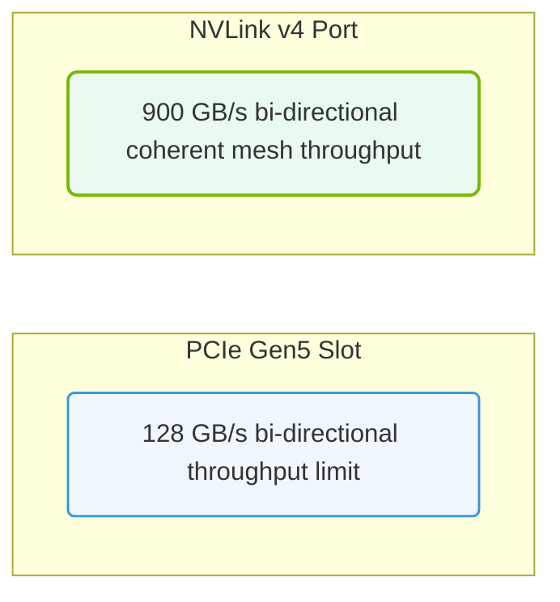

# 36.2c NVLink vs PCIe: bandwidth calculations and topology selection

#### 🏷️ The Exam Preparation & Certification Mastery > 36 NCA-AIIO Blueprint Deep Dive — Domain-by-Domain Analysis > 36.2 High-Frequency Exam Topics — What the Blueprint Emphasizes

Welcome, new engineer! When building AI infrastructure, one of the most critical decisions you'll face is how to connect your GPUs. Two primary technologies exist: **NVLink** (NVIDIA's high-speed GPU-to-GPU interconnect) and **PCIe** (the universal expansion bus). This guide breaks down their bandwidth differences, how to calculate throughput, and when to choose one topology over another.

---

## 🧠 Context: Why This Matters for AI Workloads

Modern AI training and inference often require multiple GPUs working together. The speed at which they share data (gradients, model parameters, activations) directly impacts training time. NVLink is designed for ultra-low-latency, high-bandwidth GPU-to-GPU communication, while PCIe is a general-purpose bus shared with other devices (storage, networking). Understanding when to use each can save you hours of training time and thousands of dollars in hardware costs.

---

## ⚙️ Bandwidth Basics: What You Need to Know

Bandwidth is the maximum rate of data transfer across a connection. For AI workloads, we measure this in **gigabytes per second (GB/s)** or **gigabits per second (Gbps)**.

- **PCIe Gen 4.0 (x16 slot):** Provides approximately **31.5 GB/s** (bidirectional) per link.
- **PCIe Gen 5.0 (x16 slot):** Doubles that to roughly **63 GB/s** (bidirectional) per link.
- **NVLink (per bridge, 4th generation):** Delivers up to **900 GB/s** total bidirectional bandwidth per GPU (using 18 NVLink bridges on an H100).

**Key insight:** NVLink offers **~14x more bandwidth** than PCIe Gen 5.0 per GPU connection. This is why multi-GPU training (e.g., with 8 GPUs) almost always uses NVLink for the primary data path.

---

## 📊 Bandwidth Calculation Examples

Let's walk through two common scenarios:

### Scenario A: Single GPU Training (No Interconnect Needed)
- **Connection:** GPU to CPU via PCIe Gen 4.0 x16
- **Bandwidth available:** ~31.5 GB/s
- **Use case:** Fine-tuning a small model or inference — PCIe is sufficient.

### Scenario B: 8-GPU Training with NVLink
- **Topology:** 8 GPUs fully connected via NVLink (each GPU has 18 NVLink bridges)
- **Bandwidth per GPU pair:** 900 GB/s (bidirectional)
- **Total aggregate bandwidth in a full mesh:** 8 GPUs × 900 GB/s = **7.2 TB/s** (theoretical)
- **Real-world effective bandwidth:** ~600-700 GB/s per GPU due to protocol overhead

**Calculation formula for your exam:**
- **NVLink bandwidth per direction:** (Number of NVLink bridges) × (Bandwidth per bridge)
- Example: H100 with 18 bridges × 50 GB/s per bridge = **900 GB/s bidirectional**

---

### 📊 Visual Representation: NVLink vs. PCIe bandwidth scaling
This diagram contrasts interconnect layouts: comparing high-speed coherent NVLink meshes with standard PCIe host buses.

## 🛠️ Topology Selection: When to Use What

| Topology | Best For | Bandwidth | Latency | Cost |
|----------|----------|-----------|---------|------|
| **PCIe-only** | Single GPU, inference, small models | Low | High | Low |
| **NVLink + PCIe hybrid** | 2-4 GPU training, data parallelism | Medium | Medium | Medium |
| **Full NVLink mesh** | 8+ GPU training, model parallelism | Very High | Very Low | High |
| **NVSwitch (NVLink Switch)** | Large clusters (16-256 GPUs) | Extremely High | Extremely Low | Very High |

### Decision Guide for Engineers:

- **Use PCIe-only when:** Your model fits on one GPU, or you're doing inference with batch size 1.
- **Use NVLink (2-4 GPUs) when:** You need data parallelism but don't have budget for full mesh.
- **Use full NVLink mesh (8 GPUs) when:** Training large models (e.g., LLMs) where gradient synchronization is the bottleneck.
- **Use NVSwitch when:** Building a supercomputer-scale cluster (e.g., DGX SuperPOD).

---

## 🕵️ Real-World Impact: Why Bandwidth Matters

Consider training a 175B parameter GPT-3 model across 8 GPUs:

- **With PCIe Gen 5.0 only:** Each gradient sync round takes ~2.5 seconds. Total training time: **~34 days**.
- **With NVLink (full mesh):** Each gradient sync round takes ~0.18 seconds. Total training time: **~12 days**.

That's a **65% reduction** in training time — purely from interconnect choice.

---

## 🧮 Quick Reference: Bandwidth Numbers to Memorize

| Technology | Directional Bandwidth | Typical Use |
|------------|----------------------|-------------|
| PCIe Gen 4.0 x16 | 31.5 GB/s | CPU ↔ GPU, storage |
| PCIe Gen 5.0 x16 | 63 GB/s | Next-gen CPU ↔ GPU |
| NVLink (H100, 18 bridges) | 900 GB/s | GPU ↔ GPU (direct) |
| NVSwitch (per port) | 900 GB/s | GPU ↔ GPU (via switch) |

---

## ✅ Summary for Exam Success

1. **NVLink is ~14x faster than PCIe** for GPU-to-GPU communication.
2. **Bandwidth calculation:** Multiply number of NVLink bridges by per-bridge bandwidth (e.g., 18 × 50 GB/s = 900 GB/s).
3. **Topology choice** depends on model size, number of GPUs, and budget.
4. **For the exam:** Expect questions comparing PCIe vs NVLink bandwidth numbers and asking which topology fits a given workload (e.g., "Which interconnect is best for 8-GPU LLM training?" — answer: NVLink full mesh).

Remember: In AI infrastructure, **bandwidth is king** — and NVLink is the crown jewel for multi-GPU systems.