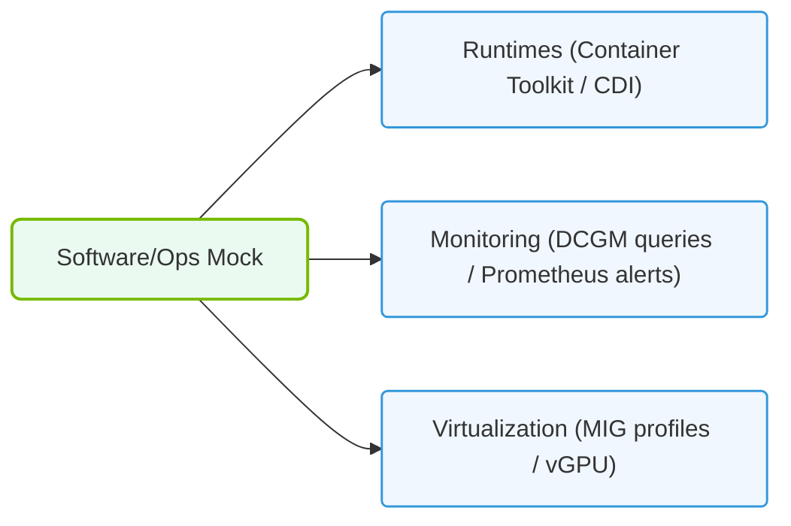

# 37.2b Mock Exam 2: Software and operations focus — containers, K8s, monitoring

#### 🏷️ The Exam Preparation & Certification Mastery > 37 Comprehensive Practice Assessments > 37.2 Three Full-Length Timed Mock Exams

Welcome to the second mock exam in our NVIDIA-Certified Associate preparation series. This assessment focuses on the software and operations side of AI infrastructure — specifically how containers, Kubernetes (K8s), and monitoring tools work together to manage AI workloads. If you're new to this field, think of this exam as a practical test of your ability to deploy, orchestrate, and observe AI applications in production environments.

---

## ⚙️ Exam Overview

This mock exam covers three core domains:

- **Containers** — Packaging AI models and dependencies into portable units
- **Kubernetes (K8s)** — Orchestrating containerized AI workloads at scale
- **Monitoring** — Tracking performance, resource usage, and health of AI systems

The exam consists of **50 multiple-choice questions** to be completed in **60 minutes**. Each question tests your understanding of how these technologies apply specifically to AI infrastructure operations.

---

## 📦 Container Concepts for AI Workloads

### 🐳 What Engineers Need to Know About Containers

Containers are lightweight, standalone packages that include everything needed to run an AI application: code, runtime, system tools, libraries, and settings. For AI workloads, containers solve the common problem of "it works on my machine" by ensuring consistent environments across development, testing, and production.

Key container concepts tested in this exam:

- **Container images** — Read-only templates that define the application and its dependencies
- **Container registries** — Storage locations for sharing and versioning images (e.g., NVIDIA NGC)
- **Dockerfiles** — Scripts that automate the creation of container images
- **GPU passthrough** — Enabling containers to access NVIDIA GPUs using the NVIDIA Container Toolkit
- **Multi-stage builds** — Creating smaller, more secure images by separating build and runtime environments

### 🛠️ Container Best Practices for AI

When preparing containers for AI workloads, engineers should:

- Use official base images from NVIDIA NGC for optimized GPU support
- Keep images small by removing unnecessary packages and using multi-stage builds
- Pin specific versions of CUDA, cuDNN, and TensorRT to ensure reproducibility
- Avoid running containers as root to improve security
- Use environment variables for configuration rather than hardcoding values

---

## ☸️ Kubernetes Orchestration for AI

### 🎯 Why Kubernetes Matters for AI Operations

Kubernetes (K8s) automates the deployment, scaling, and management of containerized applications. For AI workloads, K8s provides:

- **Automatic scheduling** — Placing containers on nodes with available GPU resources
- **Self-healing** — Restarting failed containers or replacing unhealthy pods
- **Horizontal scaling** — Adding or removing replicas based on workload demand
- **Resource management** — Allocating CPU, memory, and GPU resources to containers
- **Service discovery** — Enabling AI microservices to find and communicate with each other

### 📊 Key Kubernetes Objects for AI

This exam tests your understanding of these K8s objects:

| Object | Purpose | AI Use Case |
|--------|---------|-------------|
| **Pod** | Smallest deployable unit, runs one or more containers | Running a single inference model |
| **Deployment** | Manages replica sets and rolling updates | Updating model versions without downtime |
| **Service** | Provides stable network endpoint for pods | Exposing inference APIs |
| **ConfigMap** | Stores configuration data as key-value pairs | Model hyperparameters or environment settings |
| **Secret** | Stores sensitive data like API keys | Access credentials for model registries |
| **PersistentVolumeClaim** | Requests storage resources | Storing trained models or datasets |
| **HorizontalPodAutoscaler** | Automatically scales pods based on metrics | Scaling inference pods during traffic spikes |

### 🕵️ GPU Scheduling in Kubernetes

To run AI workloads on GPUs in K8s, engineers must:

- Install the NVIDIA device plugin on each GPU node
- Specify GPU resource requests in pod specifications
- Use node selectors or affinity rules to target GPU-enabled nodes
- Understand that GPU resources are not divisible — each pod requests whole GPUs

---

### 📊 Visual Representation: Mock Exam Software & Operations validation
This diagram maps software mock exams, auditing understanding of docker runtimes, DCGM, and Kubernetes Operators.

## 📈 Monitoring AI Infrastructure

### 🔍 What to Monitor in AI Operations

Effective monitoring ensures AI systems remain healthy, performant, and cost-efficient. This exam covers three monitoring layers:

**Infrastructure monitoring:**
- GPU utilization and memory usage
- CPU and RAM consumption
- Network throughput and latency
- Storage I/O and capacity

**Application monitoring:**
- Model inference latency (p50, p95, p99)
- Throughput (requests per second)
- Error rates and failure modes
- Model drift detection

**Cluster monitoring (K8s):**
- Pod health and restart counts
- Node resource pressure
- Service endpoint availability
- Horizontal pod autoscaler activity

### 🛠️ Monitoring Tools and Approaches

Engineers use these tools to collect and visualize metrics:

- **Prometheus** — Time-series database for collecting metrics from containers and K8s
- **Grafana** — Dashboarding tool for visualizing Prometheus data
- **NVIDIA DCGM** (Data Center GPU Manager) — Exposes GPU health and performance metrics
- **Kubernetes Dashboard** — Web UI for monitoring cluster resources
- **Custom metrics** — Application-specific metrics exposed via Prometheus client libraries

### 📊 Key Metrics to Understand

For the exam, focus on interpreting these common metrics:

- **GPU utilization** — Percentage of GPU compute capacity being used
- **GPU memory usage** — How much GPU memory is consumed by models
- **Pod restart count** — Indicates application crashes or resource exhaustion
- **Request latency** — Time taken to process an inference request
- **Error rate** — Percentage of failed inference requests

---

## 🧠 Sample Exam Questions (Conceptual)

Here are examples of the types of questions you'll encounter:

**Question 1:** An engineer deploys a containerized AI model on a Kubernetes cluster. The model requires a specific CUDA version. What is the best practice for ensuring the correct CUDA version is available?

**Answer:** Use an official NVIDIA NGC base image that includes the required CUDA version, and pin the image tag to a specific version in the deployment specification.

**Question 2:** A monitoring dashboard shows that GPU utilization is consistently below 30%, but GPU memory is at 90%. What does this indicate?

**Answer:** The model is memory-bound rather than compute-bound. The engineer may need to optimize model memory usage or consider using a smaller batch size.

**Question 3:** A Kubernetes pod running an inference service keeps restarting every few minutes. What monitoring metric would help diagnose the issue?

**Answer:** Check the pod restart count and container logs. Common causes include out-of-memory errors, application crashes, or failed health checks.

---

## ✅ Exam Preparation Tips

- **Practice with containers** — Build a simple container image for a PyTorch or TensorFlow model locally
- **Explore K8s basics** — Understand how to create deployments, services, and view pod logs
- **Learn monitoring fundamentals** — Familiarize yourself with Prometheus queries and Grafana dashboards
- **Review NVIDIA documentation** — Focus on the NVIDIA Container Toolkit and GPU operator for K8s
- **Take practice exams** — Use this mock exam to identify weak areas and revisit those topics

---

## 🔄 Next Steps

After completing this mock exam:

1. Review any questions you answered incorrectly
2. Revisit the corresponding sections in your study materials
3. Practice hands-on with containerized AI workloads on a local K8s cluster (like Minikube or kind)
4. Move on to **Mock Exam 3** for a comprehensive final assessment

Good luck with your preparation for the NVIDIA-Certified Associate certification!