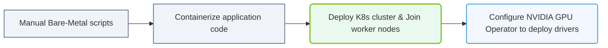

# 37.3c Case Study: Migrating a bare-metal AI cluster to Kubernetes with the GPU Operator

#### 🏷️ The Exam Preparation & Certification Mastery > 37 Comprehensive Practice Assessments > 37.3 Scenario-Based Questions and Case Studies

---

## 📖 Context Introduction

Imagine you're an engineer at a mid-sized AI research company. Your team has been running a **bare-metal AI cluster** — a handful of powerful servers with NVIDIA GPUs, each manually configured with drivers, CUDA libraries, and container runtimes. Training jobs are launched via SSH scripts, and managing GPU allocation is a headache. The company wants to **modernize** by migrating to **Kubernetes** for better scalability, resource sharing, and operational consistency. The key enabler? **NVIDIA's GPU Operator**, which automates GPU management inside Kubernetes.

This case study walks through the migration journey, the challenges faced, and how the GPU Operator simplifies the process.

---

## ⚙️ The Starting Point: Bare-Metal AI Cluster

Before migration, the cluster looked like this:

- **Hardware**: 4 physical servers, each with 4 NVIDIA A100 GPUs (16 GPUs total).
- **Software**: Ubuntu 20.04, NVIDIA drivers installed manually, CUDA 11.8, Docker CE, and `nvidia-docker2` runtime.
- **Workflow**: Engineers SSH into a "head node," write training scripts, and manually assign GPUs using `CUDA_VISIBLE_DEVICES`. Jobs are tracked via a shared spreadsheet.
- **Pain Points**:
  - No automated GPU scheduling — GPUs often sit idle while others are overcommitted.
  - Driver updates require downtime on each server.
  - No health monitoring for GPUs — failures are discovered only when a job crashes.
  - Scaling up means buying and manually configuring new hardware.

---

## 🛠️ The Migration Plan: From Bare-Metal to Kubernetes

The migration follows a phased approach:

### Phase 1: Kubernetes Cluster Setup
- Install a Kubernetes cluster (e.g., using **kubeadm** or a managed service) across the same 4 servers.
- Ensure each node has **NVIDIA drivers** pre-installed (temporary — the GPU Operator will manage this later).

### Phase 2: Install the GPU Operator
- The GPU Operator is deployed via **Helm** (a Kubernetes package manager).
- It automates:
  - **Driver installation** (if needed) via a DaemonSet.
  - **CUDA toolkit** and **container runtime** configuration.
  - **GPU monitoring** with DCGM (Data Center GPU Manager).
  - **GPU partitioning** (MIG — Multi-Instance GPU) for better utilization.

### Phase 3: Migrate Workloads
- Convert existing training scripts into **Kubernetes Pods** or **Jobs**.
- Use **NVIDIA device plugin** (part of the GPU Operator) to request GPUs via resource limits.
- Implement **Kubernetes Scheduler** to automatically assign GPUs to pods.

### Phase 4: Validation and Optimization
- Run a subset of training jobs to verify performance parity.
- Enable **GPU time-slicing** or **MIG** to share GPUs across multiple smaller jobs.
- Set up **Prometheus** and **Grafana** for GPU monitoring dashboards.

---

## 🕵️ Key Challenges and Solutions

| Challenge | Solution with GPU Operator |
|-----------|----------------------------|
| **Manual GPU driver management** | GPU Operator's **Node Feature Discovery** and **Driver DaemonSet** automatically install and upgrade drivers across all nodes. |
| **No GPU scheduling** | The **NVIDIA Device Plugin** registers GPUs as Kubernetes resources, allowing the scheduler to allocate them to pods. |
| **GPU sharing inefficiency** | **MIG support** partitions GPUs into smaller, isolated instances. **Time-slicing** allows multiple pods to share a single GPU. |
| **Lack of monitoring** | **DCGM Exporter** (deployed by the Operator) exposes GPU metrics (temperature, memory usage, power) to Prometheus. |
| **Container runtime mismatch** | The Operator configures **containerd** or **CRI-O** with the NVIDIA runtime, replacing the old `nvidia-docker2` setup. |

---

### 📊 Visual Representation: Bare-Metal to Kubernetes migration roadmap
This flowchart maps out a phased migration: transitioning from manual host runs to containerized K8s operators.

## 📊 Migration Workflow: Step-by-Step

1. **Backup existing data and models** from the bare-metal cluster.
2. **Install Kubernetes** on all nodes (control plane + workers).
3. **Label worker nodes** with GPU capability:
   - Apply a label like `nvidia.com/gpu.present=true` to each GPU node.
4. **Deploy the GPU Operator** using Helm:
   - The Operator creates DaemonSets for drivers, device plugin, and monitoring.
5. **Verify GPU discovery**:
   - Check that each node reports the correct number of GPUs via `kubectl describe node`.
6. **Migrate a sample training job**:
   - Create a Pod YAML that requests `nvidia.com/gpu: 1` under resources.
   - Run the job and confirm it uses the GPU.
7. **Scale up**:
   - Add more nodes to the cluster; the GPU Operator automatically configures them.
8. **Enable monitoring**:
   - Deploy Prometheus and Grafana, then import a DCGM dashboard.

---

## 🏁 Outcome and Benefits

After migration, the team experiences:

- **Automated GPU lifecycle management** — no more manual driver updates.
- **Better GPU utilization** — from ~40% to ~75% thanks to time-slicing and MIG.
- **Simplified scaling** — adding a new server takes minutes, not hours.
- **Centralized monitoring** — real-time GPU health and performance dashboards.
- **Job isolation** — Kubernetes namespaces prevent resource conflicts between teams.

---

## ✅ Key Takeaways for New Engineers

- The **GPU Operator** is not a single tool but a **suite of components** (driver, device plugin, monitoring, MIG manager) that work together.
- Migration is **incremental** — you don't need to move all workloads at once.
- **Testing** is critical: always validate GPU performance and memory bandwidth after migration.
- **Documentation** matters: keep a record of your cluster configuration, GPU Operator version, and Helm values for future upgrades.

---

## 🔍 Further Exploration

- Practice deploying the GPU Operator on a **local Kubernetes cluster** (e.g., using Minikube with GPU passthrough).
- Experiment with **MIG profiles** to understand how GPU partitioning affects training throughput.
- Study **Kubernetes resource quotas** to limit GPU usage per team or namespace.

---

*This case study reflects a common real-world scenario for the NVIDIA-Certified Associate exam. Focus on understanding the **why** behind each step, not just the commands.*