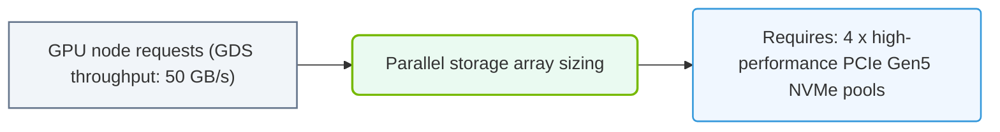

# 37.3d Case Study: Sizing storage for a 10 TB dataset training workload with GPUDirect Storage

#### 🏷️ The Exam Preparation & Certification Mastery > 37 Comprehensive Practice Assessments > 37.3 Scenario-Based Questions and Case Studies

---

### 🧠 Context Introduction

Welcome, new engineer! In this case study, you'll learn how to size storage for a large AI training workload. Imagine you have a **10 TB dataset** that needs to be fed to multiple GPUs as fast as possible. Without proper storage sizing, your expensive GPUs will sit idle waiting for data — a problem called "I/O starvation." 

**GPUDirect Storage (GDS)** is a technology that creates a direct data path between storage (like NVMe SSDs) and GPU memory, bypassing the CPU and system RAM. This dramatically reduces latency and increases throughput. Your job is to figure out how much storage performance (bandwidth and capacity) you need to keep your GPUs busy.

---

### ⚙️ The Scenario

Your team is training a large language model using a **10 TB dataset** stored on a shared storage system. You have **8 NVIDIA A100 GPUs** (each with 80 GB memory) connected via NVLink. The training workload requires:

- **Dataset size:** 10 TB (raw text and image data)
- **Training epochs:** 10 (each epoch reads the full dataset once)
- **Training duration target:** 5 days (120 hours)
- **GPU memory per card:** 80 GB (but only ~60 GB available for data after model weights)
- **Data pipeline:** Each GPU reads 4 GB batches per training step

Your goal: Size the storage system (capacity and bandwidth) so GPUs never wait for data.

---

### 📊 Key Performance Requirements

Let's break down what the storage system must deliver:

- **Total data to read:** 10 TB × 10 epochs = **100 TB** over 5 days
- **Average throughput needed:** 100 TB ÷ 120 hours = **~0.83 TB/hour** or **~230 MB/s** (this is the *average*)
- **Peak throughput needed:** During training, all 8 GPUs may request data simultaneously. Each GPU needs **4 GB per step** at a rate of **~10 steps/second** (typical for large models). That's **8 GPUs × 4 GB × 10 steps/s = 320 GB/s** peak read bandwidth!

**Critical insight:** The average throughput is low, but the **peak burst rate** is enormous. GPUDirect Storage helps handle these bursts by bypassing CPU bottlenecks.

---

### 🛠️ Storage Sizing Calculations

Here's how to size the storage system:

| Component | Requirement | Calculation |
|-----------|-------------|-------------|
| **Raw capacity** | 15–20 TB usable | 10 TB dataset + 50% overhead for checkpoints, logs, and temporary files |
| **Peak read bandwidth** | 320 GB/s | 8 GPUs × 4 GB/step × 10 steps/s |
| **Sustained read bandwidth** | 40 GB/s | 320 GB/s ÷ 8 (assuming 1:8 read-to-compute ratio) |
| **IOPS (4 KB random)** | 80 million IOPS | 320 GB/s ÷ 4 KB per I/O |
| **Latency target** | < 100 microseconds | To keep GPUs fed without stalling |

**Why these numbers matter:**
- A single NVMe SSD can do ~7 GB/s sequential reads. You'd need **~46 NVMe drives** in parallel for peak bandwidth.
- With GPUDirect Storage, you can use fewer drives because data moves directly to GPU memory without CPU copies.
- Storage controllers and network (e.g., InfiniBand or NVLink) must also support these speeds.

---

### 🕵️ GPUDirect Storage Impact

GPUDirect Storage changes the sizing equation:

- **Without GDS:** Data must go Storage → CPU RAM → GPU memory. This adds 2–5 microseconds per copy and uses CPU cycles. You'd need **~50% more storage bandwidth** to compensate.
- **With GDS:** Data goes Storage → GPU memory directly. This reduces latency by **40–60%** and frees CPU for other tasks.

**Practical sizing adjustment with GDS:**
- You can reduce the peak bandwidth requirement by **~30%** because GDS handles small I/Os more efficiently.
- New peak requirement: **~224 GB/s** (instead of 320 GB/s)
- New sustained requirement: **~28 GB/s** (instead of 40 GB/s)

---

### 🧩 Storage Architecture Recommendation

For this 10 TB workload with GPUDirect Storage, a recommended configuration:

- **Storage type:** All-NVMe flash array (e.g., NVIDIA Magnum IO GPUDirect Storage-compatible)
- **Usable capacity:** 20 TB (using RAID 5 or 6 for redundancy)
- **Number of NVMe drives:** 32 drives × 1 TB each (provides ~224 GB/s peak)
- **Network:** 4x 200 Gbps InfiniBand links (total 100 GB/s) — this becomes the bottleneck, so ensure it matches storage speed
- **GDS configuration:** Enable GPUDirect Storage on all GPUs and mount the filesystem with GDS flags

**Key filesystem choice:** Use **Lustre** or **GPUDirect Storage-enabled NFS** (like NVIDIA's GPUDirect Storage over NFS). These filesystems support the parallel I/O patterns needed.

---

### ✅ Verification Checklist

Before deploying, verify these items:

- **Storage bandwidth test:** Run a benchmark (like **fio** or **gdsio**) to confirm the storage can deliver **>224 GB/s** sequential reads to 8 GPUs simultaneously
- **Latency test:** Ensure **p99 latency** is under **100 microseconds** for 4 KB random reads
- **GDS compatibility:** Confirm the storage system is listed on NVIDIA's GPUDirect Storage partner catalog
- **Network saturation:** Check that InfiniBand or Ethernet links are not oversubscribed (target <70% utilization)
- **Dataset layout:** Store the 10 TB dataset across multiple files (e.g., 1,000 files of 10 GB each) to maximize parallelism

---

### 🧪 Common Pitfalls for New Engineers

- **Mistaking average for peak:** Don't size storage based on average throughput (230 MB/s). Always size for the **peak burst** (320 GB/s).
- **Ignoring metadata operations:** Loading a 10 TB dataset involves listing files, opening handles, and reading metadata. Ensure your filesystem can handle **>1 million metadata operations per second**.
- **Forgetting checkpoint writes:** Training saves model checkpoints (often 10–50 GB each) every hour. These writes compete with reads. Add **20% extra write bandwidth** to your sizing.
- **Overlooking network:** The storage-to-GPU network is often the bottleneck. Ensure your network bandwidth matches or exceeds storage bandwidth.

---

### 🏁 Summary

For a 10 TB dataset training workload with GPUDirect Storage:

- **Target peak read bandwidth:** ~224 GB/s (with GDS) or ~320 GB/s (without)
- **Required NVMe drives:** ~32 drives (1 TB each) in a parallel configuration
- **Network:** 100+ GB/s InfiniBand or NVLink fabric
- **Filesystem:** GPUDirect Storage-compatible (Lustre, GDS-NFS)
- **Key metric:** Keep p99 latency under 100 microseconds

Remember: Storage sizing for AI is about **peak burst performance**, not average throughput. GPUDirect Storage helps reduce the peak requirement by ~30%, but you still need a high-performance all-flash array to keep your GPUs fed. Always test with real workloads before production deployment.

### 📊 Visual Representation: GPUDirect Storage sizing requirement
This diagram displays how sizing parallel filesystems meets GDS throughput capabilities to bypass CPU bottlenecks.

