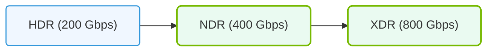

# 38.1c InfiniBand speed tiers: HDR/NDR bandwidth and port configuration table

#### 🏷️ The Exam Preparation & Certification Mastery > 38 Reference Appendices and Quick-Reference Guides > 38.1 Hardware Quick Reference

---

## 🔍 Context Introduction

InfiniBand is a high-speed, low-latency interconnect technology widely used in AI and high-performance computing (HPC) clusters. For engineers new to AI infrastructure, understanding the speed tiers—specifically HDR (High Data Rate) and NDR (Next Data Rate)—is essential for designing and operating efficient GPU clusters. This guide breaks down the bandwidth capabilities and port configurations of these two key InfiniBand generations in a simple, easy-to-digest format.

---

## ⚙️ What Are HDR and NDR?

- **HDR (High Data Rate)** – The previous-generation InfiniBand standard, offering up to **200 Gbps** per port (bidirectional).
- **NDR (Next Data Rate)** – The current-generation standard, delivering up to **400 Gbps** per port (bidirectional), effectively doubling HDR's throughput.
- Both technologies use **switched fabric** topologies to connect GPUs, storage, and servers in AI clusters.

---

## 📊 Bandwidth Comparison Table

| Feature | HDR (200 Gbps) | NDR (400 Gbps) |
|------------------------|--------------------------|--------------------------|
| **Single-port bandwidth** | 200 Gbps (25 GB/s) | 400 Gbps (50 GB/s) |
| **Bidirectional bandwidth** | 400 Gbps (50 GB/s) | 800 Gbps (100 GB/s) |
| **Typical port count per switch** | 36 or 40 ports | 32 or 64 ports |
| **Cable type** | QSFP56 (copper or optical) | QSFP-DD (copper or optical) |
| **Latency** | ~0.6 µs (switch) | ~0.5 µs (switch) |
| **Backward compatibility** | Yes (with slower devices) | Yes (with HDR via adapters) |

---

### 📊 Visual Representation: InfiniBand speed generation progression
This diagram displays InfiniBand speed progression, showing transitions from HDR (200Gbps) to NDR (400Gbps) and XDR (800Gbps).

## 🛠️ Port Configuration Examples

### HDR (200 Gbps) Port Configurations

- **HDR100** – A single 100 Gbps lane (half of full HDR). Often used for cost-sensitive nodes.
- **HDR200** – Full 200 Gbps per port. Common in high-end GPU servers (e.g., NVIDIA DGX A100).
- **Switch example:** A 40-port HDR switch provides **8 Tbps** aggregate switching capacity (40 ports × 200 Gbps).

### NDR (400 Gbps) Port Configurations

- **NDR200** – A single 200 Gbps lane (half of full NDR). Used for bridging to HDR infrastructure.
- **NDR400** – Full 400 Gbps per port. Standard for NVIDIA DGX H100/H200 and newer systems.
- **Switch example:** A 64-port NDR switch provides **25.6 Tbps** aggregate switching capacity (64 ports × 400 Gbps).

---

## 🕵️ Key Considerations for New Engineers

- **Bandwidth per GPU:** Each GPU in a DGX system typically requires one HDR or NDR port. For example, a DGX H100 with 8 GPUs uses 8 NDR400 ports.
- **Cable lengths:** Copper cables are limited to ~3–5 meters; optical cables can reach 100+ meters. NDR often requires optical for longer distances.
- **Port speed negotiation:** InfiniBand switches automatically negotiate the highest common speed. Mixing HDR and NDR devices will run at the slower tier.
- **Power and cooling:** NDR switches consume more power (~500–800W per switch) than HDR (~300–500W). Plan rack cooling accordingly.

---

## 📈 Quick Reference: Port Configuration Table

| Tier | Port Speed | Typical Switch Ports | Aggregate Switch Bandwidth | Common Use Case |
|------------|----------------|--------------------------|-------------------------------|------------------------------|
| HDR100 | 100 Gbps | 36–40 | 3.6–4 Tbps | Entry-level AI clusters |
| HDR200 | 200 Gbps | 36–40 | 7.2–8 Tbps | Mid-range AI clusters |
| NDR200 | 200 Gbps | 32–64 | 6.4–12.8 Tbps | Mixed HDR/NDR environments |
| NDR400 | 400 Gbps | 32–64 | 12.8–25.6 Tbps | High-end AI training clusters |

---

## ✅ Summary

- **HDR** provides 200 Gbps per port; **NDR** doubles that to 400 Gbps.
- Port configurations vary by switch model (e.g., 36-port HDR vs. 64-port NDR).
- Always match cable types and lengths to your cluster's physical layout.
- For certification, remember the key bandwidth numbers: HDR = 200 Gbps, NDR = 400 Gbps, and their aggregate switch capacities.

> 💡 **Tip:** When studying for the NVIDIA-Certified Associate exam, focus on the bandwidth doubling from HDR to NDR and the typical port counts for each tier. This will help you quickly answer questions about cluster design and performance.