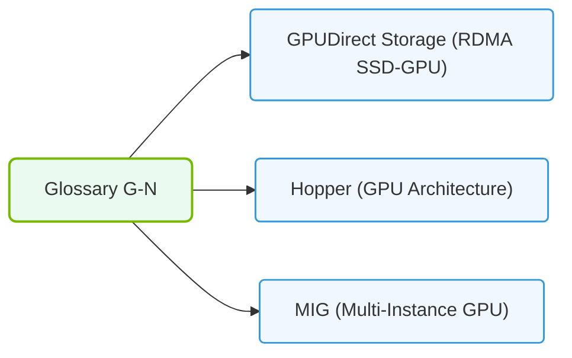

# 38.3b G–N: GEMM, GPUDirect, HBM, HCA, Hopper, InfiniBand, MIG, MPS, NCCL, NVLink, NVSwitch...

#### 🏷️ The Exam Preparation & Certification Mastery > 38 Reference Appendices and Quick-Reference Guides > 38.3 Glossary of All Terms

Welcome, new engineers! This section breaks down key terms from G through N that you'll encounter when working with NVIDIA AI infrastructure. These concepts form the backbone of how GPUs compute, communicate, and scale in modern AI workloads. Think of this as your quick-reference dictionary for the NVIDIA-Certified Associate exam.

---

### ⚙️ GEMM (General Matrix Multiply)

**What it is:** The fundamental mathematical operation at the heart of neural network training and inference. GEMM multiplies two matrices together (C = A × B + C).

**Why it matters for engineers:**
- **Performance bottleneck:** Most deep learning operations (fully connected layers, convolutions) are implemented as GEMM operations.
- **GPU optimization:** NVIDIA GPUs have specialized hardware (Tensor Cores) designed specifically to accelerate GEMM.
- **Precision flexibility:** GEMM can run in FP32, FP16, BF16, INT8, and FP8 formats, trading accuracy for speed.

**Key takeaway:** When you hear "optimizing for GEMM," it means tuning how efficiently the GPU performs matrix multiplications — the single most common operation in AI.

---

### 🚀 GPUDirect

**What it is:** A family of technologies that allows data to move directly between GPUs, or between GPUs and other devices (like network adapters or storage), without passing through the CPU or system memory.

**Three main flavors:**

- **GPUDirect Peer-to-Peer (P2P):** Two GPUs on the same node communicate directly over PCIe or NVLink.
- **GPUDirect RDMA (Remote Direct Memory Access):** A GPU on one server reads/writes data directly to/from a GPU on another server over the network (InfiniBand or RoCE).
- **GPUDirect Storage:** Data flows directly from NVMe storage into GPU memory, bypassing the CPU and system RAM.

**Why it matters:** Reduces latency, lowers CPU overhead, and increases bandwidth for distributed training.

---

### 🧠 HBM (High Bandwidth Memory)

**What it is:** A specialized type of memory stacked directly on or near the GPU die, providing extremely high bandwidth compared to traditional GDDR memory.

**Key characteristics:**

| Feature | HBM (e.g., HBM2e, HBM3) | Traditional GDDR (e.g., GDDR6) |
|---------|--------------------------|--------------------------------|
| **Bandwidth** | Very high (2–3 TB/s+) | Moderate (500–900 GB/s) |
| **Capacity per stack** | Lower (typically 8–80 GB total) | Higher (up to 48 GB per card) |
| **Physical design** | 3D stacked dies | 2D memory chips on PCB |
| **Power efficiency** | Better per bit transferred | Less efficient |
| **Primary use** | AI training, HPC | Gaming, inference |

**Why it matters:** AI models need to move massive amounts of data between memory and compute units. HBM's high bandwidth ensures the GPU cores aren't starved for data.

---

### 🌐 HCA (Host Channel Adapter)

**What it is:** A network interface card (NIC) designed for high-performance computing networks like InfiniBand. Think of it as a supercharged Ethernet card.

**Key points:**
- **Connects servers** to the InfiniBand fabric (switch network).
- **Offloads networking tasks** from the CPU (RDMA, protocol processing).
- **Supports GPUDirect RDMA** — data flows directly from GPU memory to the HCA and onto the network.

**Common examples:** NVIDIA ConnectX-7, ConnectX-8 adapters.

---

### 🏗️ Hopper (NVIDIA GPU Architecture)

**What it is:** The GPU architecture powering NVIDIA H100 (and H200) GPUs, released in 2022. It's the successor to Ampere (A100).

**Key innovations for engineers:**
- **Transformer Engine:** Dynamically chooses between FP8 and FP16 precision for each layer, accelerating transformer models (like GPT, BERT).
- **DPX Instructions:** Hardware acceleration for dynamic programming algorithms (used in genomics, path planning).
- **Confidential Computing:** Hardware-based isolation for sensitive workloads.
- **NVLink Switch System:** Connects up to 256 H100 GPUs in a single logical cluster.

**Why it matters:** Hopper was designed specifically for large language models (LLMs) and generative AI.

---

### 🔗 InfiniBand

**What it is:** A high-speed, low-latency networking technology used to connect servers in AI and HPC clusters.

**Comparison with Ethernet:**

| Feature | InfiniBand | Ethernet (RoCE v2) |
|---------|------------|---------------------|
| **Latency** | Extremely low (sub-microsecond) | Low (few microseconds) |
| **Bandwidth** | Up to 400/800 Gbps per port | Up to 400/800 Gbps |
| **Flow control** | Lossless by design | Requires additional configuration |
| **RDMA support** | Native | Supported via RoCE |
| **Ecosystem** | NVIDIA/Mellanox | Broad vendor support |
| **Cost** | Higher | Lower |

**Why it matters:** For distributed training across hundreds or thousands of GPUs, InfiniBand provides the deterministic, lossless, low-latency fabric that keeps all GPUs synchronized.

---

### 🧩 MIG (Multi-Instance GPU)

**What it is:** A technology that partitions a single physical GPU into multiple smaller, isolated GPU instances. Each instance has dedicated memory, cache, and compute units.

**Key points:**
- **Available on:** A100, H100, and newer data center GPUs.
- **Use case:** Running multiple smaller workloads (inference, training) on one GPU without interference.
- **Isolation:** Each MIG instance is hardware-separated — one workload cannot see or affect another.
- **Granularity:** H100 supports up to 7 MIG instances (e.g., 1g.10gb, 2g.20gb, 3g.40gb profiles).

**Example scenario:** Instead of buying 7 small GPUs, you buy one H100 and split it into 7 MIG instances for serving 7 different models.

---

### 🔄 MPS (Multi-Process Service)

**What it is:** A software layer that allows multiple CPU processes to share a single GPU, improving utilization and reducing memory duplication.

**Key differences from MIG:**

| Feature | MIG | MPS |
|---------|-----|-----|
| **Isolation level** | Hardware (physical partitioning) | Software (logical sharing) |
| **Memory protection** | Full hardware isolation | Shared memory space |
| **Performance isolation** | Guaranteed | Best-effort |
| **Flexibility** | Fixed partition sizes | Dynamic sharing |
| **Use case** | Multi-tenant, security-critical | Single-user, multiple processes |

**Why it matters:** MPS is useful when you have multiple small processes (e.g., data preprocessing, inference requests) that don't need full hardware isolation.

---

### 🤝 NCCL (NVIDIA Collective Communications Library)

**What it is:** A library that implements multi-GPU and multi-node communication primitives optimized for NVIDIA GPUs.

**Common operations (collectives):**
- **AllReduce:** Sums gradients across all GPUs and distributes the result back to each GPU (used in data-parallel training).
- **AllGather:** Collects data from all GPUs and distributes the full collection to each GPU.
- **ReduceScatter:** Sums data across GPUs, then scatters portions back.
- **Broadcast:** Sends data from one GPU to all others.

**Why it matters:** Without NCCL, engineers would have to write custom networking code for distributed training. NCCL automatically selects the fastest path (NVLink, InfiniBand, PCIe) for each communication.

**Example usage (conceptual):**
- A training script calls `torch.distributed.all_reduce()`.
- Under the hood, PyTorch uses NCCL to perform the operation across all GPUs.

---

### 🔌 NVLink

**What it is:** A high-speed, direct GPU-to-GPU interconnect that provides much higher bandwidth than PCIe.

**Key facts:**
- **Bandwidth:** H100 NVLink provides 900 GB/s total bidirectional bandwidth per GPU (18 links × 50 GB/s each).
- **Topology:** GPUs connect in a mesh or hybrid cube-mesh topology within a single server (typically 8 GPUs).
- **Comparison to PCIe:** NVLink is 5–10x faster than PCIe Gen5 for GPU-to-GPU traffic.

**Why it matters:** When training large models, GPUs need to share gradients and activations constantly. NVLink makes this nearly as fast as accessing local memory.

---

### 🔗 NVSwitch

**What it is:** A dedicated switch chip that connects multiple NVLinks together, allowing all GPUs in a system to communicate at full bandwidth simultaneously.

**How it works:**
- **Within a server:** An NVSwitch connects 8 H100 GPUs in a full non-blocking topology — every GPU can talk to every other GPU at full NVLink speed.
- **Across servers:** NVLink Switch Systems connect up to 256 H100 GPUs across multiple servers, creating a single large GPU pool.

**Why it matters:** Without NVSwitch, GPU communication would be limited by the number of NVLinks per GPU. With NVSwitch, you get a fully connected fabric where bandwidth scales linearly with the number of GPUs.

---

### 📊 Quick Reference Comparison Table

| Term | Category | Key Function | Where You'll See It |
|------|----------|--------------|---------------------|
| **GEMM** | Computation | Matrix multiplication | Every neural network layer |
| **GPUDirect** | Data movement | Bypass CPU for GPU I/O | Distributed training, storage |
| **HBM** | Memory | High-bandwidth GPU memory | GPU specs (e.g., H100 has 80GB HBM3) |
| **HCA** | Networking | InfiniBand adapter | Server network ports |
| **Hopper** | Architecture | GPU generation (H100) | GPU model names |
| **InfiniBand** | Networking | High-speed fabric | Cluster interconnect |
| **MIG** | Partitioning | Hardware GPU slicing | Multi-tenant GPU servers |
| **MPS** | Sharing | Software GPU sharing | Single-user multi-process |
| **NCCL** | Library | Multi-GPU communication | Training scripts, `torch.distributed` |
| **NVLink** | Interconnect | Direct GPU-to-GPU link | Inside GPU servers |
| **NVSwitch** | Fabric | Full-bandwidth GPU switching | Large GPU clusters |

---

### 🕵️ Final Tips for New Engineers

1. **Start with the data flow:** Trace how data moves from storage → CPU → GPU memory → compute → network → other GPUs. Each term above plays a role in that journey.
2. **Remember the bottlenecks:** AI training is usually limited by either compute (GEMM), memory bandwidth (HBM), or communication (NCCL/InfiniBand). Identify which one is your constraint.
3. **Know your tools:** `nvidia-smi` shows GPU memory and MIG partitions. `nvidia-smi topo -m` shows NVLink topology. `ibstatus` shows InfiniBand link state.
4. **Think in layers:** Hardware (Hopper, HBM, NVLink) → System software (NCCL, GPUDirect) → Application (PyTorch, TensorFlow). Problems can exist at any layer.

Good luck with your certification journey — these terms will become second nature as you work with AI infrastructure!

### 📊 Visual Representation: Glossary terms mapping (G to N)
This diagram displays how core glossary terms (GDS, H100, InfiniBand, MIG) relate to GPU systems.

