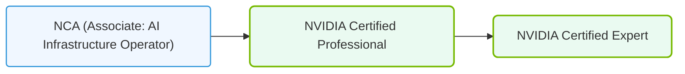

# 38.4d Post-NCA-AIIO certification roadmap: NVIDIA Certified Professional (NCP) tracks

#### 🏷️ The Exam Preparation & Certification Mastery > 38 Reference Appendices and Quick-Reference Guides > 38.4 Recommended Learning Resources and Certification Next Steps

Congratulations on earning your NVIDIA-Certified Associate: AI Infrastructure and Operations (NCA-AIIO) certification! This milestone demonstrates your foundational understanding of AI infrastructure, GPU-accelerated computing, and operational best practices. Now, it's time to plan your next steps toward becoming an NVIDIA Certified Professional (NCP). This guide outlines the available NCP tracks, helping you choose a specialization that aligns with your career goals.

---

## 🎯 Why Pursue an NCP Certification?

- **Deepen Expertise:** Move beyond foundational knowledge into specialized, hands-on skills.
- **Validate Advanced Skills:** Prove your ability to design, deploy, and manage complex AI solutions.
- **Career Advancement:** Stand out to employers seeking professionals with verified NVIDIA expertise.
- **Stay Current:** Align with industry trends in AI, data science, and accelerated computing.

---

## 🗺️ Overview of NCP Tracks

NVIDIA offers several NCP certification tracks, each focusing on a distinct domain. As an engineer with an NCA-AIIO background, you are well-positioned to choose one of the following paths:

| NCP Track | Focus Area | Ideal For |
|-----------|------------|-----------|
| **NCP – AI Infrastructure** | Designing and managing large-scale AI data centers, cluster deployment, and performance optimization. | Engineers working with multi-node GPU clusters and enterprise AI workloads. |
| **NCP – Data Science** | Building, training, and deploying machine learning models using NVIDIA tools like RAPIDS and CUDA. | Engineers focused on data pipelines, model development, and MLOps. |
| **NCP – Networking** | Configuring and optimizing high-performance networks (e.g., InfiniBand, RoCE) for AI workloads. | Engineers specializing in network architecture for distributed training. |
| **NCP – Edge Computing** | Deploying AI inference at the edge using NVIDIA Jetson and EGX platforms. | Engineers working on IoT, robotics, or real-time AI applications. |

---

## 📘 Track 1: NCP – AI Infrastructure

### ⚙️ What You Will Learn
- Advanced cluster management with NVIDIA Base Command Manager.
- GPU resource scheduling and multi-tenant isolation.
- Performance tuning for large-scale training and inference.
- Troubleshooting common infrastructure bottlenecks.

### 🛠️ Key Skills Gained
- Deploying and managing NVIDIA DGX systems.
- Configuring storage and networking for AI workloads.
- Monitoring cluster health and optimizing power/thermal profiles.

### 🕵️ Recommended Next Steps
- Complete the **NVIDIA DGX Foundations** and **NVIDIA AI Enterprise** courses.
- Practice with **NVIDIA Base Command Manager** in a lab environment.
- Review case studies on large-scale AI deployments.

---

## 📊 Track 2: NCP – Data Science

### ⚙️ What You Will Learn
- Accelerating data processing with RAPIDS cuDF and cuML.
- Building end-to-end ML pipelines using NVIDIA Triton Inference Server.
- Optimizing model training with CUDA and cuDNN.
- Implementing MLOps practices for model versioning and monitoring.

### 🛠️ Key Skills Gained
- Writing GPU-accelerated Python code for data science.
- Deploying models for low-latency inference.
- Using NVIDIA Nsight tools for performance profiling.

### 🕵️ Recommended Next Steps
- Take the **NVIDIA RAPIDS Accelerator** and **Triton Inference Server** courses.
- Build a sample project: train a model on a GPU-enabled Jupyter notebook.
- Experiment with **NVIDIA Nsight Systems** to profile your code.

---

### 📊 Visual Representation: NVIDIA Certification career roadmap
This diagram maps career progression: advancing from NCA Associate levels to Professional and Expert certifications.

## 🌐 Track 3: NCP – Networking

### ⚙️ What You Will Learn
- Designing high-speed interconnects (InfiniBand, RoCE v2) for AI clusters.
- Configuring NVIDIA Mellanox switches and adapters.
- Optimizing network topology for collective communication (e.g., NCCL).
- Troubleshooting latency and bandwidth issues.

### 🛠️ Key Skills Gained
- Setting up RDMA and GPUDirect for peer-to-peer GPU communication.
- Monitoring network performance with **UFM (Unified Fabric Manager)** .
- Implementing congestion control and load balancing.

### 🕵️ Recommended Next Steps
- Complete the **NVIDIA Networking Fundamentals** and **InfiniBand for AI** courses.
- Practice configuring a small InfiniBand fabric in a virtual lab.
- Study NCCL performance benchmarks and best practices.

---

## 🤖 Track 4: NCP – Edge Computing

### ⚙️ What You Will Learn
- Deploying AI models on NVIDIA Jetson modules (e.g., Jetson Orin, Xavier).
- Optimizing inference for power-constrained environments.
- Integrating edge devices with cloud-based AI pipelines.
- Using NVIDIA DeepStream for video analytics.

### 🛠️ Key Skills Gained
- Flashing and configuring Jetson devices.
- Running containerized AI applications with **NVIDIA JetPack**.
- Implementing real-time object detection and classification at the edge.

### 🕵️ Recommended Next Steps
- Take the **NVIDIA Jetson AI Specialist** and **DeepStream SDK** courses.
- Build a simple edge AI project (e.g., a smart camera with object detection).
- Explore **NVIDIA Isaac** for robotics applications.

---

## 📈 How to Choose Your Track

Consider the following questions to guide your decision:

- **What excites you most?** Large-scale systems (Infrastructure), data pipelines (Data Science), network design (Networking), or real-time devices (Edge)?
- **What is your current role?** Align with your daily tasks to maximize learning impact.
- **What are your career goals?** Infrastructure roles often lead to data center management; Data Science roles lead to ML engineering; Networking roles lead to HPC architecture; Edge roles lead to IoT/robotics.

---

## 🚀 Your Post-NCA-AIIO Action Plan

1. **Review the NCP exam blueprints** on the NVIDIA certification portal.
2. **Enroll in recommended training courses** (many are free on the NVIDIA Developer site).
3. **Set up a lab environment** using NVIDIA LaunchPad or cloud GPU instances.
4. **Join the NVIDIA Developer community** for study groups and forums.
5. **Schedule your NCP exam** once you feel confident in the chosen track.

---

## ✅ Final Thoughts

The NCA-AIIO certification is your launchpad. Each NCP track builds on that foundation, offering a clear path to specialization. Whether you choose to optimize massive AI clusters, accelerate data science workflows, design high-performance networks, or deploy intelligent edge devices, NVIDIA provides the tools, training, and certification to validate your expertise.

Best of luck on your journey to becoming an NVIDIA Certified Professional!