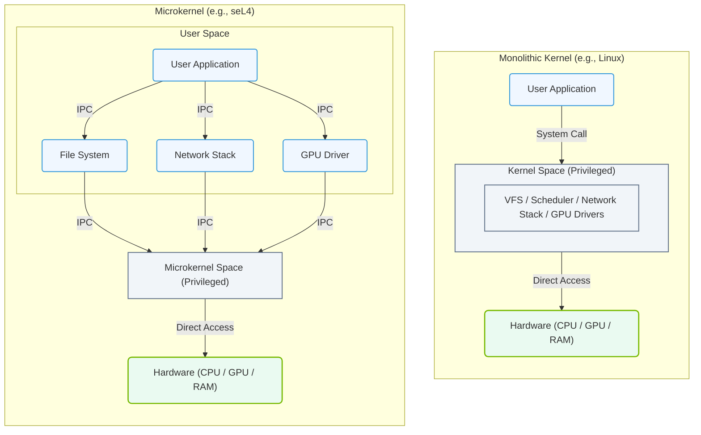

# 3.1b Monolithic vs. microkernel architectures

#### 🏷️ The Operating System Layer — Linux for AI Infrastructure Operators > 3 Linux System Fundamentals — The OS From the Ground Up > 3.1 What Is an Operating System? Kernel vs. User Space

---

## 🧭 Context Introduction

When you start working with AI infrastructure, you'll hear about the "kernel" — the core of an operating system that manages everything from memory to hardware. But not all kernels are built the same way. Two major design philosophies exist: **monolithic** and **microkernel** architectures. Understanding the difference helps you appreciate why Linux (a monolithic kernel) dominates AI infrastructure, and when you might encounter microkernel-based systems.

Think of it like a workshop:
- **Monolithic kernel** = one big toolbox where everything is tightly connected and runs in the same space.
- **Microkernel** = a small central toolbox with separate specialized tool sheds that communicate through messengers.

---

## ⚙️ What Is a Kernel Architecture?

A kernel architecture defines how the operating system's core services (like process management, memory management, device drivers, and file systems) are organized and how they interact with hardware and user applications.

The two main approaches are:

- **Monolithic kernel** — All core services run in kernel space (privileged mode) as a single large process.
- **Microkernel** — Only the most essential services (like inter-process communication and basic scheduling) run in kernel space; everything else runs in user space as separate processes.

---

## 🏗️ Monolithic Kernel Architecture

### Key Characteristics

- **Single address space** — All kernel components share the same memory space, making communication between them very fast.
- **Tight integration** — Device drivers, file systems, and networking stacks all run inside the kernel.
- **High performance** — Because components don't need to switch between kernel and user space for internal communication.
- **Larger kernel size** — More code runs in privileged mode, increasing the kernel's memory footprint.

### ✅ Advantages

- **Speed** — Direct function calls between components are extremely fast.
- **Efficient resource management** — Shared memory space reduces overhead.
- **Mature ecosystem** — Linux, the most widely used monolithic kernel, has decades of optimization.
- **Rich feature set** — Everything is built-in and readily available.

### ❌ Disadvantages

- **Less fault isolation** — A bug in one driver can crash the entire system.
- **Larger attack surface** — More code running in kernel space means more potential vulnerabilities.
- **Harder to extend** — Adding new features often requires modifying the kernel itself.
- **Less modular** — Updating one component may require recompiling the entire kernel.

### 📌 Real-World Example: Linux

Linux is the most famous monolithic kernel. It powers:
- Most AI training clusters and data centers
- Cloud platforms (AWS, GCP, Azure)
- Embedded systems and Android
- Supercomputers

---

## 🧩 Microkernel Architecture

### Key Characteristics

- **Minimal kernel** — Only essential services (like inter-process communication, basic scheduling, and memory management) run in kernel space.
- **User-space services** — Device drivers, file systems, networking stacks, and other services run as separate user-space processes.
- **Message passing** — Components communicate through explicit messages, not direct function calls.
- **Small kernel size** — The kernel itself is tiny, often just a few thousand lines of code.

### ✅ Advantages

- **Fault isolation** — A crash in a driver or service doesn't bring down the whole system; you can restart that service.
- **Security** — Smaller attack surface; components are isolated from each other.
- **Modularity** — Easy to add, remove, or update services without touching the kernel.
- **Portability** — Easier to port to new hardware because the kernel is minimal.

### ❌ Disadvantages

- **Performance overhead** — Message passing between user-space components is slower than direct function calls.
- **Complexity** — Designing and debugging inter-process communication can be challenging.
- **Less mature** — Fewer production-ready microkernel systems exist compared to monolithic kernels.
- **Higher latency** — Context switching between user and kernel space adds delay.

### 📌 Real-World Examples

- **Minix** — Educational microkernel that inspired Linux
- **QNX** — Used in real-time systems (cars, medical devices)
- **seL4** — High-assurance microkernel for security-critical systems
- **macOS/iOS (XNU)** — Hybrid kernel with microkernel-like features

---

## 📊 Comparison Table: Monolithic vs. Microkernel

| Feature | Monolithic Kernel | Microkernel |
|---------|------------------|-------------|
| **Kernel size** | Large | Small |
| **Performance** | High (direct calls) | Lower (message passing) |
| **Fault isolation** | Poor (one crash = system crash) | Excellent (services can restart) |
| **Security** | Larger attack surface | Smaller attack surface |
| **Modularity** | Low (tightly coupled) | High (loosely coupled) |
| **Development complexity** | Simpler internally | More complex IPC design |
| **Maturity** | Very mature (Linux, BSD) | Less mature (QNX, seL4) |
| **Use in AI infrastructure** | Dominant (Linux) | Rare (specialized cases) |

### 📊 Visual Architecture: Monolithic vs. Microkernel Structures

This structural diagram contrasts a monolithic kernel (where all OS services reside in a single privileged memory space) with a microkernel (which keeps only critical services in kernel space, running drivers and file systems in user space).

---

## 🛠️ Why This Matters for AI Infrastructure

### For Engineers Working with AI Infrastructure

- **Linux (monolithic) is your default** — Almost all AI frameworks (TensorFlow, PyTorch, CUDA) are built and tested on Linux. You'll rarely encounter microkernels in production AI environments.
- **Performance is critical** — AI workloads are compute- and I/O-intensive. Monolithic kernels give you the raw speed needed for GPU communication, data loading, and model training.
- **Fault tolerance comes from redundancy** — In AI clusters, you handle failures at the hardware or application level (e.g., checkpointing, redundant nodes), not by isolating kernel components.
- **Driver support** — NVIDIA GPU drivers, InfiniBand, and high-speed networking all rely on monolithic kernel integration for maximum performance.

### When Microkernels Might Appear

- **Embedded AI** — Edge devices or IoT systems may use microkernels for safety-critical applications (e.g., autonomous vehicles with QNX).
- **Security-sensitive environments** — Systems requiring formal verification (like seL4) for military or aerospace AI.
- **Research** — Some academic projects explore microkernel-based AI accelerators.

---

## 🕵️ Key Takeaway for New Engineers

> **For AI infrastructure, monolithic kernels (specifically Linux) are the industry standard. Microkernels are an important architectural concept to understand, but you'll almost always work with Linux in production.**

Focus your learning on:
- Linux kernel fundamentals (process management, memory management, file systems)
- How Linux handles device drivers (especially NVIDIA GPUs)
- Performance tuning for AI workloads (CPU pinning, huge pages, I/O scheduling)

Understanding the monolithic vs. microkernel distinction helps you appreciate *why* Linux is designed the way it is — and why it's the right choice for AI infrastructure.

---

## 📚 Further Exploration (Optional)

If you want to dive deeper:
- Read about **Linus Torvalds' famous debate with Andrew Tanenbaum** about monolithic vs. microkernel design (a classic in OS history).
- Explore **QNX** documentation to see how a microkernel handles real-time AI inference in vehicles.
- Look at **seL4** for an example of formally verified microkernel security.