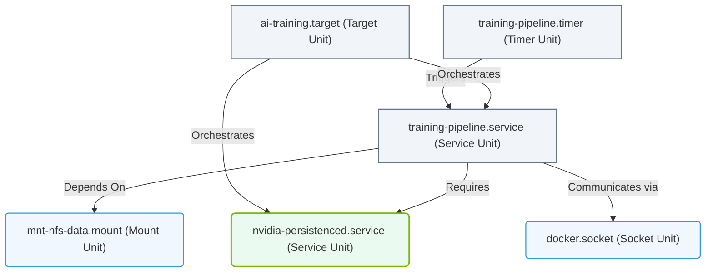

# 3.4a Units: service, socket, target, mount, timer — the systemd object model

#### 🏷️ The Operating System Layer — Linux for AI Infrastructure Operators > 3 Linux System Fundamentals — The OS From the Ground Up > 3.4 systemd — Deep Dive into Modern Service Management

## 🔍 Context Introduction

In modern Linux systems, **systemd** is the core system and service manager that controls how processes start, run, and stop. For engineers working with AI infrastructure, understanding systemd is essential because it manages everything from GPU drivers to training jobs, monitoring agents, and data pipelines.

At the heart of systemd lies the concept of **units**. A unit is simply a resource that systemd knows how to manage. Each unit type has a specific purpose, and together they form a complete object model for controlling your AI infrastructure.

---

## ⚙️ What Are systemd Units?

Think of systemd units as **configuration objects** — each one describes a resource, how it should behave, and when it should run. Every unit is defined in a file (usually located in `/etc/systemd/system/` or `/lib/systemd/system/`) with a specific extension that tells systemd what type it is.

Key characteristics of units:
- Each unit has a **name** and a **type** (e.g., `nvidia-persistenced.service`)
- Units can have **dependencies** on other units
- Units can be **started, stopped, enabled, or disabled**
- Units can be **grouped** into targets for coordinated startup

---

## 🧩 The Five Essential Unit Types

For AI infrastructure operations, these five unit types are the most important to understand:

| Unit Type | File Extension | Purpose | AI Infrastructure Example |
|-----------|---------------|---------|--------------------------|
| **Service** | `.service` | Manages a daemon or process | `nvidia-persistenced.service` for GPU persistence |
| **Socket** | `.socket` | Manages network or IPC sockets | `docker.socket` for container API access |
| **Target** | `.target` | Groups units into synchronization points | `multi-user.target` for normal operation |
| **Mount** | `.mount` | Controls filesystem mount points | `mnt-nfs-data.mount` for shared storage |
| **Timer** | `.timer` | Schedules recurring tasks | `model-training.timer` for nightly retraining |

---

## 🛠️ Service Units — The Workhorses

**Service units** are the most common type. They manage actual processes — daemons, applications, or scripts that run in the background.

What a service unit defines:
- The **command** to execute (e.g., start a Python training script)
- **Dependencies** (e.g., wait for the GPU driver to be ready)
- **Restart behavior** (e.g., restart if the process crashes)
- **Resource limits** (e.g., memory or CPU constraints)

For AI workloads, service units are used to:
- Start GPU monitoring agents (like `nvidia-smi` daemons)
- Launch model serving endpoints (like Triton Inference Server)
- Run data preprocessing pipelines
- Manage distributed training coordinators

---

## 🔌 Socket Units — Communication Gateways

**Socket units** manage network sockets or inter-process communication (IPC) endpoints. They are often paired with service units to enable **on-demand activation** — the service starts only when a connection arrives.

How socket units work:
- A socket unit listens on a port or Unix socket
- When a connection is received, systemd activates the associated service
- The service inherits the socket file descriptor

For AI infrastructure, socket units are useful for:
- **Container runtimes** (Docker, containerd) that listen for API calls
- **Model serving endpoints** that should only start when clients connect
- **IPC between AI components** (e.g., shared memory for GPU communication)

---

## 🎯 Target Units — Orchestration Points

**Target units** are like milestones or runlevels — they group other units together into a desired system state. When you activate a target, all units that depend on it are started in the correct order.

Common targets in AI infrastructure:
- **`multi-user.target`** — Normal multi-user operation (most AI servers run here)
- **`graphical.target`** — For systems with a display (rare in headless AI servers)
- **`poweroff.target`** — Shutdown sequence
- **Custom targets** — You can create targets like `ai-training.target` to group all training-related services

Targets help engineers:
- Define **boot order** (GPU drivers before training services)
- Create **maintenance modes** (stop all AI services with one command)
- Ensure **proper shutdown** (services stop gracefully before unmounting storage)

---

## 📂 Mount Units — Storage Management

**Mount units** control filesystem mount points. They replace traditional `/etc/fstab` entries and integrate fully with systemd's dependency system.

Why mount units matter for AI:
- **Data storage** — Mount NFS or cloud storage where training data lives
- **Model repositories** — Mount shared volumes for model artifacts
- **GPU memory** — Some AI frameworks use mounted tmpfs for GPU memory sharing
- **Dependency ordering** — Ensure storage is mounted before training services start

Mount units automatically:
- Mount filesystems at boot time
- Unmount them cleanly during shutdown
- Handle network filesystem reconnection

---

## ⏰ Timer Units — Scheduled Automation

**Timer units** provide a modern replacement for cron jobs. They can trigger service units on a schedule or based on system events (like boot time or idle time).

Timer features for AI operations:
- **Calendar-based** — Run every night at 2 AM for model retraining
- **Monotonic** — Run 10 minutes after boot for startup checks
- **Randomized delays** — Prevent thundering herd when many timers fire simultaneously
- **Persistent** — Catch up on missed runs after system downtime

Common AI timer use cases:
- **Nightly model retraining** — Retrain models with new data
- **Data cleanup** — Remove old checkpoints and logs
- **Health checks** — Periodic validation of GPU health
- **Backup timers** — Regular snapshots of model weights

---

## 🔗 How Units Work Together

The power of systemd's object model comes from how units **interconnect**. Here's a typical AI infrastructure example:

1. **`mnt-data.mount`** mounts your NFS storage
2. **`nvidia-persistenced.service`** initializes GPU state
3. **`training-pipeline.service`** depends on both — it starts only after storage is mounted and GPUs are ready
4. **`training-pipeline.timer`** triggers the service every 24 hours
5. **`ai-training.target`** groups all these together for coordinated startup

This dependency chain ensures:
- Storage is available before training begins
- GPUs are initialized before model loading
- Services shut down in reverse order
- The entire AI stack starts reliably after a reboot

### 📊 Visual Representation: systemd Unit Object Interactions

This diagram illustrates how target, timer, service, mount, and socket units interconnect within systemd's unified object model to manage AI workloads.

---

## 🕵️ Key Takeaways for New Engineers

- **Units are configuration files** — Each `.service`, `.socket`, `.target`, `.mount`, or `.timer` file describes one manageable resource
- **Dependencies matter** — Use `After=`, `Requires=`, and `Wants=` to define startup order
- **Services run processes** — Most AI workloads are managed as service units
- **Timers replace cron** — Use them for scheduled AI tasks with better reliability
- **Targets group units** — Create custom targets for your AI application stack
- **Mounts integrate with systemd** — Storage dependencies are automatically handled

Understanding these five unit types gives you the foundation to manage any AI infrastructure component — from GPU drivers to training pipelines to model serving endpoints — using systemd's powerful and consistent object model.