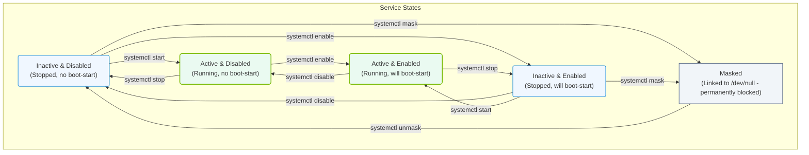

# 3.4b systemctl commands: start, stop, enable, disable, status, mask

#### 🏷️ The Operating System Layer — Linux for AI Infrastructure Operators > 3 Linux System Fundamentals — The OS From the Ground Up > 3.4 systemd — Deep Dive into Modern Service Management

---

## 🌐 Context Introduction

When managing AI workloads on Linux servers, you will frequently need to control background services — such as monitoring agents, GPU drivers, or model-serving daemons. The **systemctl** command is your primary tool for interacting with **systemd**, the modern service manager found in most enterprise Linux distributions. This section covers the six essential systemctl commands that every engineer must know to keep AI infrastructure running reliably.

---

## ⚙️ The Core Commands — At a Glance

Each of these commands targets a **systemd unit** (typically a service file ending in `.service`). Think of a unit as a recipe that tells the OS how to start, stop, and manage a program.

| Command | Purpose | When to Use |
|---------|---------|-------------|
| **start** | Launches a stopped service immediately | After installing a new AI agent or fixing a failed service |
| **stop** | Halts a running service gracefully | Before updating a service or troubleshooting a stuck process |
| **enable** | Configures a service to auto-start at boot | For critical services like GPU monitoring or log collectors |
| **disable** | Prevents a service from starting at boot | For temporary services or after removing a component |
| **status** | Shows current state, logs, and process info | First step in troubleshooting any service issue |
| **mask** | Completely blocks a service from being started | To permanently disable conflicting or dangerous services |

---

## 🚀 Start and Stop — Immediate Control

- **start** tells systemd to run the service right now. It does not affect whether the service will start again after a reboot.
- **stop** sends a termination signal to the service process. systemd handles cleanup of child processes and resources.

**Example usage pattern:**  
To start a service named `nvidia-persistenced`, you would type: **systemctl start nvidia-persistenced**  
To stop it: **systemctl stop nvidia-persistenced**

---

## 🔄 Enable and Disable — Boot-Time Behavior

- **enable** creates symbolic links in the filesystem that tell systemd to launch the service automatically when the system boots. This is essential for services that must always be running, like AI model load balancers or telemetry exporters.
- **disable** removes those symbolic links, so the service will not start automatically on the next reboot. The service can still be started manually with **start**.

**Key distinction:**  
- **start/stop** = immediate, temporary action  
- **enable/disable** = persistent, boot-time setting  

**Example usage pattern:**  
To make a service start on every boot: **systemctl enable nvidia-persistenced**  
To stop it from auto-starting: **systemctl disable nvidia-persistenced**

---

## 📊 Status — The Troubleshooting Swiss Army Knife

The **status** command provides a wealth of information in a single view:

- Whether the service is currently **active (running)**, **inactive (dead)**, or **failed**
- The process ID (PID) and memory usage
- The most recent log entries from the service
- Whether the service is enabled or disabled for boot

**Example usage pattern:**  
To check a service: **systemctl status nvidia-persistenced**

📤 Output: The command will show a multi-line summary including the service name, loaded state, active state, recent log lines, and the main process ID.

---

## 🛡️ Mask — The Nuclear Option

- **mask** goes beyond **disable** by creating a symlink to `/dev/null`, which makes it impossible for any process (including dependencies) to start the service. Even a direct **start** command will fail silently.
- **unmask** reverses this action.

**When to use mask:**  
- A service conflicts with critical AI drivers  
- A service is a security risk and must never run  
- You want to prevent accidental starts during maintenance windows  

**Example usage pattern:**  
To permanently block a problematic service: **systemctl mask some-problematic-service**  
To restore it: **systemctl unmask some-problematic-service**

---

## 🕵️ Quick Reference — Common Troubleshooting Flow

1. Check if a service is running: **systemctl status service-name**
2. If stopped, start it: **systemctl start service-name**
3. Verify it started: **systemctl status service-name**
4. Make it persistent: **systemctl enable service-name**
5. If it misbehaves, stop it: **systemctl stop service-name**
6. If it must never run, mask it: **systemctl mask service-name**

---

## 🧠 Key Takeaways for AI Infrastructure

- AI services (GPU managers, model servers, data pipelines) often run as systemd units
- Always use **status** first — it saves time by showing logs and state together
- **Enable** critical services so they survive reboots (common during kernel updates)
- Use **mask** sparingly — only for services that actively cause problems
- Remember that **start/stop** are temporary; **enable/disable** are permanent across reboots

---

## ✅ Summary Table

| Command | Immediate Effect | Persistent After Reboot | Reversible |
|---------|-----------------|------------------------|------------|
| **start** | Service runs now | No | Yes (stop) |
| **stop** | Service stops now | No | Yes (start) |
| **enable** | None immediately | Service starts at boot | Yes (disable) |
| **disable** | None immediately | Service does not start at boot | Yes (enable) |
| **status** | Shows current state | N/A | N/A |
| **mask** | Blocks all starts | Blocks all starts permanently | Yes (unmask) |

### 📊 Visual Representation: systemd Service State Transitions

This flowchart visualizes the state machine of a systemd unit as it transitions between active, inactive, enabled, disabled, and masked states under systemctl commands.

---

*Master these six commands, and you will have full control over the services that power your AI infrastructure.*