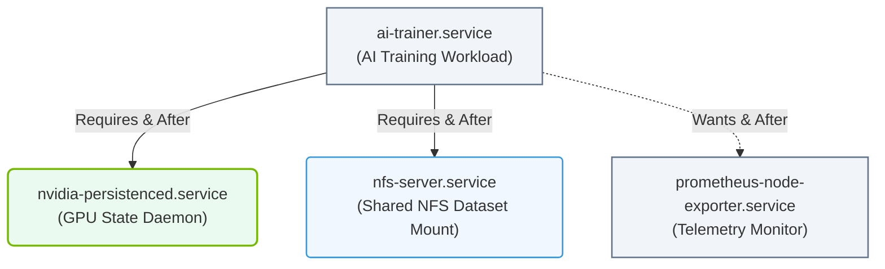

# 3.4c Dependency ordering: After=, Requires=, Wants= in unit files

#### 🏷️ The Operating System Layer — Linux for AI Infrastructure Operators > 3 Linux System Fundamentals — The OS From the Ground Up > 3.4 systemd — Deep Dive into Service Management

---

## 🧭 Context Introduction

When managing AI workloads on Linux, services often depend on each other. For example, a machine learning training job might need the GPU driver service to be running first, or a data pipeline might require a database to be available. In systemd, you control these relationships using three key directives: **After=**, **Requires=**, and **Wants=**. These tell systemd *when* and *if* a service should start relative to another service.

Think of it like building with blocks: you need the bottom block (dependency) in place before you can place the top block (your service). These directives define the rules for stacking those blocks.

---

## ⚙️ The Three Dependency Directives

### 1. After= (Ordering Only)
- **What it does:** Ensures your service starts *after* another service has started.
- **Key point:** It does **not** force the other service to start. If the other service fails or is disabled, your service still tries to start.
- **Use case:** You want your service to run after something else, but you don't require that something else to be running.

### 2. Requires= (Hard Dependency)
- **What it does:** Creates a strict dependency. If the required service fails to start, your service will **not** start.
- **Key point:** systemd will attempt to start the required service automatically. If it fails, your service is also stopped or not started.
- **Use case:** Your AI application absolutely needs a database or GPU driver to function.

### 3. Wants= (Soft Dependency)
- **What it does:** Creates a weaker dependency. systemd will try to start the wanted service, but if it fails, your service still starts.
- **Key point:** This is a "nice to have" relationship. It does not enforce failure.
- **Use case:** You prefer a monitoring service to be running, but your AI job can work without it.

---

## 🛠️ Comparison Table

| Directive | Forces the other service to start? | Blocks your service if the other fails? | Use when... |
|-----------|-----------------------------------|----------------------------------------|-------------|
| **After=** | No | No | You only care about ordering, not availability |
| **Requires=** | Yes | Yes | Your service cannot function without the other |
| **Wants=** | Yes (attempts) | No | You prefer the other service, but can work without it |

---

## 🕵️ How They Work Together

In practice, you often combine **After=** with **Requires=** or **Wants=**. Here's why:

- **After=** alone only controls *when* your service starts, not *if* the dependency is running.
- **Requires=** alone ensures the dependency starts, but does **not** guarantee your service waits for it to finish starting.
- **Best practice:** Use **After=** with **Requires=** or **Wants=** to get both ordering and dependency behavior.

Example logic:
- **After=network.target** + **Requires=network.target** = Your service starts only after the network is fully up, and if the network fails, your service stops.
- **After=gpu-driver.service** + **Wants=gpu-driver.service** = Your service starts after the GPU driver, but if the driver fails, your service still runs (maybe with degraded performance).

---

## 📊 Real-World AI Infrastructure Example

Imagine you have an AI training service called **ai-trainer.service** that needs:
1. A GPU driver service (**nvidia-persistenced.service**) to be running.
2. A shared storage service (**nfs-server.service**) to be mounted.
3. A monitoring agent (**prometheus-node-exporter.service**) to be active, but not critical.

Your unit file would look like this (conceptually):

- **After=nvidia-persistenced.service nfs-server.service**
- **Requires=nvidia-persistenced.service nfs-server.service**
- **Wants=prometheus-node-exporter.service**

This means:
- The AI trainer starts **after** the GPU driver and NFS are up.
- If the GPU driver or NFS fails, the AI trainer **will not start**.
- The monitoring agent is attempted, but if it fails, the AI trainer **still starts**.

### 📊 Visual Representation: systemd Dependency Relationships

This flowchart maps the different types of dependencies (`Requires`, `Wants`, and `After` ordering) that systemd resolves when launching a custom AI training service.

---

## 🔍 Common Pitfalls for New Engineers

- **Forgetting After= with Requires=:** If you only use **Requires=**, systemd might start your service *before* the dependency finishes initializing. Always add **After=** for proper ordering.
- **Using After= alone for critical dependencies:** If the dependency fails, your service will still start and likely crash. Use **Requires=** for hard dependencies.
- **Overusing Requires=:** Not every dependency is critical. Use **Wants=** for optional services like logging or monitoring to avoid unnecessary failures.

---

## ✅ Quick Summary

| Directive | Controls Order? | Forces Start? | Blocks on Failure? |
|-----------|----------------|---------------|---------------------|
| **After=** | Yes | No | No |
| **Requires=** | No | Yes | Yes |
| **Wants=** | No | Yes (attempt) | No |

**Golden rule for AI services:** Always pair **After=** with **Requires=** for critical dependencies (like GPU drivers or databases), and use **Wants=** for non-critical helpers (like monitoring or logging).

---

## 📚 Further Learning

- Experiment by creating simple unit files in **/etc/systemd/system/** and testing with **systemctl start**, **systemctl status**, and **systemctl list-dependencies**.
- Look at existing unit files on your system (e.g., **/usr/lib/systemd/system/**) to see how real services define dependencies.
- Remember: systemd reads these directives at boot time and when you manually start services. Changes take effect after running **systemctl daemon-reload**.