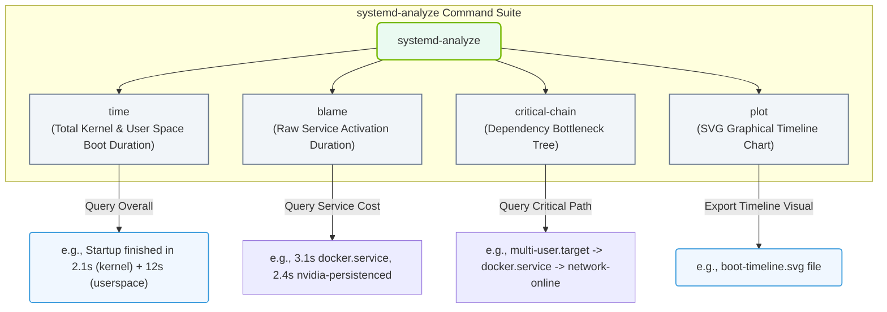

# 3.4f systemd-analyze blame: profiling boot time and identifying slow services

#### 🏷️ The Operating System Layer — Linux for AI Infrastructure Operators > 3 Linux System Fundamentals — The OS From the Ground Up > 3.4 systemd — Deep Dive into Modern Service Management

---

## 🔍 Context Introduction

When you work with AI infrastructure, every second of system startup matters. A server that takes 90 seconds to boot delays model deployment, slows down cluster recovery, and wastes compute resources. The **systemd-analyze blame** command is your go-to tool for understanding exactly what happens during boot — and which services are the slowest culprits.

Think of it like a race timer for your system's startup. Instead of guessing why your server is slow to come online, this tool gives you a ranked list of services sorted by how long each one takes to start. For new engineers, this is the first step toward optimizing boot performance and ensuring your AI workloads get to work as fast as possible.

---

## ⚙️ What Does systemd-analyze blame Actually Do?

The **blame** subcommand measures the time each systemd service unit spends during the boot process. It does not measure total wall-clock time from power-on to login — instead, it focuses on the **activation time** of each service, sorted from slowest to fastest.

Key points to understand:
- **It only shows services that were started during boot** — not services started later manually.
- **Times are cumulative** — if a service depends on another, the parent service's time includes its children.
- **The output is a simple list** — service name followed by the time it took to start.

---

## 📊 How to Read the Output

When you run the command (formatted as bold inline text: **systemd-analyze blame**), you will see output similar to this:

📤 **Output:**  
**5.234s** network-online.target  
**3.102s** docker.service  
**2.456s** nvidia-persistenced.service  
**1.890s** sshd.service  
**0.987s** systemd-logind.service  
**0.654s** systemd-udevd.service  
... (and so on, down to services taking milliseconds)

What this tells you:
- **network-online.target** is the slowest — it waits for the network to be fully ready.
- **docker.service** takes over 3 seconds — this is critical for AI workloads.
- **nvidia-persistenced.service** takes over 2 seconds — this is the NVIDIA driver persistence daemon.

---

## 🛠️ How to Use This Information as a New Engineer

### Step 1: Identify the Top 3 Slowest Services
Look at the first few lines of the output. These are your biggest opportunities for improvement.

### Step 2: Understand Why Each Service Is Slow
- **Network services** often wait for DHCP or DNS — consider static IPs or parallel startup.
- **Container runtimes** like Docker may load many images — optimize image sizes or use pre-pulled images.
- **GPU services** like nvidia-persistenced may initialize hardware — check for driver issues.

### Step 3: Decide Whether to Optimize or Accept
Not all slow services can be fixed. Some are necessary for functionality. Focus on:
- Services that are **not critical** for your AI workload.
- Services that can be **delayed** to start after boot (using systemd timers or dependencies).
- Services that have **known configuration tweaks** to speed them up.

---

## 🕵️ Comparison: systemd-analyze blame vs. Other Profiling Tools

| Tool | What It Measures | Best For |
|------|------------------|----------|
| **systemd-analyze blame** | Per-service startup time | Finding slow individual services |
| **systemd-analyze critical-chain** | Dependency chain and bottlenecks | Understanding why a service waits |
| **systemd-analyze plot** | Graphical timeline of boot | Visualizing the entire boot sequence |
| **systemd-analyze time** | Total kernel + userspace boot time | Quick overall health check |

### 📊 Visual Representation: systemd-analyze Profiling Toolkit

This diagram maps the subcommands of `systemd-analyze`, highlighting how each profiling perspective reports boot duration, bottlenecks, and service ordering.

---

## 🧠 Practical Tips for AI Infrastructure Operators

- **GPU servers often have slow nvidia-persistenced** — this is normal but can be tuned by adjusting the service's timeout settings.
- **Docker or containerd startup** can be slow if many container images are stored locally — consider using a minimal base image.
- **Network services** are frequently the bottleneck — if your AI workload does not need immediate network access, consider delaying network.target.
- **Always run the command after a fresh reboot** — cached results from previous boots may not reflect current performance.

---

## ⚠️ Common Pitfalls for New Engineers

- **Do not confuse "blame" with "critical-chain"** — blame shows raw time, critical-chain shows dependency delays.
- **Do not assume all slow services are bad** — some services (like GPU initialization) are inherently slow and necessary.
- **Do not disable services without understanding dependencies** — disabling a slow service might break other critical functions.

---

## ✅ Quick Checklist for Using systemd-analyze blame

1. ✅ Run **systemd-analyze blame** after a fresh reboot.
2. ✅ Identify the top 3 slowest services.
3. ✅ Research each service's purpose (use **systemctl status <service>** ).
4. ✅ Decide if the service can be optimized, delayed, or disabled.
5. ✅ Test changes with another reboot and re-run the command.

---

## 📚 Summary

**systemd-analyze blame** is your window into boot performance. For new engineers managing AI infrastructure, it helps you:
- Quickly identify which services are slowing down your server.
- Understand the cost of each component in the boot chain.
- Make informed decisions about optimization without breaking functionality.

Start by running this command on your test system. Look at the top three services. Research them. Then experiment with small changes. Over time, you will build an intuition for what is normal and what needs attention — and your AI workloads will thank you for the faster startup.