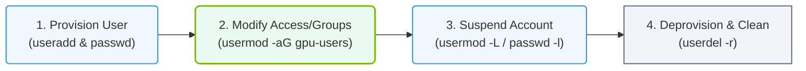

# 4.2b useradd, usermod, userdel, passwd: user lifecycle management

#### 🏷️ The Operating System Layer — Linux for AI Infrastructure Operators > 4 Core Linux Administration for AI Operators > 4.2 User and Group Management

## 🧭 Introduction

In any AI infrastructure environment, managing users is a fundamental responsibility. Whether you are setting up access for data scientists, granting permissions to model trainers, or removing access for departing team members, understanding the user lifecycle is essential. This topic covers the four core commands that allow you to create, modify, delete, and manage passwords for user accounts on a Linux system. These commands form the backbone of user administration and are critical for maintaining security and organization in your AI operations.


---

## ⚙️ Creating Users with useradd

The **useradd** command is used to create new user accounts. When you add a user, the system automatically creates a home directory, assigns a user ID (UID), and sets default shell and group settings.

Key points about **useradd**:
- It creates a new entry in the **/etc/passwd** file.
- It can automatically create a home directory under **/home/username**.
- You can specify a custom home directory, shell, or group during creation.
- By default, the user account is locked until a password is set.

Common options used with **useradd**:
- **-m** — creates the home directory if it does not exist.
- **-d /path/to/home** — specifies a custom home directory.
- **-s /bin/bash** — sets the login shell.
- **-g groupname** — assigns the user to a primary group.
- **-G group1,group2** — adds the user to supplementary groups.
- **-c "Full Name"** — adds a comment (usually the user's full name).

For reference:
```
sudo useradd -m -s /bin/bash -g ai-team -G docker,ml-users -c "Alice Johnson" alice
```
📤 Output: No output on success; user **alice** is created with home directory **/home/alice**, shell **/bin/bash**, primary group **ai-team**, and supplementary groups **docker** and **ml-users**.

---

## 🛠️ Modifying Users with usermod

The **usermod** command modifies existing user account settings. This is useful when a user changes roles, needs access to new resources, or requires updated permissions.

Key points about **usermod**:
- It updates the user's entry in **/etc/passwd** and **/etc/group**.
- You can change the username, home directory, shell, groups, and account expiration.
- The user must not be logged in when modifications are applied.

Common options used with **usermod**:
- **-l newusername** — changes the login name.
- **-d /new/home** — changes the home directory (use **-m** to move contents).
- **-s /bin/zsh** — changes the login shell.
- **-aG groupname** — appends the user to a supplementary group (preserves existing groups).
- **-L** — locks the user account (prevents login).
- **-U** — unlocks the user account.
- **-e YYYY-MM-DD** — sets an account expiration date.

For reference:
```
sudo usermod -aG gpu-users alice
```
📤 Output: No output on success; user **alice** is added to the **gpu-users** group while retaining all existing group memberships.

---

## 🗑️ Deleting Users with userdel

The **userdel** command removes user accounts from the system. This is a critical operation in the user lifecycle, especially when employees leave or roles change.

Key points about **userdel**:
- It removes the user's entry from **/etc/passwd**, **/etc/shadow**, and **/etc/group**.
- By default, the user's home directory and mail spool are **not** removed.
- The user must not be logged in, and no processes should be running under that user.

Common options used with **userdel**:
- **-r** — removes the user's home directory and mail spool.
- **-f** — forces removal even if the user is logged in (use with caution).

For reference:
```
sudo userdel -r alice
```
📤 Output: No output on success; user **alice** is removed along with **/home/alice** and any mail spool files.

---

## 🔑 Managing Passwords with passwd

The **passwd** command is used to set, change, or manage passwords for user accounts. Password management is essential for securing access to AI infrastructure resources.

Key points about **passwd**:
- Any user can change their own password.
- Only root or a user with **sudo** privileges can change another user's password.
- Passwords are stored in an encrypted format in **/etc/shadow**.
- You can lock, unlock, or expire passwords using this command.

Common options used with **passwd**:
- **-l** — locks the user's password (prevents login).
- **-u** — unlocks the user's password.
- **-e** — forces the user to change their password at next login.
- **-d** — removes the user's password (allows login without password — use with caution).
- **-S** — displays the status of the user's password (locked, unlocked, last changed date).

For reference:
```
sudo passwd alice
```
📤 Output: Prompts for a new password and confirmation. On success, displays **passwd: password updated successfully**.

---

## 📊 Comparison Table: User Lifecycle Commands

| Command    | Purpose                        | Common Use Case                                   |
|------------|--------------------------------|---------------------------------------------------|
| **useradd**  | Create a new user              | Onboarding a new data scientist or ML engineer    |
| **usermod**  | Modify an existing user        | Adding a user to a GPU access group               |
| **userdel**  | Delete a user                  | Removing access for a departing team member       |
| **passwd**   | Set or manage passwords        | Setting initial password or forcing a reset       |

### 📊 Visual Representation: User Lifecycle States and Commands
This flowchart illustrates the typical user account lifecycle on a Linux server, identifying key system commands utilized during provisioning, access modification, disabling, and final deletion.



---

## 🕵️ Best Practices for User Lifecycle Management

- **Always create users with a home directory** using the **-m** flag to ensure proper environment setup.
- **Use groups** to manage permissions rather than assigning permissions to individual users. This simplifies access control for AI tools and datasets.
- **Lock accounts instead of deleting** when a user is temporarily away. Use **usermod -L** to lock and **usermod -U** to unlock.
- **Force password changes** on first login using **passwd -e** to ensure users set their own secure passwords.
- **Remove home directories** with **userdel -r** only when you are certain no important data remains. Consider archiving first.
- **Document all user changes** in a change log or ticket system to maintain an audit trail for compliance.

---

## ✅ Summary

The four commands **useradd**, **usermod**, **userdel**, and **passwd** form the complete toolkit for managing user accounts throughout their lifecycle in an AI infrastructure environment. By mastering these commands, you can securely onboard new team members, adjust permissions as roles evolve, and properly offboard users when they leave. This foundational skill ensures that your AI operations remain organized, secure, and compliant with organizational policies.