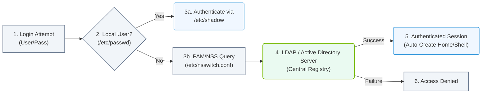

# 4.2e LDAP and Active Directory integration for enterprise user management

#### 🏷️ The Operating System Layer — Linux for AI Infrastructure Operators > 4 Core Linux Administration for AI Operators > 4.2 User and Group Management

---

In enterprise environments, managing user accounts across dozens or hundreds of AI servers manually is impractical. Engineers need a centralized way to authenticate users, control access, and enforce security policies. This is where **LDAP** (Lightweight Directory Access Protocol) and **Active Directory** (Microsoft's directory service) come into play. They act as a single source of truth for user identities, allowing engineers to log into any AI infrastructure node with the same credentials.

For AI infrastructure operations, integrating LDAP or Active Directory means that data scientists, ML engineers, and system administrators can seamlessly access GPU clusters, storage systems, and management nodes without maintaining separate local accounts on each machine.

---

## ⚙️ What is LDAP and Active Directory?

- **LDAP** is an open, vendor-neutral protocol used to access and maintain distributed directory information services. Think of it as a phonebook for your network — it stores usernames, passwords, group memberships, and other attributes.
- **Active Directory (AD)** is Microsoft's implementation of LDAP, combined with Kerberos authentication, DNS, and policy management. It is the most common directory service in enterprise Windows environments, but Linux systems can also authenticate against it.

Both systems serve the same core purpose: **centralized user management**.

---

## 🛠️ Why Integrate with AI Infrastructure?

| Benefit | Description |
|---------|-------------|
| 🔑 **Single Sign-On (SSO)** | Users log in once and access all authorized AI resources |
| 👥 **Group-Based Access Control** | Assign permissions to groups (e.g., "GPU-Users", "Data-Scientists") instead of individual users |
| 🔄 **Centralized Password Policies** | Enforce password complexity, expiration, and lockout rules from one place |
| 📋 **Audit and Compliance** | Track who accessed which system and when |
| 🚀 **Scalability** | Add or remove users without touching every server |

---

## 🕵️ How Integration Works (High-Level)

The integration process follows a client-server model:

1. **Directory Server** (LDAP or Active Directory) holds all user and group records.
2. **Linux Client** (your AI server) is configured to query the directory server when a user attempts to log in.
3. **Authentication Flow**:
   - User enters username and password at the Linux login prompt.
   - The system checks local files first (like **/etc/passwd** and **/etc/shadow**).
   - If the user is not found locally, the system queries the LDAP/AD server.
   - The directory server verifies credentials and returns user attributes (UID, GID, home directory, shell).
   - The user is granted access if authentication succeeds.

### 📊 Visual Representation: Centralized LDAP/AD Authentication Flow
This flowchart displays the Linux login lookup sequence, checking local user directories first before querying the remote enterprise LDAP/AD directory server using PAM/NSS.

---

## 📂 Key Configuration Files and Concepts

For engineers setting up integration, these are the essential components:

- **Name Service Switch (NSS)** — Tells the system where to look for user and group information. Configured in **/etc/nsswitch.conf**.
- **Pluggable Authentication Modules (PAM)** — Controls how authentication happens. Configured in **/etc/pam.d/** directory.
- **LDAP Client Configuration** — Typically stored in **/etc/ldap/ldap.conf** or **/etc/openldap/ldap.conf**.
- **Active Directory Realm** — For AD integration, the Kerberos realm is configured in **/etc/krb5.conf**.

---

## 🔄 Comparison: LDAP vs. Active Directory Integration

| Feature | LDAP | Active Directory |
|---------|------|------------------|
| **Protocol** | LDAP v3 | LDAP + Kerberos |
| **Authentication** | Simple bind or SASL | Kerberos tickets |
| **Password Storage** | Plain text or hashed | NTLM hash or Kerberos |
| **Group Management** | Static groups | Nested groups, Organizational Units |
| **Policy Enforcement** | Manual | Group Policy Objects (GPO) |
| **Typical Use Case** | Linux-only environments | Mixed Windows/Linux environments |
| **Complexity** | Lower | Higher (requires Kerberos setup) |

---

## 🧩 Common Integration Methods

Engineers typically choose one of these approaches:

- **sssd (System Security Services Daemon)** — Modern, recommended approach. Handles LDAP, AD, and Kerberos. Caches credentials for offline access.
- **nslcd (Name Service LDAP Client Daemon)** — Lightweight, traditional LDAP client. Good for simple LDAP setups.
- **Winbind (part of Samba)** — Specifically designed for Active Directory integration. Provides seamless AD authentication on Linux.
- **Direct PAM + LDAP** — Manual configuration without a daemon. Less common due to lack of caching.

---

## ✅ Verification Steps After Integration

Once configured, engineers should verify that the integration works correctly:

- **Check user lookup** — Use **getent passwd username** to confirm the directory user appears in the system's user list.
- **Test group membership** — Use **groups username** to verify group assignments from the directory.
- **Attempt SSH login** — Log in from another machine using the directory user's credentials.
- **Check authentication logs** — Review **/var/log/secure** or **/var/log/auth.log** for any errors.
- **Test offline access** — If using sssd with caching, disconnect the network and verify that previously cached users can still log in.

---

## ⚠️ Common Pitfalls for New Engineers

- **Time Synchronization** — LDAP and Kerberos are sensitive to clock skew. Ensure all servers use NTP to sync time.
- **Firewall Rules** — LDAP uses port **389** (plain) or **636** (SSL). Active Directory also uses **88** for Kerberos and **464** for password changes.
- **DNS Resolution** — Active Directory heavily relies on DNS. The Linux client must be able to resolve the AD domain controller's hostname.
- **Case Sensitivity** — Linux is case-sensitive; Windows is not. Usernames like "JohnDoe" and "johndoe" are different in LDAP.
- **Home Directory Creation** — Directory users may not have local home directories. Configure **pam_mkhomedir.so** in PAM to auto-create them on first login.

---

## 📌 Summary

LDAP and Active Directory integration transforms user management from a manual, per-server task into a centralized, scalable system. For AI infrastructure, this means engineers can focus on deploying and optimizing workloads rather than managing user accounts. The key is understanding the authentication flow, choosing the right client software (sssd is recommended for most cases), and verifying that time, DNS, and firewall configurations are correct.

With this foundation, new engineers can confidently set up enterprise-grade user management for any AI infrastructure environment.