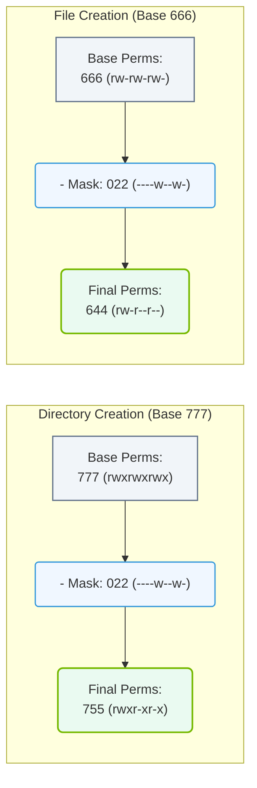

# 4.3f umask: default permission masking for new files and directories

#### 🏷️ The Operating System Layer — Linux for AI Infrastructure Operators > 4 Core Linux Administration for AI Operators > 4.3 Linux Permissions — Controlling Access to AI Resources

---

## 🔍 Context Introduction

When engineers create new files or directories in a Linux-based AI infrastructure, those items are automatically assigned a set of default permissions. Without careful control, these defaults could accidentally expose sensitive AI model weights, training data, or configuration files to unauthorized users. The **umask** (user file-creation mode mask) is the tool that defines which permission bits are *removed* (masked) from the default base permissions whenever a new file or directory is created. Understanding umask helps engineers maintain consistent security boundaries across shared AI compute environments.

## ⚙️ What Is umask?

- **umask** stands for "user file-creation mode mask."
- It is a three-digit octal value (e.g., **022**, **077**) that specifies which permission bits should be **turned off** by default.
- The umask value is subtracted from the system's base permissions to produce the actual permissions for a new file or directory.
- The default base permissions are:
  - For **files**: **666** (read + write for owner, group, and others)
  - For **directories**: **777** (read + write + execute for owner, group, and others)
- The umask does not add permissions — it only removes them.

---

## 📊 How umask Works — The Logic

The actual permissions for a new item are calculated as:

**Base permissions** minus **umask** = **final permissions**

- Each digit in the umask corresponds to a user category: owner, group, and others.
- Each digit represents the permissions to *remove*:
  - **0** = remove nothing
  - **1** = remove execute
  - **2** = remove write
  - **4** = remove read
  - Combinations (e.g., **7** = remove read + write + execute)

### Common umask Values and Their Effects

| umask Value | File Permissions (from 666) | Directory Permissions (from 777) | Meaning |
|-------------|-----------------------------|----------------------------------|---------|
| **022** | **644** (rw-r--r--) | **755** (rwxr-xr-x) | Owner can write; group and others can only read/execute |
| **027** | **640** (rw-r-----) | **750** (rwxr-x---) | Owner full access; group read/execute; others no access |
| **077** | **600** (rw-------) | **700** (rwx------) | Only owner has any access |
| **002** | **664** (rw-rw-r--) | **775** (rwxrwxr-x) | Owner and group can write; others read only |
| **007** | **660** (rw-rw----) | **770** (rwxrwx---) | Owner and group full access; others no access |

---

## 🛠️ Setting and Viewing umask

- To view the current umask value for your shell session, use the command **umask** (without any arguments).
- To set a new umask value temporarily (for the current session only), use **umask** followed by the desired three-digit octal value.
- To make a umask change permanent for a user, add the umask command to the user's shell profile file (e.g., **~/.bashrc** or **~/.profile**).
- For system-wide defaults, the umask is often set in files like **/etc/profile** or **/etc/login.defs**.

### 📊 Visual Representation: umask Permission Filtering Logic
This flowchart illustrates how a umask of `022` is applied to default base permissions during directory and file creation, resulting in the system's final permission settings.

---

## 🕵️ Why umask Matters for AI Infrastructure

- **Security boundaries**: AI training data and model checkpoints are often sensitive. A restrictive umask (e.g., **077**) prevents other users on a shared system from reading your files.
- **Collaboration**: In team environments, a more permissive umask (e.g., **002**) allows group members to read and write shared datasets without exposing them to everyone.
- **Consistency**: Using a standard umask across all AI nodes ensures that automated pipelines and scripts create files with predictable permissions.
- **Compliance**: Many AI workloads must adhere to data governance policies. umask helps enforce "least privilege" by default.

---

## ✅ Best Practices for Engineers

- Always verify the current umask before starting a sensitive task (e.g., downloading model weights or creating a shared dataset directory).
- For personal AI experiments, use **umask 077** to keep your work private by default.
- For shared team projects, use **umask 002** and ensure all team members belong to the same group.
- Never set umask to **000** — this would give everyone full access to everything you create.
- Document the expected umask value in your project's README or onboarding guide so all team members use the same default.

---

## 📝 Summary

- umask is a simple but powerful tool for controlling default permissions on new files and directories.
- It works by *subtracting* permission bits from the system base permissions.
- Choosing the right umask value balances security and collaboration in AI infrastructure.
- Engineers should always be aware of their current umask setting, especially when working with sensitive AI assets.