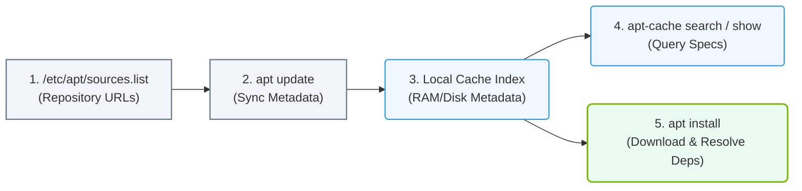

# 4.4a APT (Debian/Ubuntu): apt update, apt install, apt-cache, sources.list

#### 🏷️ The Operating System Layer — Linux for AI Infrastructure Operators > 4 Core Linux Administration for AI Operators > 4.4 Package Management — Installing Software on Linux

---

When you work with AI infrastructure on Debian or Ubuntu systems, you will frequently need to install, update, and manage software packages. The **APT (Advanced Package Tool)** is the standard package manager for these Linux distributions. Think of APT as your software store — it helps you find, install, update, and remove programs cleanly without breaking your system.

For new engineers, understanding APT is essential because AI frameworks (like TensorFlow, PyTorch, CUDA drivers, and Python libraries) are often installed via APT. This section covers the four core APT concepts you will use daily.

## ⚙️ Understanding `sources.list` — Where APT Gets Its Software

The file **`/etc/apt/sources.list`** (and files in **`/etc/apt/sources.list.d/`**) tells APT which online repositories to download packages from. Think of it as a list of trusted software catalogs.

- Each line in `sources.list` defines a repository with:
  - The **type** of repository (deb for binary packages, deb-src for source code)
  - The **URL** of the repository server
  - The **distribution** name (e.g., focal, jammy for Ubuntu)
  - The **components** (e.g., main, universe, restricted, multiverse)

- For AI work, you will often add third-party repositories (like NVIDIA's CUDA repository) by creating a new file in **`/etc/apt/sources.list.d/`** (e.g., `cuda.list`).

- **Important**: After editing `sources.list`, you must run **`apt update`** to refresh the package index.

---

## 🛠️ `apt update` — Refreshing the Package Index

**`apt update`** downloads the latest package lists from all repositories defined in `sources.list`. It does **not** install anything — it simply tells your system what packages are available and what versions exist.

- Run this command **before** installing any new software to ensure you get the latest versions.
- It is safe to run at any time and does not affect running services.
- Expected behavior: APT will contact each repository, download updated index files, and show a summary of how many packages can be upgraded.

---

## 📦 `apt install` — Installing Software Packages

**`apt install`** is how you install new software on your system. It automatically resolves dependencies (other packages required by the software you are installing).

- You can install multiple packages in one command by listing them separated by spaces.
- APT will show you a summary of what will be installed, upgraded, or removed before asking for confirmation.
- For AI infrastructure, common installs include:
  - **`nvidia-driver-535`** (NVIDIA GPU drivers)
  - **`python3-pip`** (Python package manager)
  - **`docker.io`** (container runtime)
  - **`build-essential`** (compilers and development tools)

- If a package is already installed, **`apt install`** will upgrade it to the latest version if available.

---

## 🔍 `apt-cache` — Searching and Inspecting Packages

**`apt-cache`** is a powerful tool for querying the package database without installing anything. It helps you find packages and understand what they provide.

- **`apt-cache search`** — Searches package names and descriptions for a keyword. Useful when you know what you need but not the exact package name.
- **`apt-cache show`** — Displays detailed information about a specific package, including version, description, dependencies, and size.
- **`apt-cache policy`** — Shows which version of a package is installed, which is available, and from which repository it would be installed.
- **`apt-cache depends`** — Lists all dependencies required by a package.

---

## 📊 Comparison Table: APT Commands at a Glance

| Command | Purpose | When to Use |
|---------|---------|-------------|
| **`apt update`** | Refresh package lists from repositories | Before any install or upgrade |
| **`apt install`** | Install or upgrade a specific package | When you need new software |
| **`apt-cache search`** | Find packages by keyword | When you don't know the exact package name |
| **`apt-cache show`** | Get detailed info about a package | Before installing, to verify details |
| **`apt-cache policy`** | Check available versions and sources | When troubleshooting version issues |

---

## 🧪 Practical Workflow for AI Engineers

1. **Before any installation**, always run **`apt update`** to refresh your package index.
2. **Search** for a package using **`apt-cache search`** if you are unsure of the exact name.
3. **Inspect** the package details with **`apt-cache show`** to confirm it is what you need.
4. **Install** the package with **`apt install`**.
5. **Verify** the installation by checking the package version with **`apt-cache policy`** or by running the software.

### 📊 Visual Representation: The APT Package Management Lifecycle
This flowchart traces the package management lifecycle in Debian/Ubuntu environments, illustrating how repository metadata is synced, cached, and queried before software installation.

---

## ⚠️ Common Pitfalls for New Engineers

- **Forgetting to run `apt update`** before installing — this can lead to installing outdated or missing packages.
- **Editing `sources.list` incorrectly** — a typo in the repository URL will cause APT to fail. Always double-check your entries.
- **Running `apt install` without `sudo`** — package management requires superuser privileges. Always prefix with **`sudo`**.
- **Assuming `apt update` upgrades packages** — it does not. Use **`apt upgrade`** or **`apt full-upgrade`** to actually upgrade installed packages.

---

## ✅ Key Takeaways

- **`sources.list`** defines where APT looks for software — treat it like your software shopping list.
- **`apt update`** refreshes your local package catalog — run it first, always.
- **`apt install`** is your primary tool for adding software to the system.
- **`apt-cache`** helps you explore and verify packages before committing to an install.
- Mastering these four concepts will make you comfortable managing software on any Debian/Ubuntu-based AI infrastructure.