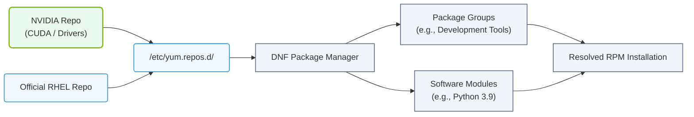

# 4.4b YUM/DNF (RHEL/CentOS): package groups, modules, and repositories

#### 🏷️ The Operating System Layer — Linux for AI Infrastructure Operators > 4 Core Linux Administration for AI Operators > 4.4 Package Management — Installing Software on Linux

---

When you work with AI infrastructure on Red Hat Enterprise Linux (RHEL) or CentOS systems, you will frequently need to install, update, and manage software packages. Unlike manual downloads, package managers like **YUM** (Yellowdog Updater Modified) and its modern replacement **DNF** (Dandified YUM) handle dependencies automatically and keep your system consistent.

For new engineers, understanding three key concepts is essential:
- **Package groups** — collections of related packages installed together
- **Modules** — streams of software with different versions or configurations
- **Repositories** — remote or local sources where packages are stored

This guide breaks down each concept simply, so you can confidently manage software on AI infrastructure nodes.

## ⚙️ What Are Package Groups?

A **package group** is a predefined collection of RPM packages that serve a common purpose. Instead of installing 20 individual packages one by one, you install the entire group with a single command.

Key points:
- Groups are defined in repository metadata
- Common groups include "Development Tools", "System Administration Tools", and "Scientific Support"
- Groups can be **mandatory**, **default**, or **optional** packages
- Installing a group ensures all required dependencies are met

Example of how you would use a group:
- To install all development tools needed for compiling AI libraries, you would reference the group name **"Development Tools"**
- The package manager then resolves and installs everything inside that group

---

## 📦 What Are Modules?

**Modules** (introduced in DNF) allow you to install different versions or configurations of software from a single repository. This is extremely useful in AI environments where you might need Python 3.9 for one project and Python 3.11 for another.

Key points:
- A module contains a **stream** (version track) and optionally a **profile** (use case)
- You enable a specific stream to access that version's packages
- Profiles define which subset of packages to install (e.g., minimal, server, client)
- Modules prevent conflicts between different software versions

Common module examples for AI operators:
- **python39** stream for Python 3.9
- **nodejs** stream with different major versions
- **container-tools** for working with containers

---

## 🗂️ What Are Repositories?

A **repository** (or repo) is a storage location from which your system retrieves and installs RPM packages. Repositories can be:
- **Official** — provided by Red Hat, CentOS, or EPEL
- **Third-party** — from vendors like NVIDIA, Docker, or Grafana
- **Local** — hosted on your own network for air-gapped environments

Each repository contains:
- RPM package files
- Metadata files (descriptions, dependencies, versions)
- GPG keys for verifying package authenticity

For AI infrastructure, you will commonly configure:
- **EPEL** (Extra Packages for Enterprise Linux) — for additional open-source tools
- **NVIDIA CUDA repository** — for GPU drivers and CUDA toolkit
- **Docker CE repository** — for container runtime

---

## 🛠️ How These Three Concepts Work Together

The relationship between groups, modules, and repositories is straightforward:

| Concept | Purpose | Example for AI Infrastructure |
|---------|---------|-------------------------------|
| **Repository** | Where packages live | **epel**, **nvidia-cuda-rhel8** |
| **Module** | Versioned software stream | **python39:3.9** stream |
| **Package Group** | Collection of related packages | **"Development Tools"** group |

When you install software:
1. Your system checks configured **repositories** for available packages
2. If using a **module**, it first enables the desired stream
3. You can then install a **package group** or individual packages from that stream

---

## 🕵️ Practical Workflow for AI Operators

Here is a typical workflow you might follow when setting up an AI compute node:

1. **Verify available repositories** — Check which repositories are currently enabled on your system
2. **Enable a module stream** — For example, enable Python 3.9 to ensure compatibility with AI frameworks
3. **Install a package group** — Install "Development Tools" to get compilers and libraries needed for building AI software
4. **Install** individual packages — Add specific tools like **nvidia-driver** or **cuda-toolkit** from the NVIDIA repository

### 📊 Visual Representation: YUM/DNF Package Management Components
This flowchart illustrates the structured architecture of Red Hat-based package management, showing how DNF consumes repositories, software modules, and package groups to resolve installations.

---

## 📊 Comparison: YUM vs DNF

While both tools work similarly, DNF is the modern replacement with better performance and module support.

| Feature | YUM | DNF |
|---------|-----|-----|
| Default in RHEL/CentOS | Older versions (RHEL 7) | Newer versions (RHEL 8+) |
| Module support | Limited | Full support |
| Dependency resolution | Slower | Faster with libsolv |
| Memory usage | Higher | Lower |
| Python version | Python 2 | Python 3 |

For new engineers: if your system is RHEL 8 or CentOS 8+, use **DNF**. For RHEL 7, use **YUM**.

---

## ✅ Key Takeaways for New Engineers

- **Package groups** save time by installing related software together
- **Modules** let you choose specific software versions without conflicts
- **Repositories** are the sources where packages and metadata are stored
- Always verify repository GPG keys to ensure software authenticity
- For AI infrastructure, configure repositories for **EPEL**, **NVIDIA CUDA**, and **container tools**
- Use **DNF** on modern systems; fall back to **YUM** only on legacy systems

Understanding these three concepts will help you maintain consistent, reproducible AI infrastructure environments — whether you are setting up a single workstation or managing a cluster of GPU nodes.