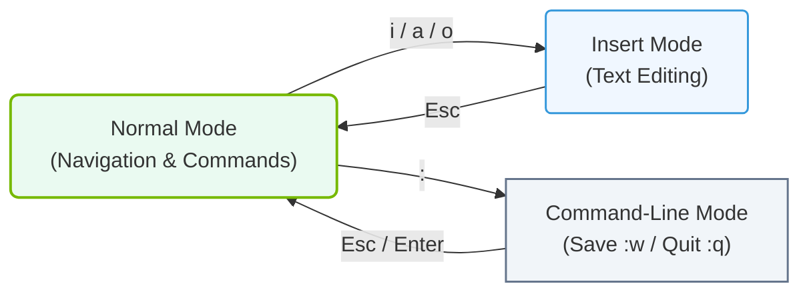

# 4.5a Vim essentials: modes, navigation, insert, save, quit — the minimum to survive

#### 🏷️ The Operating System Layer — Linux for AI Infrastructure Operators > 4 Core Linux Administration for AI Operators > 4.5 Text Processing — Manipulating Configuration and Log Files

When you work with AI infrastructure, you will frequently need to edit configuration files, review logs, or modify scripts directly on remote servers. Many of these servers run minimal Linux installations without graphical editors. **Vim** is the text editor you will encounter most often — it is powerful, lightweight, and available on virtually every Linux system. This section covers the absolute minimum Vim skills you need to survive: understanding its modes, navigating a file, inserting text, saving changes, and quitting.


## 🧭 Understanding Vim Modes

Vim is a **modal editor**, meaning its behavior changes depending on which mode you are in. This is the most important concept to grasp. There are three essential modes:

- **Normal Mode** — This is the default mode when you open Vim. In this mode, every key you press is a command (not text input). You use it to navigate, delete, copy, and paste.
- **Insert Mode** — This mode allows you to type and edit text directly, just like a regular text editor. You enter Insert Mode from Normal Mode.
- **Command-Line Mode** — This mode is used for saving files, quitting, searching, and running other Vim commands. You enter it from Normal Mode by typing a colon (**:**).

---

## 🧭 Mode Comparison Table

| Mode | Purpose | How to Enter | How to Exit |
|------|---------|--------------|-------------|
| **Normal** | Navigate, delete, copy, paste | Press **Esc** from any mode | Already in this mode by default |
| **Insert** | Type and edit text | Press **i** from Normal Mode | Press **Esc** to return to Normal Mode |
| **Command-Line** | Save, quit, search, run commands | Press **:** from Normal Mode | Press **Esc** or complete the command |

---

## 🧭 Essential Navigation in Normal Mode

Once you are in Normal Mode, you can move around the file without using arrow keys. This is much faster once you get used to it.

- **h** — Move cursor left one character
- **j** — Move cursor down one line
- **k** — Move cursor up one line
- **l** — Move cursor right one character
- **0** (zero) — Move cursor to the beginning of the current line
- **$** — Move cursor to the end of the current line
- **gg** — Move cursor to the first line of the file
- **G** — Move cursor to the last line of the file
- **Ctrl + d** — Move down half a page
- **Ctrl + u** — Move up half a page

---

## 🧭 Entering Insert Mode

To start typing or editing text, you must leave Normal Mode and enter Insert Mode. There are several ways to do this, depending on where you want to start typing:

- **i** — Insert text at the current cursor position
- **I** — Insert text at the beginning of the current line
- **a** — Insert text after the current cursor position (append)
- **A** — Insert text at the end of the current line
- **o** — Open a new line below the current line and enter Insert Mode
- **O** — Open a new line above the current line and enter Insert Mode

Once you are in Insert Mode, you can type normally. When you are finished, press **Esc** to return to Normal Mode.

---

## 🧭 Saving and Quitting (Command-Line Mode)

All save and quit operations are performed from Command-Line Mode. From Normal Mode, type a colon (**:**) to enter Command-Line Mode, then type one of the following commands and press **Enter**:

- **:w** — Save the current file (write)
- **:q** — Quit Vim (only works if no changes were made)
- **:wq** — Save the file and quit
- **:q!** — Quit without saving (force quit, discarding all changes)
- **:x** — Save and quit (same as **:wq**)

---

## 🧭 A Typical Workflow for a New Engineer

Here is the most common sequence you will use when editing a configuration file:

1. Open a file from the terminal: **vim /etc/nginx/nginx.conf**
2. You are now in Normal Mode. Use **j** and **k** to move to the line you want to edit.
3. Press **i** to enter Insert Mode.
4. Type your changes.
5. Press **Esc** to return to Normal Mode.
6. Type **:wq** and press **Enter** to save and quit.

If you make a mistake and want to exit without saving, type **:q!** instead.

### 📊 Visual Representation: Vim Mode Transitions
This horizontal flowchart shows how to transition between Vim's three primary operating modes (Normal, Insert, and Command-Line) and the keystrokes used to switch between them.



---

## 🧭 Quick Reference Card

For reference, here is a compact summary of the essential commands:

```
Normal Mode Navigation:
  h j k l    — move left, down, up, right
  gg         — go to top of file
  G          — go to bottom of file
  0          — go to start of line
  $          — go to end of line

Enter Insert Mode:
  i          — insert at cursor
  a          — append after cursor
  o          — open new line below

Save and Quit (from Normal Mode, type : then the command):
  :w         — save file
  :q         — quit
  :wq        — save and quit
  :q!        — quit without saving
```

📤 **Output:** No output is shown for these commands — Vim simply performs the action and returns to Normal Mode or exits.

---

## 🧭 Final Tips for Survival

- If you ever get stuck or accidentally enter a mode you do not understand, press **Esc** a few times. This will always return you to Normal Mode.
- Do not be afraid to use **:q!** if you are lost — it is better to quit without saving than to accidentally corrupt a configuration file.
- Practice the navigation keys (**h**, **j**, **k**, **l**) until they become automatic. They are faster than arrow keys and will always work, even over slow SSH connections.
- Remember that Vim is everywhere on Linux servers. Learning these few commands will save you time and frustration when managing AI infrastructure.