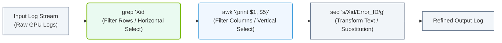

# 4.5b grep, awk, sed: searching, filtering, and transforming text streams

#### 🏷️ The Operating System Layer — Linux for AI Infrastructure Operators > 4 Core Linux Administration for AI Operators > 4.5 Text Processing — Manipulating Configuration and Log Files

Welcome to the world of text processing in Linux. As an engineer working with AI infrastructure, you will constantly interact with configuration files, log files, and data streams. These three tools — **grep**, **awk**, and **sed** — are your essential companions for searching, filtering, and transforming text without needing to open a full editor. Think of them as your command-line Swiss Army knife for text.


## 🕵️ What is grep? — Searching for Patterns

**grep** stands for "global regular expression print." Its primary job is to search through text and print lines that match a specific pattern. This is incredibly useful when you need to find specific errors in a log file or locate a configuration setting across many files.

- **Use case:** Finding all lines in a log file that contain the word "ERROR"
- **How it works:** You provide a pattern (like a word or phrase) and a file name. grep scans each line and shows you only the matching lines.
- **Common flags:**
  - **-i** makes the search case-insensitive (so "error" matches "ERROR")
  - **-v** inverts the match, showing lines that do NOT contain the pattern
  - **-r** searches recursively through all files in a directory
  - **-n** shows line numbers alongside the matching lines
  - **-c** counts how many lines matched instead of showing them

For reference, a basic grep command looks like this:

```
grep "ERROR" /var/log/syslog
```

📤 Output: All lines from the syslog file containing the word "ERROR" are printed to the terminal.

---

## 📊 What is awk? — Filtering and Processing Structured Data

**awk** is a powerful programming language designed specifically for text processing. While grep finds lines, awk can break those lines into fields (columns) and perform actions on them. This makes it perfect for working with structured data like CSV files, log files with consistent formats, or system output.

- **Use case:** Extracting specific columns from a log file or calculating sums from numerical data
- **How it works:** awk automatically splits each line into fields. **$1** refers to the first field, **$2** to the second, and so on. **$0** refers to the entire line.
- **Common patterns:**
  - Print only specific columns from a file
  - Filter lines based on a condition in a particular column
  - Perform calculations (like summing values in a column)
  - Format output with custom separators

For reference, a basic awk command looks like this:

```
awk '{print $1, $3}' /var/log/syslog
```

📤 Output: Only the first and third columns from each line of the syslog file are printed, separated by a space.

---

## 🛠️ What is sed? — Stream Editing and Transformation

**sed** stands for "stream editor." Unlike a regular text editor, sed operates on a stream of text line by line. It is best used for making automated, repetitive changes to files — like replacing text, deleting lines, or inserting new content.

- **Use case:** Replacing all occurrences of "old_hostname" with "new_hostname" in a configuration file
- **How it works:** sed reads a file line by line, applies the transformation you specify, and outputs the result. By default, it does not modify the original file — it prints the changes to the terminal.
- **Common operations:**
  - **Substitution (s/old/new/):** Replace text patterns
  - **Deletion (d):** Remove specific lines
  - **Insertion (i and a):** Add lines before or after a match
  - **In-place editing (-i):** Save changes directly to the file

For reference, a basic sed command looks like this:

```
sed 's/old_hostname/new_hostname/g' config.txt
```

📤 Output: All occurrences of "old_hostname" in config.txt are replaced with "new_hostname" and the result is printed to the terminal.

---

## ⚖️ Comparison Table: When to Use Each Tool

| Tool | Primary Purpose | Best For | Example Scenario |
|------|----------------|----------|------------------|
| **grep** | Searching | Finding lines that match a pattern | Find all "CRITICAL" errors in a log file |
| **awk** | Filtering & processing | Working with columns and structured data | Extract IP addresses and timestamps from access logs |
| **sed** | Transforming | Making automated edits to text | Replace all deprecated configuration values in a file |

---

## 🔄 Combining grep, awk, and sed

In real-world AI infrastructure work, these tools are often used together in a pipeline. The output of one command becomes the input for the next. This is done using the pipe symbol (**|**).

- **grep → awk:** First search for relevant lines, then extract specific columns from those lines
- **grep → sed:** Find lines containing a pattern, then transform the content of those lines
- **awk → sed:** Process structured data with awk, then apply text transformations with sed

For reference, a combined pipeline looks like this:

```
grep "ERROR" /var/log/syslog | awk '{print $1, $2, $5}'
```

📤 Output: Only lines containing "ERROR" are shown, and from those lines, only the first, second, and fifth columns are printed.

### 📊 Visual Representation: Log Processing Pipeline (grep -> awk -> sed)
This horizontal flowchart shows how a raw system log stream is incrementally parsed, filtered, structured, and transformed by piping `grep`, `awk`, and `sed` together.



---

## 💡 Practical Tips for New Engineers

- **Start with grep** — it is the simplest and most forgiving tool to learn
- **Use awk for column-based data** — if your data has consistent spacing or delimiters, awk is your friend
- **Test sed with sample files first** — always run sed without **-i** to preview changes before modifying the original file
- **Combine tools gradually** — start with single commands, then add pipes as you become comfortable
- **Remember the pipe (**|**)** — it is the glue that connects these tools into powerful workflows

These three tools form the foundation of text processing in Linux. Master them, and you will be able to navigate log files, modify configurations, and automate repetitive tasks with confidence.