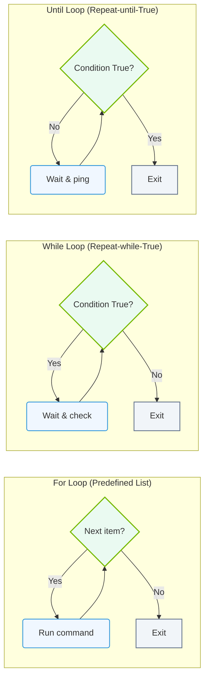

# 4.6c Loops: for, while, until — iterating over GPU lists and node arrays

#### 🏷️ The Operating System Layer — Linux for AI Infrastructure Operators > 4 Core Linux Administration for AI Operators > 4.6 Bash Scripting for Infrastructure Automation

---

## 🌐 Context Introduction

When managing AI infrastructure, engineers often need to perform the same action across multiple GPUs or multiple nodes in a cluster. Instead of typing commands manually for each device or server, loops allow you to automate these repetitive tasks efficiently. This section covers the three fundamental loop types in Bash — **for**, **while**, and **until** — and shows how they apply to iterating over GPU lists and node arrays.

## ⚙️ The Three Loop Types at a Glance

| Loop Type | Best Use Case | Example Scenario |
|-----------|---------------|------------------|
| **for** | Iterating over a known list of items | Loop through GPU IDs 0, 1, 2, 3 |
| **while** | Repeating until a condition becomes false | Monitor GPU memory until it drops below a threshold |
| **until** | Repeating until a condition becomes true | Wait for a node to become available |

---

## 🛠️ The `for` Loop — Iterating Over GPU Lists

The **for** loop is the most common choice when you have a predefined list of items, such as GPU indices or node hostnames.

**Basic structure:**  
The loop takes each item from a list, assigns it to a variable, and executes the commands inside the loop body for that item.

**Practical example — checking GPU status across multiple devices:**  
You define a list of GPU IDs (0, 1, 2, 3). For each GPU ID, you run a command to check its temperature or utilization. The loop automatically moves to the next GPU after finishing the current one.

**Key points:**
- The list can be written explicitly (e.g., GPU 0 1 2 3) or generated dynamically (e.g., from a file or command output).
- Use the variable name (like **gpu_id**) inside the loop to reference the current item.
- The loop ends after the last item in the list is processed.

---

## 🔄 The `while` Loop — Monitoring GPU Utilization

The **while** loop continues executing as long as a specified condition remains true. This is ideal for monitoring tasks where you need to keep checking a value until it changes.

**Basic structure:**  
The condition is evaluated before each iteration. If the condition is true, the loop body runs. If false, the loop stops.

**Practical example — waiting for GPU memory to free up:**  
You want to start a training job only when GPU memory usage drops below 80%. The while loop checks the memory usage every few seconds. As long as usage is above 80%, the loop continues. Once it drops below, the loop exits and the training command runs.

**Key points:**
- Always include a mechanism to update the condition inside the loop (e.g., re-checking GPU stats).
- Be careful with infinite loops — include a sleep command to avoid overwhelming the system.
- Use a counter or timeout to break out of the loop if the condition never changes.

---

## ⏳ The `until` Loop — Waiting for Node Availability

The **until** loop is the opposite of **while**: it runs until a condition becomes true. This is useful for waiting on infrastructure events, such as a node coming online or a service starting.

**Basic structure:**  
The condition is evaluated before each iteration. If the condition is false, the loop body runs. If true, the loop stops.

**Practical example — waiting for a GPU node to become reachable:**  
You have a list of worker nodes that need to be online before you can distribute a job. The until loop checks if each node responds to a ping. As long as the node is unreachable (condition false), the loop continues to wait. Once the node responds (condition true), the loop exits and you proceed to the next node.

**Key points:**
- The condition must eventually become true, or the loop will run forever.
- Add a maximum wait time or retry count to prevent indefinite hanging.
- Combine with a sleep interval to avoid excessive network checks.

---

## 🕵️ Choosing the Right Loop for Your Task

| Scenario | Recommended Loop | Why |
|----------|------------------|-----|
| You have a fixed list of GPU IDs to configure | **for** | Simple and direct iteration over known items |
| You need to keep checking GPU temperature until it cools down | **while** | Condition-based repetition until a threshold is met |
| You want to wait for a node to finish rebooting | **until** | Runs until the node becomes responsive |
| You need to process all files in a directory | **for** | Works perfectly with file globbing patterns |
| You are monitoring a log file for a specific event | **while** | Continuously reads new lines until the event appears |

### 📊 Visual Representation: Bash Loop Control Structures
This diagram maps out and compares the logical decision-making paths of `for` loops (iterating over lists), `while` loops (repeating while true), and `until` loops (repeating until true).

---

## 📊 Common Pitfalls and Best Practices

**Pitfall 1: Forgetting to update the condition in while/until loops**  
If the condition never changes, the loop runs forever. Always include a command inside the loop that modifies the condition (e.g., re-checking GPU stats or incrementing a counter).

**Pitfall 2: Using a for loop when the list is dynamic**  
If the number of GPUs or nodes changes frequently, generate the list dynamically (e.g., from a command that detects available devices) rather than hardcoding it.

**Pitfall 3: Not including a delay in monitoring loops**  
Checking GPU utilization every millisecond can overload the system. Add a sleep of a few seconds between iterations.

**Best practice — always test with a small subset first:**  
Before running a loop across all 8 GPUs or 50 nodes, test it on a single device to verify the logic works correctly.

**Best practice — use meaningful variable names:**  
Instead of **i** or **x**, use names like **gpu_id** or **node_name** to make the script self-documenting.

---

## ✅ Summary

- The **for** loop is your go-to tool for iterating over a known list of GPUs or nodes.
- The **while** loop keeps running as long as a condition is true — perfect for monitoring tasks.
- The **until** loop runs until a condition becomes true — ideal for waiting on infrastructure events.
- Always include a mechanism to prevent infinite loops (sleep, counters, or timeouts).
- Test loops on a single item before scaling to your entire GPU cluster or node array.

By mastering these three loop types, engineers can automate repetitive infrastructure tasks, reduce manual errors, and manage AI workloads across large-scale GPU environments with confidence.