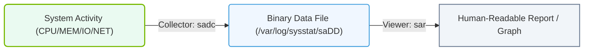

# 5.1f sar (System Activity Reporter): historical resource trending

#### 🏷️ The Operating System Layer — Linux for AI Infrastructure Operators > 5 Storage & Resource Management for AI Workloads > 5.1 Linux Resource Monitoring — Understanding System Load

---

## 🌱 Context Introduction

When managing AI workloads, understanding how your system performed in the past is just as important as monitoring it in real time. AI training jobs can run for hours or days, and resource bottlenecks often appear gradually. The **sar** (System Activity Reporter) tool is your historical record-keeper — it collects, reports, and saves system activity data so you can look back at CPU, memory, disk, and network usage over time. For new engineers, think of **sar** as a flight data recorder for your Linux server: it logs everything so you can investigate what happened during a critical AI training run or identify when a resource started to become overloaded.

---

## ⚙️ What is sar?

- **sar** is part of the **sysstat** package on Linux systems.
- It collects and displays historical resource usage data from system activity logs.
- Unlike real-time tools like **top** or **htop**, **sar** lets you examine data from minutes, hours, or even days ago.
- It is invaluable for troubleshooting performance issues that occur during long-running AI training or inference workloads.

---

## 📊 Key Metrics sar Can Report

| Metric Category | What It Shows | Why It Matters for AI Workloads |
|----------------|---------------|----------------------------------|
| **CPU** | User time, system time, idle time, I/O wait | High I/O wait can indicate disk bottlenecks during data loading |
| **Memory** | Used, free, cached, swap usage | Insufficient memory can cause swapping and slow training |
| **Disk** | Read/write rates, transfer rates, queue length | Slow disk I/O can stall data pipelines |
| **Network** | Packets sent/received, errors, throughput | Network bottlenecks affect distributed training |
| **Load Average** | System load over 1, 5, and 15 minutes | High load suggests CPU or I/O contention |
| **Swap** | Pages swapped in/out | Excessive swapping indicates memory pressure |

---

## 🕵️ How sar Collects Historical Data

- The **sysstat** service runs in the background and collects data at regular intervals (typically every 10 minutes).
- Data is saved to binary log files in the **/var/log/sysstat/** directory.
- These logs are rotated daily, so you can review activity from previous days.
- Engineers can specify a time range to analyze exactly when a problem occurred.

---

### 📊 Visual Representation: sar System Activity Data Flow
This flowchart illustrates the collection flow of system activity metrics by sadc into daily binary files, and their extraction into reports using sar.

## 🛠️ Common Use Cases for AI Infrastructure Operators

- **Post-mortem analysis**: After a training job fails or slows down, use **sar** to check CPU, memory, and disk usage during the failure window.
- **Capacity planning**: Review historical trends to predict when you need to add more CPU, memory, or storage.
- **Identifying resource contention**: Check if multiple AI workloads are competing for the same disk or network resources.
- **Validating optimizations**: After tuning system parameters, compare **sar** data before and after the change.

---

## 📈 Understanding Historical Trends

- **sar** can display data for a specific time range, such as the last hour, a specific day, or a custom interval.
- You can view data in real-time mode (like **top**) or historical mode (looking at past logs).
- Output is presented in columns with timestamps, making it easy to correlate with job logs or error messages.
- Engineers often combine **sar** data with AI framework logs to pinpoint exactly when resource exhaustion occurred.

---

## 🔍 Example Workflow for a New Engineer

1. **Identify the problem**: An AI training job slowed down unexpectedly around 2:00 PM yesterday.
2. **Check historical CPU usage**: Use **sar** to look at CPU utilization between 1:30 PM and 2:30 PM.
3. **Check disk activity**: Review disk read/write rates during the same period to see if data loading was slow.
4. **Check memory and swap**: Determine if the system ran out of physical memory and started swapping.
5. **Correlate findings**: Compare the timestamps of high resource usage with the job's log timestamps.
6. **Take action**: Add more memory, optimize data loading, or schedule jobs during off-peak hours.

---

## 🧠 Tips for Using sar Effectively

- Enable the **sysstat** service on all AI infrastructure nodes so historical data is always available.
- Increase the data collection interval (e.g., every 2 minutes) for more granular insights during critical workloads.
- Store **sar** logs on a separate partition or network storage to avoid filling up the root filesystem.
- Use **sar** alongside other tools like **iostat**, **vmstat**, and **netstat** for a complete picture.
- Automate daily or weekly **sar** reports to spot long-term trends in resource usage.

---

## ✅ Summary

- **sar** is your go-to tool for understanding historical resource usage on Linux systems.
- It collects CPU, memory, disk, network, and swap data at regular intervals.
- Historical trending helps engineers diagnose performance issues, plan capacity, and optimize AI workloads.
- By mastering **sar**, you gain the ability to look backward in time and understand exactly what your system was doing during any AI training or inference operation.

---

*Remember: In AI infrastructure, what happened yesterday is often the key to making tomorrow's workloads run faster and more reliably.*

