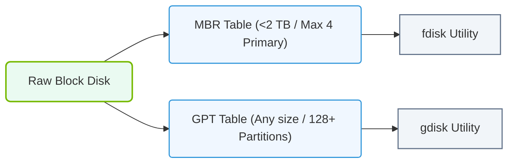

# 5.2b Partitioning with fdisk and gdisk: MBR vs GPT partition tables

#### 🏷️ The Operating System Layer — Linux for AI Infrastructure Operators > 5 Storage & Resource Management for AI Workloads > 5.2 Linux Block Storage — Partitions, Filesystems, and Mounting

---

## 🧭 Context Introduction

When you work with AI infrastructure, you will frequently need to prepare storage devices — whether they are local NVMe drives, SSDs, or large network-attached storage volumes. Before you can create filesystems and store data, you must first create **partitions** on the block device. This is where **fdisk** and **gdisk** come in.

These two tools help you divide a disk into logical sections. The key difference between them is the type of **partition table** they create: **MBR** (Master Boot Record) or **GPT** (GUID Partition Table). Understanding when to use each is critical for AI workloads, especially when dealing with large datasets or modern hardware.

---

## ⚙️ What is a Partition Table?

A partition table is a data structure stored at the beginning of a disk that tells the operating system how the disk is divided. It defines where each partition starts and ends, and what type of filesystem it contains.

- **MBR** is the older standard, introduced in the 1980s.
- **GPT** is the modern replacement, part of the UEFI specification.

---

## 📊 MBR vs GPT — Key Differences at a Glance

| Feature | MBR (Master Boot Record) | GPT (GUID Partition Table) |
|---|---|---|
| **Maximum disk size** | 2 TB | 9.4 ZB (zettabytes) |
| **Maximum partitions** | 4 primary partitions (or 3 primary + 1 extended) | 128 partitions by default |
| **Redundancy** | No backup — single copy at start of disk | Stores primary and backup table at start and end of disk |
| **Compatibility** | Works with BIOS and older systems | Requires UEFI (modern systems) |
| **Data integrity** | No checksum protection | CRC32 checksum for partition table integrity |
| **Use case** | Legacy systems, small disks, bootable USB drives | Modern servers, AI storage, disks larger than 2 TB |

---

## 🛠️ When to Use fdisk (MBR)

**fdisk** is the traditional tool for creating MBR partition tables. Use it when:

- The disk is **smaller than 2 TB**
- You need compatibility with **older BIOS-based systems**
- You are creating a **bootable USB drive** for legacy hardware
- The operating system does not support UEFI or GPT

**Limitations to remember for AI workloads:**
- MBR cannot address disks larger than 2 TB. If you have a 4 TB NVMe drive for storing AI model checkpoints, MBR will waste half the space.
- You are limited to only 4 primary partitions. If you need more, you must use an extended partition — which adds complexity.

---

### 📊 Visual Representation: Partitioning Utilities and Partition Tables
This flowchart maps out partition table choices (MBR vs. GPT) and the corresponding Linux management utilities.

## 🕵️ When to Use gdisk (GPT)

**gdisk** is the modern tool for creating GPT partition tables. Use it when:

- The disk is **larger than 2 TB** (common for AI datasets and model storage)
- You need **more than 4 partitions** (e.g., separate partitions for OS, data, logs, and swap)
- The system uses **UEFI firmware** (most modern servers and workstations)
- You want **data integrity protection** via checksums

**Why GPT is preferred for AI Infrastructure:**
- AI datasets often exceed 2 TB. GPT handles them natively.
- You can create separate partitions for different AI workloads (training data, inference cache, logs) without hitting the 4-partition limit.
- The backup partition table at the end of the disk provides redundancy — important for production storage.

---

## 🔧 How fdisk and gdisk Work (Conceptually)

Both tools operate interactively. You specify a block device (like **/dev/sda** or **/dev/nvme0n1**) and then use simple single-letter commands to create, delete, or modify partitions.

**Common workflow for both tools:**

1. **Open the disk** — You specify the device path.
2. **Create a new partition table** — You choose MBR (fdisk) or GPT (gdisk).
3. **Add partitions** — You define the size, starting sector, and type.
4. **Write changes** — The changes are saved to the disk.
5. **Verify** — You confirm the new layout.

**Important:** Neither tool writes changes to the disk until you explicitly tell it to. This gives you a safety net to review your plan before committing.

---

## 🧪 Practical Example: Partitioning a 4 TB AI Storage Drive

Imagine you have a 4 TB NVMe drive for storing training datasets and model checkpoints.

**With fdisk (MBR):**
- You would be limited to 2 TB usable space.
- You could only create 4 primary partitions — not ideal for organizing different datasets.

**With gdisk (GPT):**
- You can use the full 4 TB.
- You could create partitions like:
  - 500 GB for training data set A
  - 500 GB for training data set B
  - 2 TB for model checkpoints
  - 500 GB for logs and temporary files
  - 500 GB for swap or scratch space
- You have room for more partitions later without restructuring the disk.

---

## ✅ Summary Checklist for Engineers

- **Use fdisk** when: disk < 2 TB, legacy BIOS, simple bootable media.
- **Use gdisk** when: disk > 2 TB, UEFI system, many partitions, production AI storage.
- **Always verify** your partition layout before writing changes.
- **Remember:** GPT is the standard for modern AI infrastructure. MBR is only for legacy compatibility.

---

## 📚 Key Takeaway

For AI Infrastructure and Operations, **GPT with gdisk is the default choice**. It handles the large storage requirements of AI workloads, provides redundancy, and gives you the flexibility to organize your data efficiently. MBR with fdisk is useful only for very specific legacy scenarios. As a new engineer, focus on mastering gdisk first — it will serve you well in almost every modern AI deployment.

