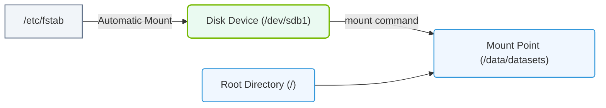

# 5.2d Mounting filesystems: mount command, /etc/fstab, and persistent mounts

#### 🏷️ The Operating System Layer — Linux for AI Infrastructure Operators > 5 Storage & Resource Management for AI Workloads > 5.2 Linux Block Storage — Partitions, Filesystems, and Mounting

## 🧭 Context Introduction

When working with AI workloads, you will frequently need to attach storage volumes to your Linux systems. These volumes might contain training datasets, model checkpoints, or inference logs. Before you can use a storage device (like a new SSD or a network-attached drive), you must **mount** it — which means attaching the filesystem to a specific directory in your Linux directory tree. This topic covers how to mount filesystems manually, how to make mounts survive a reboot, and how to configure persistent mounts using the system configuration file.

---

## ⚙️ What Does "Mounting" Mean?

- **Mounting** is the process of making a storage device's filesystem accessible at a specific directory (called a **mount point**).
- Before mounting, the device is just a raw block device (e.g., `/dev/sdb1`). After mounting, you can read and write files to it through the mount point (e.g., `/mnt/data`).
- AI workloads often require large, dedicated storage volumes for datasets and model outputs — proper mounting ensures these volumes are always available when needed.

---

## 🛠️ The `mount` Command — Manual Mounting

The **mount** command is used to attach a filesystem to a directory. It is the primary tool for temporary or one-time mounts.

**Key concepts:**
- You must specify the **device** (e.g., `/dev/sdb1`) and the **mount point** (e.g., `/mnt/data`).
- The mount point directory must already exist before mounting.
- Only the root user (or users with sudo privileges) can mount filesystems.

**Example usage (inline):**
- To mount a device: **mount /dev/sdb1 /mnt/data**
- To see all currently mounted filesystems: **mount** (run without arguments)
- To unmount (detach) a filesystem: **umount /mnt/data**

**Common options:**
- **-t** — Specify the filesystem type (e.g., **-t ext4** or **-t xfs**)
- **-o** — Pass mount options (e.g., **-o ro** for read-only, **-o noexec** to prevent execution of binaries)
- **-a** — Mount all filesystems listed in `/etc/fstab` (useful after editing that file)

**Important for AI workloads:**
- Use **noatime** option to reduce disk writes (improves performance for read-heavy datasets)
- Use **nofail** to allow the system to boot even if the mount fails (critical for removable or network storage)

---

## 📄 The `/etc/fstab` File — The Mount Configuration Database

The **/etc/fstab** file (filesystem table) is a system configuration file that defines how disk partitions, block devices, and remote filesystems should be mounted. It is read at boot time and by the **mount -a** command.

**Structure of each line in /etc/fstab:**
Each line contains six fields, separated by spaces or tabs:

1. **Device** — The block device or UUID (e.g., `/dev/sdb1` or `UUID=abc123...`)
2. **Mount point** — The directory where the filesystem will be mounted (e.g., `/mnt/data`)
3. **Filesystem type** — e.g., `ext4`, `xfs`, `nfs`, `btrfs`
4. **Options** — Mount options separated by commas (e.g., `defaults`, `noatime`, `nofail`)
5. **Dump** — Backup flag (usually `0` to disable)
6. **Pass** — Filesystem check order at boot (`0` = skip, `1` = root filesystem, `2` = other filesystems)

**Example entry (inline):**
- **/dev/sdb1 /mnt/data ext4 defaults,noatime,nofail 0 2**

**Why use UUID instead of device names?**
- Device names like `/dev/sdb1` can change when you add or remove drives (e.g., after a reboot, the same drive might become `/dev/sdc1`).
- UUIDs (Universally Unique Identifiers) are permanent and tied to the filesystem itself.
- To find a device's UUID: **blkid /dev/sdb1** (output: UUID="abc123...")

---

### 📊 Visual Representation: Mounting Directory Tree Binding
This diagram displays how a physical disk device partition is mapped to a mount point directory within the root file system tree.

## 🔄 Persistent Mounts — Surviving Reboots

A **persistent mount** is a mount that is automatically recreated every time the system boots. This is achieved by adding an entry to `/etc/fstab`.

**Why persistent mounts matter for AI:**
- Training jobs may run for days or weeks — if a storage volume is not mounted after a reboot, the job will fail.
- Shared datasets on network filesystems (NFS) must be mounted automatically for all compute nodes.
- Model checkpoint directories must be reliably available to save and resume training.

**How to make a mount persistent:**
1. Identify the device or UUID using **blkid**.
2. Create the mount point directory if it doesn't exist (e.g., **mkdir -p /mnt/data**).
3. Edit `/etc/fstab` and add a new line with the correct fields.
4. Test the entry by running **mount -a** (this mounts all entries in fstab without rebooting).
5. Verify with **mount** or **df -h** that the filesystem is now mounted.

**Common pitfalls:**
- If the mount point directory does not exist, the mount will fail.
- If the device is not present (e.g., removable drive), the system may hang at boot unless you use the **nofail** option.
- Typos in `/etc/fstab` can prevent the system from booting — always test with **mount -a** first.

---

## 📊 Comparison: Temporary vs. Persistent Mounts

| Feature | Temporary Mount (mount command) | Persistent Mount (/etc/fstab) |
|---------|-------------------------------|-------------------------------|
| Survives reboot | ❌ No | ✅ Yes |
| Configuration location | Command line only | `/etc/fstab` file |
| Ease of change | Quick, no file editing | Requires editing config file |
| Best for | Testing, one-time data transfers | Production AI storage, shared datasets |
| Error handling | Immediate feedback | Can cause boot failures if misconfigured |
| Common AI use case | Loading a single experiment dataset | Mounting network storage for training cluster |

---

## 🕵️ Verification and Troubleshooting

**How to check if a mount is working:**
- Run **mount** to list all mounted filesystems (look for your mount point in the output).
- Run **df -h** to see disk usage and mount points.
- Run **findmnt** for a tree view of mount relationships.

**Common issues and solutions:**
- **"mount: /mnt/data: special device /dev/sdb1 does not exist"** — The device name may have changed. Use **lsblk** to find the correct device name or use UUID instead.
- **"mount: /mnt/data: mount point does not exist"** — Create the directory with **mkdir -p /mnt/data**.
- **System hangs at boot** — Boot into recovery mode, edit `/etc/fstab` to comment out the problematic line (add **#** at the start), then fix the entry.
- **"mount: wrong fs type, bad option, bad superblock"** — The filesystem type specified in the command or fstab does not match the actual filesystem on the device. Use **blkid** to check the correct type.

---

## ✅ Summary

- **Mounting** makes storage devices accessible at directories in the Linux filesystem tree.
- The **mount** command is used for manual, temporary mounts.
- The **/etc/fstab** file defines persistent mounts that survive reboots.
- For AI infrastructure, persistent mounts are essential for reliable access to datasets, model checkpoints, and shared storage.
- Always use **UUID** instead of device names for persistent mounts to avoid issues when hardware configuration changes.
- Test fstab entries with **mount -a** before rebooting to catch errors early.

Understanding mounting is a foundational skill for managing AI infrastructure — it ensures your workloads always have access to the data they need, even after system restarts.

