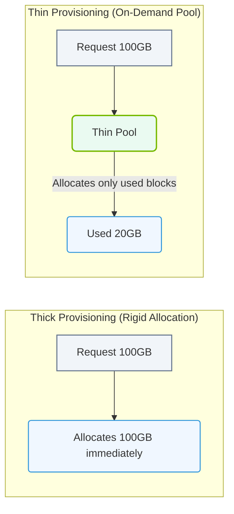

# 5.3d Thin provisioning for checkpoint storage optimization

#### 🏷️ The Operating System Layer — Linux for AI Infrastructure Operators > 5 Storage & Resource Management for AI Workloads > 5.3 Logical Volume Management (LVM) — Flexible Storage Pools

---

## 📘 Context Introduction

In AI infrastructure, checkpoints are snapshots of model training state — weights, optimizer state, and training step data. These checkpoints can consume massive amounts of storage, especially during long-running training jobs. **Thin provisioning** is a storage technique that allows you to allocate storage space on-demand rather than reserving it all upfront. This is particularly valuable for checkpoint storage because checkpoints are often created, retained for a period, and then deleted as training progresses. Without thin provisioning, you would need to pre-allocate the maximum possible storage for every checkpoint, leading to significant wasted capacity.

---

## ⚙️ What Is Thin Provisioning?

Thin provisioning is a storage virtualization method where the logical volume appears to have more capacity than is physically allocated. Storage is consumed only when data is actually written, not when the volume is created.

- **Traditional (thick) provisioning**: When you create a 100GB volume, 100GB of physical storage is immediately reserved, even if only 1GB is used.
- **Thin provisioning**: When you create a 100GB thin volume, only metadata is allocated. Physical storage is consumed incrementally as data is written.

---

## 🧠 Why Thin Provisioning Matters for Checkpoints

Checkpoint storage has unique characteristics that make thin provisioning ideal:

- **Bursty writes**: Checkpoints are written in large bursts, then idle for long periods.
- **Temporary nature**: Old checkpoints are frequently deleted as new ones are created.
- **Over-provisioning safety**: You can define a large logical size (e.g., 5TB) while only using the physical space actually needed at any moment.
- **Cost efficiency**: Reduces the need to purchase physical storage for peak theoretical usage.

---

## 🛠️ How Thin Provisioning Works in LVM

In LVM (Logical Volume Manager), thin provisioning is implemented using a **thin pool** and **thin volumes**:

- **Thin pool**: A special logical volume that acts as a shared reservoir of physical storage. It is created from a volume group.
- **Thin volumes**: Logical volumes created within the thin pool. Each thin volume has a virtual size (the maximum it can grow to) but only consumes physical space from the pool as data is written.

Key concepts:

- **Virtual size**: The maximum size the thin volume claims it can hold. This is what the operating system sees.
- **Data space**: The actual physical storage consumed from the thin pool.
- **Metadata space**: A small amount of storage used to track which blocks are allocated. Typically 0.1% to 1% of the pool size.
- **Over-provisioning ratio**: The sum of all thin volume virtual sizes divided by the thin pool physical size. A ratio of 10:1 means you can have 10TB of virtual volumes on a 1TB thin pool.

---

### 📊 Visual Representation: Thin Provisioning vs. Thick Provisioning
This flowchart contrasts thick provisioning (pre-allocating all block space) with thin provisioning (on-demand allocation from a shared storage pool).

## 📊 Comparison: Thick vs. Thin Provisioning for Checkpoints

| Feature | Thick Provisioning | Thin Provisioning |
|---|---|---|
| **Storage allocation** | All space reserved at creation | Space allocated on write |
| **Checkpoint storage efficiency** | Low — wasted space for unused capacity | High — only used space consumes storage |
| **Over-provisioning** | Not possible | Supported (e.g., 5:1 ratio) |
| **Performance** | Consistent, no allocation overhead | Slight overhead on first write to new blocks |
| **Snapshot support** | Standard LVM snapshots (copy-on-write) | Native thin snapshots (very efficient) |
| **Recovery complexity** | Simple — space is guaranteed | Requires monitoring to avoid pool exhaustion |
| **Best use case** | Databases, critical production data | Checkpoints, temporary files, development environments |

---

## 🕵️ Monitoring Thin Provisioning

Because thin provisioning allows over-commitment, monitoring is critical. If the thin pool runs out of physical space, all thin volumes in that pool may become unavailable.

Key metrics to monitor:

- **Thin pool data usage**: Percentage of physical space consumed in the pool.
- **Thin pool metadata usage**: Metadata space consumption (should stay below 90%).
- **Thin volume virtual-to-actual ratio**: How much of the virtual size is actually used.
- **Free space in the volume group**: Remaining physical space available to expand the thin pool.

---

## 🧩 Best Practices for Checkpoint Storage with Thin Provisioning

- **Set a realistic virtual size**: Estimate the maximum checkpoint storage needed for your largest training run, then add 20-30% headroom.
- **Monitor pool usage aggressively**: Set alerts at 70%, 80%, and 90% pool utilization.
- **Use thin snapshots for checkpoint versioning**: Instead of copying entire checkpoint files, use LVM thin snapshots to capture point-in-time states with minimal storage overhead.
- **Automate cleanup**: Implement a retention policy that deletes old checkpoints (e.g., keep last 5 checkpoints). This frees space in the thin pool automatically.
- **Separate metadata and data**: Place the thin pool metadata on faster storage (e.g., NVMe) for better performance during checkpoint writes.
- **Avoid 100% over-provisioning**: Never set the sum of virtual sizes to more than 80-90% of the thin pool's physical capacity to leave room for unexpected growth.

---

## ✅ Summary

Thin provisioning is a powerful storage optimization technique for AI checkpoint management. It allows engineers to:

- Define large logical volumes without wasting physical storage.
- Efficiently handle the bursty, temporary nature of checkpoint data.
- Reduce storage costs by over-provisioning safely.
- Leverage efficient snapshots for checkpoint versioning.

The key trade-off is the need for active monitoring to prevent pool exhaustion. With proper alerting and automated cleanup, thin provisioning becomes an essential tool in any AI infrastructure operator's storage toolkit.

