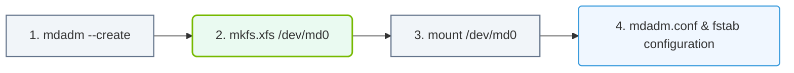

# 5.4b Linux software RAID with mdadm

#### 🏷️ The Operating System Layer — Linux for AI Infrastructure Operators > 5 Storage & Resource Management for AI Workloads > 5.4 RAID — Redundancy and Performance for AI Storage

---

## 🧠 Context Introduction

When managing storage for AI workloads, you often need a balance between **performance** and **reliability**. Hardware RAID controllers can be expensive and inflexible. That's where **Linux software RAID** comes in — it uses the operating system's built-in capabilities to combine multiple physical disks into a single logical unit, providing redundancy, improved performance, or both. The tool that makes this possible is **mdadm** (Multiple Device Administration). For engineers new to AI infrastructure, understanding software RAID is essential because it allows you to build resilient storage solutions without specialized hardware, making it ideal for prototyping, edge deployments, or cost-sensitive environments.

---

## ⚙️ What is mdadm?

**mdadm** is the standard Linux utility for managing software RAID arrays. It works at the block device level, meaning the operating system sees the RAID array as a single disk, while mdadm handles the distribution of data across the underlying physical drives.

Key characteristics:
- **No special hardware required** — works with standard SATA, SAS, or NVMe drives
- **Flexible RAID levels** — supports RAID 0, 1, 5, 6, 10, and more
- **Hot-swap capable** — can replace failed drives without rebooting
- **Kernel-based** — the RAID logic runs in the Linux kernel for efficiency

---

## 📊 Common RAID Levels for AI Workloads

| RAID Level | Description | Minimum Drives | Use Case for AI |
|------------|-------------|----------------|-----------------|
| **RAID 0** | Striping — data split across drives | 2 | High-speed scratch storage (no redundancy) |
| **RAID 1** | Mirroring — exact copy on each drive | 2 | Critical model checkpoints, logs |
| **RAID 5** | Striping with parity | 3 | Balanced read performance and redundancy |
| **RAID 6** | Striping with double parity | 4 | Large datasets where two drive failures are possible |
| **RAID 10** | Mirroring + striping | 4 | High-performance training data storage |

---

## 🛠️ How mdadm Works Under the Hood

mdadm creates a **virtual block device** (e.g., **/dev/md0**) that represents the RAID array. The kernel handles all read/write operations to this device, while mdadm manages the metadata and drive membership.

The process follows these steps:
1. **Partition or prepare** the physical drives (using tools like **fdisk** or **parted**)
2. **Create the RAID array** with mdadm, specifying the RAID level and member drives
3. **Format the array** with a filesystem (e.g., **ext4** or **xfs**)
4. **Mount the array** to a directory for use

---

### 📊 Visual Representation: mdadm Software RAID Setup Workflow
This flowchart outlines the steps to build a software RAID array, format it, and configure persistent boot mounts in Linux.

## 🕵️ Monitoring and Maintenance

Once your RAID array is running, you need to keep an eye on its health. mdadm provides several ways to do this:

- **Check array status** — view the current state of all RAID devices
- **Review detailed information** — see which drives are active, failed, or spare
- **Monitor for failures** — mdadm can send email alerts or log events when a drive fails
- **Perform consistency checks** — regularly verify data integrity across the array

Common maintenance tasks include:
- **Replacing a failed drive** — remove the bad drive, insert a new one, and add it to the array
- **Growing the array** — add more drives to increase capacity (supported for some RAID levels)
- **Migrating RAID levels** — change from RAID 1 to RAID 5, for example (requires careful planning)

---

## 📁 Managing mdadm Configuration

mdadm stores its configuration in **/etc/mdadm/mdadm.conf**. This file tells the system which arrays to assemble at boot time. Without this configuration, you would need to manually assemble the array after every reboot.

Key configuration elements:
- **ARRAY lines** — define each RAID device and its member drives
- **MAILADDR** — set an email address for failure notifications
- **PROGRAM** — specify a script to run on events (e.g., drive failure)

After creating or modifying an array, you update this configuration file so the system remembers it.

---

## 🔄 Recovering from Drive Failures

When a drive fails in a RAID array, the array continues to operate (if it has redundancy). The failed drive is marked as **removed** or **faulty**. The recovery process involves:

1. **Identifying the failed drive** — check the array status to see which drive is bad
2. **Physically replacing the drive** — swap in a new drive of equal or larger size
3. **Adding the new drive** — tell mdadm to include the replacement in the array
4. **Monitoring rebuild progress** — the array automatically rebuilds the data onto the new drive

During rebuild, performance may be degraded, but the array remains accessible.

---

## ⚠️ Important Considerations for AI Infrastructure

- **Backup is not optional** — RAID protects against drive failure, not against accidental deletion, corruption, or disasters. Always maintain separate backups of critical AI data.
- **Performance tuning** — RAID level choice affects read/write speeds. For AI training, RAID 0 or RAID 10 often provide the best throughput, while RAID 5/6 offer better space efficiency.
- **Drive size matching** — mdadm works best with identical drives. If you mix sizes, the array uses the smallest drive's capacity for each member.
- **Write-intent bitmap** — this feature helps speed up recovery after an unclean shutdown by tracking which parts of the array were being written to.

---

## ✅ Summary

Linux software RAID with **mdadm** gives engineers a powerful, flexible, and cost-effective way to manage storage for AI workloads. By understanding the different RAID levels, how to create and maintain arrays, and how to handle failures, you can build resilient storage systems that keep your AI pipelines running smoothly. The key takeaway is that mdadm turns ordinary disks into reliable, high-performance storage — no expensive hardware controllers needed.

