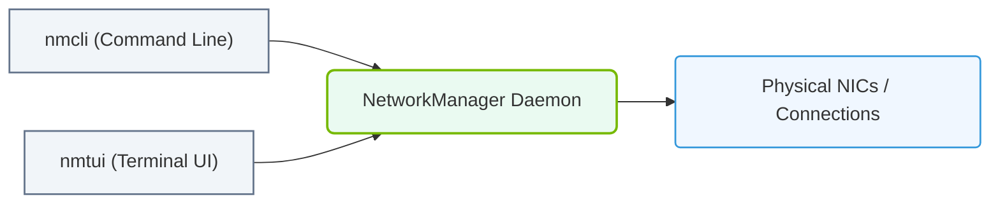

# 6.1c NetworkManager: nmcli and nmtui for interactive configuration

#### 🏷️ The Operating System Layer — Linux for AI Infrastructure Operators > 6 Linux Networking & Security Hardening > 6.1 Linux Network Interface Configuration

---

## 🌐 Context Introduction

When managing AI infrastructure, network connectivity is the backbone that connects compute nodes, storage systems, and external services. **NetworkManager** is the default network management service on many Linux distributions used in AI environments (such as Ubuntu, RHEL, and Rocky Linux). It provides two primary interactive tools for engineers to configure, monitor, and troubleshoot network interfaces without needing to manually edit configuration files:

- **nmcli** — a command-line tool (powerful for scripting and remote management)
- **nmtui** — a text-based user interface (great for quick, visual configuration)

Both tools allow you to manage connections, devices, Wi-Fi, and network settings interactively. Understanding these tools is essential for any engineer working with AI infrastructure, whether you are setting up a new server, troubleshooting a network drop, or reconfiguring interfaces after hardware changes.

---

## ⚙️ What is NetworkManager?

NetworkManager is a service that simplifies network configuration and management. It runs in the background and automatically detects network hardware, manages connections, and applies settings. Key features include:

- **Automatic detection** of Ethernet, Wi-Fi, and bonding interfaces
- **Connection profiles** that store settings (IP addresses, DNS, routes)
- **Support for both dynamic (DHCP) and static (manual) IP configuration**
- **Integration with systemd** for service management

Engineers interact with NetworkManager primarily through **nmcli** and **nmtui**.

---

## 🛠️ nmcli — The Command-Line Power Tool

**nmcli** (NetworkManager Command-Line Interface) is the most flexible and scriptable way to manage networking. It is ideal for remote sessions, automation, and detailed configuration.

### Common Use Cases

- **Viewing network status** — Check which interfaces are connected, their IP addresses, and link status
- **Managing connections** — Add, modify, activate, or delete network connection profiles
- **Configuring IP settings** — Switch between DHCP and static IP, set DNS servers, and define routes
- **Troubleshooting** — Diagnose why an interface is not connecting or has incorrect settings

### Example Workflow (Inline Commands)

To check the current state of all network devices, an engineer would run the following command:

**nmcli device status**

📤 Output: A table showing device names (e.g., eth0, ens33), their type (ethernet), state (connected/disconnected), and connection name.

To view detailed information about a specific connection profile:

**nmcli connection show eth0-profile**

📤 Output: Lists all settings for that profile, including IP address, gateway, DNS, and MAC address.

To create a new static IP connection:

**nmcli connection add type ethernet con-name static-eth0 ifname eth0 ip4 192.168.1.100/24 gw4 192.168.1.1**

📤 Output: Confirmation that the connection "static-eth0" was added successfully.

To activate a connection immediately:

**nmcli connection up static-eth0**

📤 Output: Confirmation that the connection was activated successfully.

To modify an existing connection (e.g., change DNS):

**nmcli connection modify static-eth0 ipv4.dns 8.8.8.8**

📤 Output: No output unless there is an error.

---

## 🖥️ nmtui — The Text-Based User Interface

**nmtui** (NetworkManager Text User Interface) provides a simple, menu-driven interface that runs directly in the terminal. It is perfect for engineers who prefer visual navigation or are less familiar with command syntax.

### Common Use Cases

- **Quickly editing connection settings** without remembering command flags
- **Activating or deactivating connections** with simple arrow-key navigation
- **Setting hostnames** for the system
- **Visual confirmation** of current network configuration

### How to Use

To launch nmtui, an engineer simply types:

**nmtui**

📤 Output: A full-screen menu with options like "Edit a connection", "Activate a connection", "Set system hostname", and "Quit".

Navigation is done using the **arrow keys** and **Tab** key. The **Enter** key selects an option, and **Escape** goes back or exits.

### Typical Menu Flow

1. Select **"Edit a connection"** to see a list of existing profiles
2. Choose a profile (e.g., eth0) and press **Enter**
3. Modify fields such as:
   - **IPv4 CONFIGURATION** — switch between Automatic (DHCP) or Manual
   - **Addresses** — enter static IP and subnet mask
   - **Gateway** — set the default gateway
   - **DNS servers** — add one or more DNS IP addresses
4. Select **"OK"** to save changes
5. Return to the main menu and select **"Activate a connection"** to apply changes immediately

---

### 📊 Visual Representation: NetworkManager Control Interfaces
This diagram displays how NetworkManager is controlled via CLI (nmcli) or GUI/TUI (nmtui) to modify active device connections.

## 📊 Comparison: nmcli vs nmtui

| Feature | nmcli | nmtui |
|---------|-------|-------|
| **Interface** | Command-line only | Text-based menu (GUI-like) |
| **Best for** | Scripting, automation, remote SSH | Quick visual configuration, beginners |
| **Speed** | Very fast once commands are known | Slower due to menu navigation |
| **Scriptable** | Yes — can be used in Bash scripts | No — interactive only |
| **Detail level** | Full control over all settings | Limited to common settings |
| **Learning curve** | Steeper (requires memorizing commands) | Gentle (menu-driven) |

---

## 🕵️ When to Use Which Tool

- **Use nmcli when:**
  - You are managing many servers remotely via SSH
  - You need to automate network configuration in scripts
  - You require fine-grained control over advanced settings (e.g., bonding, VLANs, bridges)
  - You are troubleshooting and need to see detailed status quickly

- **Use nmtui when:**
  - You are new to Linux networking and want a visual guide
  - You only need to make a few simple changes (e.g., set a static IP)
  - You are working on a local console and prefer menus over typing commands
  - You want to avoid syntax errors by using a guided interface

---

## ✅ Key Takeaways for New Engineers

- **NetworkManager** is the default network service on most modern Linux distributions used in AI infrastructure.
- **nmcli** is your go-to for scripting, automation, and detailed control — invest time in learning its basic commands.
- **nmtui** is a safe, visual alternative for quick changes or when you are less confident with command syntax.
- Both tools manage **connection profiles** — think of these as saved network configurations that can be activated or modified.
- Always verify your changes by checking the device status after applying modifications.
- If you make a mistake, you can always delete a connection profile and start over using either tool.

---

## 📚 Further Learning Path

- Practice creating a static IP connection with nmcli, then modify it to use DHCP using nmtui
- Explore the **nmcli connection show** command to understand all available settings
- Try using nmtui to set a custom DNS server and verify it with a simple ping test
- Learn how to use nmcli to manage Wi-Fi connections (useful for edge AI devices)

> 💡 **Pro Tip:** Always keep a backup of your working network configuration before making changes. You can export a connection profile using nmcli and restore it if something goes wrong.