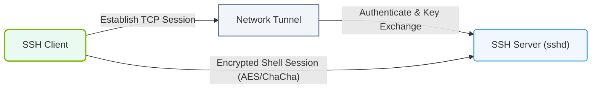

# 6.3a How SSH works: key exchange, symmetric encryption, and MACs

#### 🏷️ The Operating System Layer — Linux for AI Infrastructure Operators > 6 Linux Networking & Security Hardening > 6.3 SSH — Secure Remote Access for Cluster Management

---

## 🔍 Context Introduction

When you manage AI infrastructure — whether it's a single GPU server or a cluster of hundreds of nodes — you need a secure way to access those machines remotely. **SSH (Secure Shell)** is the standard protocol for this. It encrypts everything between your local machine and the remote server, protecting your commands, data transfers, and authentication credentials from eavesdropping or tampering.

For new engineers, understanding how SSH works under the hood helps you troubleshoot connection issues, configure secure access for AI workloads, and appreciate why SSH is trusted for managing critical infrastructure.

---

## ⚙️ The Three Pillars of SSH Security

SSH uses a clever combination of three cryptographic techniques to establish a secure connection. Each serves a specific purpose:

| Pillar | Purpose | What It Does |
|--------|---------|--------------|
| **Key Exchange** | Establish a shared secret over an insecure network | Creates a temporary session key that both sides know, without sending it directly |
| **Symmetric Encryption** | Encrypt the actual data being transmitted | Uses the shared session key to scramble all subsequent traffic (commands, file transfers, etc.) |
| **MAC (Message Authentication Code)** | Verify data integrity and authenticity | Ensures no one tampered with the data during transmission |

---

## 🕵️ Step 1: Key Exchange — Creating a Shared Secret

Before any encrypted data flows, the client and server must agree on a **session key** — a temporary, random key used only for that one connection.

- The process begins when the client connects to the server.
- Both sides exchange **public keys** and use a mathematical algorithm (like **Diffie-Hellman** or **ECDH**) to compute the same session key independently.
- Even if an attacker intercepts all the exchanged messages, they cannot derive the session key.
- The session key is **ephemeral** — it is generated fresh for each SSH session and discarded when the connection closes.

This ensures that even if one session key is compromised, past or future sessions remain secure (a property called **forward secrecy**).

---

## 🔐 Step 2: Symmetric Encryption — Protecting the Data

Once the session key is established, all communication between client and server is encrypted using **symmetric encryption**.

- Symmetric encryption means the **same key** is used to both encrypt and decrypt data.
- SSH typically uses strong algorithms like **AES (Advanced Encryption Standard)** in **CTR** or **GCM** mode.
- The session key from step 1 is fed into the symmetric cipher.
- Every command you type, every file you transfer, and every response from the server is encrypted before leaving your machine.
- Only the other end of the connection (which has the same session key) can decrypt it.

This prevents anyone on the network — including your IT department, internet service provider, or an attacker — from reading your traffic.

---

### 📊 Visual Representation: SSH Secure Connection Tunneling
This diagram shows how a secure encrypted SSH tunnel is established over public networks using public-key cryptography.

## 🛡️ Step 3: MAC — Ensuring Data Integrity

Encryption alone doesn't prevent someone from **modifying** your data in transit. A **Message Authentication Code (MAC)** solves this.

- A MAC is like a cryptographic checksum attached to each packet of data.
- It is computed using the session key and the contents of the packet.
- When the receiver gets the packet, it recomputes the MAC and compares it to the one sent.
- If they don't match, the packet was tampered with or corrupted, and SSH immediately drops the connection.

Common MAC algorithms used in SSH include **HMAC-SHA2-256** and **HMAC-SHA2-512**.

---

## 🔄 The Full SSH Handshake Flow

Here is the simplified sequence of events when you run an SSH command:

1. **TCP Connection** — Your client opens a TCP connection to port 22 on the remote server.
2. **Protocol Version Exchange** — Both sides announce which SSH protocol version they support (typically 2.0).
3. **Key Exchange Initiation** — The client and server agree on which algorithms to use for key exchange, encryption, and MAC.
4. **Key Exchange** — Using Diffie-Hellman or similar, both sides compute the shared session key.
5. **Server Authentication** — The server proves its identity using its **host key** (a long-term public/private key pair). The client checks this against a known list of trusted host keys.
6. **User Authentication** — You prove your identity using a password, SSH key pair, or other method.
7. **Encrypted Session** — All subsequent data is encrypted with the session key and protected with MACs.

---

## 🧩 Why This Matters for AI Infrastructure

- **Cluster Management** — You use SSH to run commands on GPU servers, start training jobs, and monitor logs. Understanding SSH ensures you can diagnose connection drops or performance issues.
- **Secure File Transfers** — Tools like **scp** and **rsync** (which use SSH) rely on the same encryption and integrity guarantees.
- **Automation** — AI workflows often use SSH keys (passwordless login) to automate deployment and orchestration across hundreds of nodes. Knowing how key exchange works helps you set this up securely.
- **Troubleshooting** — If you see errors like **"Host key verification failed"** or **"Connection reset by peer"**, you'll understand they relate to the key exchange or MAC verification steps.

---

## ✅ Key Takeaways for New Engineers

- SSH uses **three layers** of security: key exchange, symmetric encryption, and MACs.
- The **session key** is temporary and never sent across the network — it is computed independently by both sides.
- **Symmetric encryption** (like AES) protects the confidentiality of your data.
- **MACs** (like HMAC) protect the integrity of your data.
- The entire handshake happens automatically — you just run **ssh user@host** and the protocol handles the rest.
- For AI infrastructure operations, SSH is your primary tool for remote access, and understanding its internals helps you use it confidently and securely.