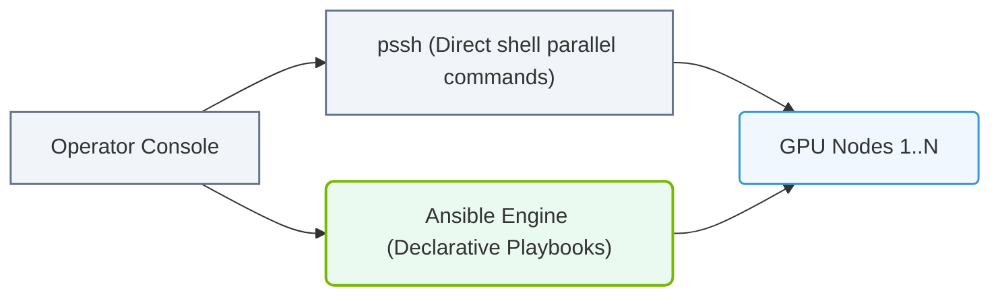

# 6.3f Managing cluster-wide SSH with pssh and Ansible for parallelism

#### 🏷️ The Operating System Layer — Linux for AI Infrastructure Operators > 6 Linux Networking & Security Hardening > 6.3 SSH — Secure Remote Access for Cluster Management

---

## 🌐 Context Introduction

When managing an AI cluster, you rarely work with a single machine. Instead, you'll need to run the same command across dozens or hundreds of nodes — checking disk space, updating configuration files, or restarting services. Doing this manually, one server at a time, is slow and error-prone.

This is where **parallel SSH tools** come in. Two of the most common approaches are **pssh** (parallel SSH) and **Ansible**. Both allow you to execute commands across multiple machines simultaneously, but they serve slightly different purposes. This guide will help you understand when and how to use each one.

---

## ⚙️ What is Parallel SSH?

Parallel SSH tools let you send a single command to many remote servers at once, rather than logging into each one individually.

**Key concepts:**
- **Host list** — A file containing the IP addresses or hostnames of all your cluster nodes
- **Parallel execution** — The command runs on all nodes at the same time, not one after another
- **Aggregated output** — Results from all nodes are collected and displayed together

---

## 🛠️ pssh — Lightweight Command Broadcasting

**pssh** (Parallel SSH) is a simple, fast tool for running one-off commands across many servers. It's ideal for quick checks and ad-hoc tasks.

**When to use pssh:**
- Checking disk usage across all nodes
- Restarting a service on every machine
- Copying a single file to multiple nodes
- Quick health checks during troubleshooting

**How it works:**
- You provide a list of hostnames or IPs in a text file
- pssh connects to all of them simultaneously using SSH
- It runs your command and collects the output

**Limitations:**
- No state management — it doesn't track what was done previously
- No error recovery — if a node fails, you must retry manually
- No templating — every command must be typed exactly

---

## 🧩 Ansible — Orchestration and Configuration Management

**Ansible** is a more powerful tool that goes beyond simple command execution. It uses **playbooks** (YAML files) to define desired states for your cluster.

**When to use Ansible:**
- Installing software packages across all nodes
- Applying consistent configuration files
- Managing users and permissions cluster-wide
- Performing multi-step workflows (e.g., update config, restart service, verify status)

**How it works:**
- You write a playbook describing the desired state
- Ansible connects to all nodes via SSH
- It checks the current state and only makes changes if needed (idempotency)
- It reports which nodes succeeded, failed, or were skipped

**Key advantages over pssh:**
- **Idempotent** — Running the same playbook twice produces the same result
- **Error handling** — Failed tasks can be retried or skipped
- **Templating** — Use variables to customize commands per node
- **Facts gathering** — Automatically collects system information from each node

---

### 📊 Visual Representation: Ad-Hoc Parallel Server Automation
This flowchart contrasts parallel SSH executions using pssh (ad-hoc commands) against declarative orchestrations using Ansible playbooks.

## 📊 Comparison: pssh vs Ansible

| Feature | pssh | Ansible |
|---------|------|---------|
| **Setup complexity** | Minimal — install one package | Moderate — requires inventory file and playbook |
| **Best for** | Quick one-off commands | Repeated, complex, or stateful operations |
| **Idempotent** | No | Yes |
| **Error recovery** | Manual retry | Automatic with retry options |
| **Templating** | No | Yes (Jinja2) |
| **Facts gathering** | No | Yes |
| **Learning curve** | Low | Medium |
| **Typical use case** | "Check disk space on all nodes" | "Ensure NTP is installed and configured on all nodes" |

---

## 🕵️ When to Use Each Tool

**Use pssh when:**
- You need a quick answer from all nodes right now
- The task is a single, simple command
- You don't need to track what was done previously
- You're troubleshooting and need immediate feedback

**Use Ansible when:**
- You're setting up or configuring the cluster
- The task involves multiple steps or dependencies
- You need to ensure consistency across all nodes
- You want to automate recurring maintenance tasks
- You need to handle failures gracefully

---

## 🔐 Prerequisites for Both Tools

Before using either pssh or Ansible, ensure the following are in place:

- **SSH key-based authentication** — Passwordless SSH from your control node to all cluster nodes
- **Known hosts** — Each node's SSH key fingerprint is accepted (or you disable strict host key checking for trusted networks)
- **Network connectivity** — All nodes are reachable from your control machine
- **Same user account** — The SSH user exists on all nodes with appropriate permissions

---

## 🚀 Getting Started Tips for New Engineers

1. **Start with pssh** — It's simpler and will help you understand the concept of parallel execution
2. **Create a host list file** — A plain text file with one hostname per line is all you need
3. **Test on a small group first** — Try your command on 2-3 nodes before scaling to the full cluster
4. **Move to Ansible for repeatable tasks** — Once you find yourself running the same pssh command repeatedly, write an Ansible playbook instead
5. **Use dry-run mode in Ansible** — Always test with the `--check` flag before making changes

---

## ✅ Summary

- **pssh** is your go-to for quick, ad-hoc commands across the cluster
- **Ansible** is your tool for configuration management and repeatable automation
- Both rely on SSH and require proper key-based authentication
- Start simple with pssh, then graduate to Ansible as your tasks become more complex
- Parallel execution is essential for AI infrastructure — it saves time and reduces human error

