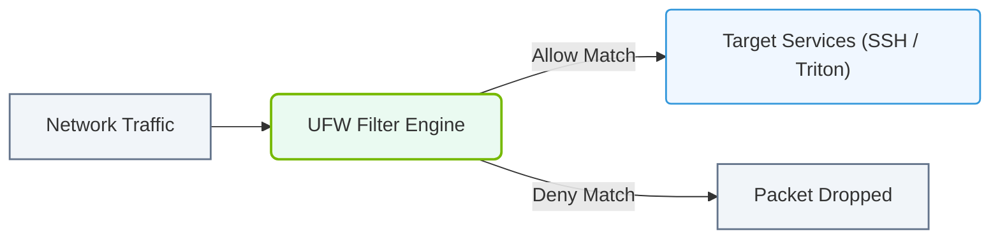

# 6.4b ufw (Uncomplicated Firewall): the Ubuntu-friendly interface

#### 🏷️ The Operating System Layer — Linux for AI Infrastructure Operators > 6 Linux Networking & Security Hardening > 6.4 Firewall and Security Basics for AI Servers

---

## 🔍 Context Introduction

When you're setting up an AI server running Ubuntu, you need a firewall to protect your system from unauthorized access. Traditional firewall tools like **iptables** are powerful but complex and error-prone for new engineers. **ufw (Uncomplicated Firewall)** is a user-friendly wrapper that simplifies firewall management on Ubuntu systems. It provides a clean, intuitive way to allow or deny network traffic to your AI workloads — whether you're running training jobs, inference servers, or data pipelines.

---

## ⚙️ What is ufw?

ufw is a command-line tool that manages **iptables** rules behind the scenes. It was designed specifically for Ubuntu to make firewall configuration accessible without needing deep networking expertise.

Key characteristics:
- **Simplified syntax** — uses plain English-like rules
- **Default deny policy** — blocks all incoming traffic unless explicitly allowed
- **Application profiles** — can manage rules for common services (SSH, HTTP, etc.)
- **Logging support** — tracks connection attempts for security auditing
- **IPv6 ready** — works with both IPv4 and IPv6 automatically

---

## 🛠️ How ufw Works for AI Servers

For an AI infrastructure operator, ufw helps you control access to critical services:

| Service | Typical Port | Why You Need It |
|---------|-------------|-----------------|
| SSH | 22 | Remote management of your AI server |
| Jupyter Notebook | 8888 | Interactive model development |
| TensorBoard | 6006 | Visualizing training metrics |
| MLflow | 5000 | Experiment tracking and model registry |
| NVIDIA Triton Inference Server | 8000, 8001 | Serving trained models |
| Prometheus Node Exporter | 9100 | Monitoring server health |

---

## 🕵️ Understanding ufw Default Policies

ufw operates with two default policies:

- **Incoming (default: deny)** — All inbound connections are blocked unless you create an explicit allow rule
- **Outgoing (default: allow)** — Your server can initiate outbound connections (e.g., downloading datasets, pulling Docker images)

This "deny by default" approach is the security best practice for AI servers — you only open ports that your workloads actually need.

---

## 📊 Common ufw Rule Patterns for AI Workloads

When configuring ufw for an AI server, you'll typically create rules for:

**1. Management access**
- Allow SSH from your specific IP range (not from everywhere)
- Allow HTTPS for web-based management tools

**2. AI service ports**
- Allow inference server ports only from application servers
- Allow Jupyter from your development workstation IP

**3. Monitoring and logging**
- Allow Prometheus or Grafana access from monitoring servers
- Allow syslog traffic from centralized logging

**4. Cluster communication**
- Allow inter-node traffic within your AI cluster subnet
- Allow Kubernetes API server access if running containers

---

### 📊 Visual Representation: Uncomplicated Firewall (UFW) Policy Rule Processing
This diagram displays how UFW sits as a user-friendly frontend managing netfilter rules, filtering inbound network traffic.

## 🧩 Understanding ufw Rule Syntax

ufw rules follow a simple pattern:

**Allow a specific port:**  
**ufw allow 22** — This opens port 22 for all IP addresses

**Allow a port with protocol:**  
**ufw allow 22/tcp** — This opens TCP port 22 only

**Allow from a specific IP:**  
**ufw allow from 192.168.1.100 to any port 22** — This restricts SSH to one IP

**Allow a subnet:**  
**ufw allow from 10.0.0.0/8 to any port 8888** — This allows Jupyter from your internal network

**Deny a specific source:**  
**ufw deny from 203.0.113.5** — This blocks a suspicious IP

---

## 🔄 Managing ufw State

ufw has three operational states:

- **Inactive** — No firewall rules are applied (not recommended for production AI servers)
- **Active** — Rules are enforced immediately
- **Enabled at boot** — Rules persist after server restart

---

## 🚦 Checking ufw Status and Rules

To verify your firewall configuration, you can check:

- **Current status** — Shows whether ufw is active or inactive
- **Rule list** — Displays all configured rules with numbers
- **Verbose output** — Shows additional details like logging status

---

## 📋 Best Practices for AI Infrastructure

1. **Start with a deny-all policy** — Only open ports you explicitly need
2. **Limit SSH to your management IP range** — Never leave SSH open to the world
3. **Use application profiles** — ufw includes profiles for common services (e.g., **ufw allow 'Nginx Full'**)
4. **Enable logging during setup** — Monitor logs to catch unexpected connection attempts
5. **Test rules before production** — Apply rules in a staging environment first
6. **Document your rules** — Keep a record of why each port is open
7. **Review rules regularly** — Remove unused rules as workloads change

---

## 🧠 Common Pitfalls for New Engineers

- **Forgetting to enable ufw** — Rules are not active until you explicitly enable the firewall
- **Opening too many ports** — Only expose what your AI services actually need
- **Allowing from everywhere** — Always restrict access to specific IPs or subnets when possible
- **Not testing after reboot** — Verify that ufw starts automatically after server restarts
- **Confusing allow and deny order** — ufw processes rules in order; first match wins

---

## 🎯 Summary

ufw is your go-to firewall tool for Ubuntu-based AI servers. It provides a simple, readable way to control network traffic without the complexity of raw iptables. By understanding default policies, rule patterns, and best practices, you can secure your AI infrastructure while keeping it accessible for legitimate workloads. Start with a restrictive policy, add rules only as needed, and always verify your configuration before deploying to production.

