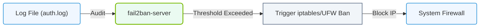

# 6.4c fail2ban: automatic IP blocking after failed SSH attempts

#### 🏷️ The Operating System Layer — Linux for AI Infrastructure Operators > 6 Linux Networking & Security Hardening > 6.4 Firewall and Security Basics for AI Servers

---

## 🔍 Context Introduction

When you manage AI servers, SSH is your primary remote access method. Unfortunately, bots and attackers constantly scan the internet for open SSH ports and try to break in by guessing passwords. This is called a **brute-force attack**.

**fail2ban** is a security tool that watches your server's log files for repeated failed login attempts. When it detects too many failures from the same IP address, it automatically adds a firewall rule to block that IP for a set period. This gives you hands-free protection without needing to manually ban attackers.

---

## ⚙️ How fail2ban Works

- fail2ban reads system log files (like **/var/log/auth.log** or **/var/log/secure**) in real time.
- It looks for patterns that indicate failed authentication attempts (e.g., "Failed password for root").
- When a configurable threshold is reached (e.g., 5 failed attempts within 10 minutes), fail2ban triggers an action.
- The action typically adds an **iptables** or **nftables** rule to drop all traffic from the offending IP address.
- After a configurable ban time (e.g., 10 minutes), the rule is removed automatically.

---

## 🛠️ Core Components of fail2ban

| Component | Purpose |
|-----------|---------|
| **Jail** | A configuration that defines what to monitor, what action to take, and for how long. Each service (SSH, HTTP, etc.) gets its own jail. |
| **Filter** | A set of regular expressions that match failed login patterns in log files. |
| **Action** | The command or script executed when a ban or unban occurs (e.g., adding a firewall rule). |
| **Log file** | The source file that fail2ban watches for suspicious activity. |

---

## 🕵️ Default Behavior for SSH

- By default, fail2ban includes a pre-configured jail for SSH.
- The default settings typically are:
  - **Max retries**: 5 failed attempts
  - **Find time**: 10 minutes (the window in which failures are counted)
  - **Ban time**: 10 minutes (how long the IP is blocked)
- When triggered, fail2ban adds a firewall rule that drops all packets from the attacker's IP.

---

### 📊 Visual Representation: fail2ban Log Auditing and Ban Pipeline
This flowchart shows how fail2ban parses access logs, increments host failure counts, and triggers firewall bans for malicious IPs.

## 📊 Example of a Typical fail2ban Workflow

1. An attacker tries to SSH into your server with wrong passwords.
2. Each failed attempt is logged to **/var/log/auth.log**.
3. fail2ban reads the log and counts failures from the same IP.
4. After 5 failures within 10 minutes, fail2ban triggers the **iptables-multiport** action.
5. The attacker's IP is now blocked at the firewall level.
6. After 10 minutes, the ban expires and the IP is unblocked automatically.

---

## 🔐 Why This Matters for AI Infrastructure

- AI servers often run 24/7 and are exposed to the internet for remote access.
- A compromised SSH account could lead to data theft, model tampering, or ransomware.
- fail2ban reduces the attack surface without requiring manual intervention.
- It works alongside your existing firewall (like **ufw** or **iptables**) and does not replace it.

---

## ✅ Best Practices for Engineers

- Always test fail2ban in a non-production environment first.
- Whitelist your own IP addresses or management jump hosts to avoid locking yourself out.
- Monitor the **fail2ban.log** file regularly to see which IPs are being blocked.
- Adjust ban times based on your environment — longer bans for persistent attackers, shorter bans for dynamic IPs.
- Combine fail2ban with SSH key-based authentication for stronger security.

---

## 🧠 Key Takeaway

fail2ban is a simple, automated way to protect your AI servers from brute-force SSH attacks. It watches logs, detects bad behavior, and blocks attackers at the firewall — all without you having to lift a finger. For any engineer managing Linux-based AI infrastructure, it is an essential first line of defense.

