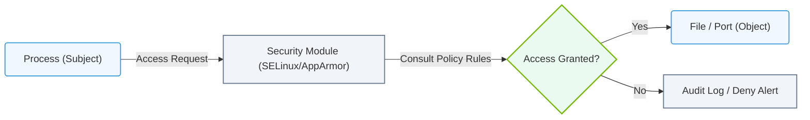

# 6.4d Security-Enhanced Linux (SELinux) and AppArmor: mandatory access control

#### 🏷️ The Operating System Layer — Linux for AI Infrastructure Operators > 6 Linux Networking & Security Hardening > 6.4 Firewall and Security Basics for AI Servers

## 🧭 Context Introduction

When you run AI workloads on Linux servers, you need more than just a firewall to keep things secure. Traditional Linux security uses **Discretionary Access Control (DAC)** — meaning each user or process controls who can access their files. But what if a compromised AI training script tries to read sensitive model data it shouldn't touch?

This is where **Mandatory Access Control (MAC)** comes in. Two major MAC systems on Linux are **SELinux** (common on Red Hat, CentOS, and Fedora) and **AppArmor** (common on Ubuntu, Debian, and SUSE). Both enforce system-wide policies that restrict what processes can do — even if the user running them has full permissions.

For engineers new to AI infrastructure, understanding MAC helps you prevent data leaks, stop malware, and keep your GPU-accelerated servers safe from misbehaving containers or scripts.

---

## ⚙️ What Is Mandatory Access Control (MAC)?

- MAC is a security model where a central policy (not the user) decides who can access what.
- Every process, file, socket, and device gets a security label or profile.
- The kernel enforces these rules automatically — no user can override them.
- MAC works **on top of** traditional Linux permissions (DAC), adding an extra layer.

**Simple analogy:** Think of DAC as a lock on your front door (you control the key). MAC is a security guard inside your house who checks every item you carry — even if you have the key.

---

## 🧩 SELinux vs. AppArmor — Core Differences

| Feature | SELinux | AppArmor |
|---------|---------|----------|
| **Origin** | Developed by NSA, integrated into Red Hat family | Developed by Novell, integrated into Ubuntu/Debian |
| **Policy model** | Label-based (every object gets a security context) | Path-based (profiles tied to file paths) |
| **Complexity** | Higher learning curve, very granular | Simpler to learn and configure |
| **Default mode** | Enforcing (blocks violations) | Complain (logs violations, doesn't block) |
| **Use case** | Enterprise, government, high-security environments | General-purpose servers, containers, ease of use |
| **Policy updates** | Requires relabeling or policy rebuilds | Can be updated by modifying text profiles |

---

## 🛠️ How SELinux Works

- Every file, process, port, and directory gets a **security context** (e.g., `system_u:object_r:httpd_sys_content_t:s0`).
- SELinux uses three modes:
  - **Enforcing** — blocks and logs violations
  - **Permissive** — logs violations but does not block
  - **Disabled** — SELinux is turned off entirely
- Common SELinux types for AI servers:
  - `container_t` — for containerized workloads
  - `nvidia_t` — for GPU-related processes
  - `httpd_t` — for web servers serving AI models

**Key concept:** If an AI training script tries to write to a file labeled `system_u:object_r:httpd_sys_content_t:s0`, SELinux will block it — even if the user has write permission — because the process label doesn't match.

---

### 📊 Visual Representation: SELinux and AppArmor MAC Policies
This diagram displays how Mandatory Access Control (MAC) frameworks intercept process system calls, checking policies before granting file system access.

## 🧰 How AppArmor Works

- AppArmor uses **profiles** that define what a specific program can do.
- Profiles are stored as text files in `/etc/apparmor.d/`.
- Each profile contains rules like:
  - Which files the program can read or write
  - Which network ports it can open
  - Which capabilities (e.g., `CAP_NET_ADMIN`) it can use
- AppArmor modes:
  - **Enforce** — blocks violations
  - **Complain** — logs violations without blocking (great for learning)

**Example for AI workloads:** You can create an AppArmor profile for your Python training script that only allows it to read `/data/datasets/` and write to `/data/models/` — blocking any attempt to access `/etc/shadow` or `/home/user/`.

---

## 🕵️ Why This Matters for AI Infrastructure

- AI workloads often run as root or with elevated privileges inside containers.
- A compromised model file or malicious training script could:
  - Steal sensitive training data
  - Modify model weights to introduce backdoors
  - Access GPU memory of other processes
- MAC prevents these attacks by enforcing strict boundaries — even if the process has root access.
- Many AI frameworks (TensorFlow, PyTorch) and container runtimes (Docker, Podman) integrate with SELinux or AppArmor.

---

## 📊 Quick Decision Guide for New Engineers

| If you are running... | Use... | Why |
|----------------------|--------|-----|
| Red Hat Enterprise Linux, CentOS, Fedora | SELinux | Native support, default enabled |
| Ubuntu, Debian, SUSE | AppArmor | Simpler to learn, default enabled |
| Kubernetes with containers | Both (via container runtime) | Most container runtimes support both |
| High-security AI model serving | SELinux | More granular control over GPU and memory |
| Rapid prototyping / learning | AppArmor | Easier to write and debug profiles |

---

## 🔍 Common Pitfalls for Beginners

- **Disabling MAC entirely** — This removes a critical security layer. Instead, set SELinux to permissive or AppArmor to complain mode first, then fix violations.
- **Ignoring audit logs** — Both systems log denials. Check `/var/log/audit/audit.log` (SELinux) or `/var/log/syslog` (AppArmor) to understand what's being blocked.
- **Running everything as root** — MAC can still block root, but it's better practice to run AI workloads with non-root users and let MAC enforce the rest.
- **Forgetting about containers** — Containers inherit MAC policies from the host. A misconfigured profile can break container networking or GPU access.

---

## ✅ Summary

- **SELinux** and **AppArmor** are mandatory access control systems that enforce security policies beyond traditional Linux permissions.
- SELinux uses labels and is more complex but very granular — ideal for high-security AI environments.
- AppArmor uses path-based profiles and is simpler — great for Ubuntu-based AI servers and rapid development.
- Both systems protect AI infrastructure from compromised processes, data leaks, and unauthorized GPU access.
- As a new engineer, start by checking which MAC system your Linux distribution uses, then learn to read audit logs and adjust policies gradually.

> **Remember:** MAC is your safety net. It doesn't replace good practices like least privilege and regular updates — it reinforces them.

