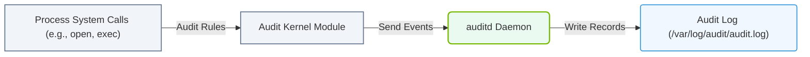

# 6.4e audit daemon (auditd): tracking system calls for security compliance

#### 🏷️ The Operating System Layer — Linux for AI Infrastructure Operators > 6 Linux Networking & Security Hardening > 6.4 Firewall and Security Basics for AI Servers

---

## 🧠 Context Introduction

When you manage AI servers, you need to know *who did what* and *when* — especially if something goes wrong. The **audit daemon (auditd)** is Linux's built-in security auditing tool. It tracks **system calls** (requests your programs make to the Linux kernel) and logs them for security compliance, incident investigation, and regulatory requirements (like SOC 2, HIPAA, or GDPR).

Think of auditd as a **security camera for your server's kernel** — it records every important action, from file access to user logins.

---

## ⚙️ What Does auditd Actually Do?

- **Monitors system calls** — every time a program asks the kernel to do something (open a file, create a network connection, change permissions), auditd can log it.
- **Tracks user activity** — who logged in, what commands they ran, and when they left.
- **Detects unauthorized changes** — if someone modifies critical system files (like `/etc/passwd` or AI model weights), auditd catches it.
- **Generates compliance reports** — provides logs that auditors can review to prove your system is secure.

---

## 🕵️ Key Components of auditd

| Component | Role |
|-----------|------|
| **auditd** | The daemon that runs in the background and writes logs |
| **auditctl** | The tool to configure rules (what to watch) |
| **aureport** | Generates summary reports from audit logs |
| **ausearch** | Searches through audit logs for specific events |
| **audit.log** | The main log file (usually at `/var/log/audit/audit.log`) |

---

## 🛠️ How auditd Works (Simple Flow)

1. **A system call happens** — for example, a user runs `rm important_file.txt`.
2. **auditd checks its rules** — if a rule says "watch file deletions," it captures the event.
3. **The event is logged** — written to `/var/log/audit/audit.log` with details like:
   - Timestamp
   - User ID
   - System call type (e.g., `unlink` for file deletion)
   - Success or failure status
4. **You review the logs** — using `ausearch` or `aureport` to find suspicious activity.

---

## 📊 Common Use Cases for AI Infrastructure

- **Monitor access to model files** — track who reads or modifies your trained AI models.
- **Watch configuration changes** — detect if someone alters network settings or firewall rules.
- **Track user logins** — especially for shared GPU servers with multiple engineers.
- **Detect privilege escalation** — catch attempts to become root or switch users.
- **Compliance auditing** — prove to auditors that your system meets security standards.

---

## 🔧 Setting Up auditd (Conceptual Overview)

To start using auditd, you would:

1. **Install the package** — on Ubuntu/Debian, it's typically pre-installed. On RHEL/CentOS, you install it via the package manager.
2. **Start the service** — enable it to run at boot.
3. **Define rules** — tell auditd what to watch. For example:
   - Watch the `/etc/shadow` file for any changes.
   - Watch the directory containing your AI models for access attempts.
   - Monitor all `execve` system calls (program execution).
4. **Verify rules are active** — check that your rules are loaded.
5. **Review logs regularly** — use reporting tools to spot anomalies.

---

### 📊 Visual Representation: auditd System Auditing Framework
This diagram shows how auditd intercepts system calls at the kernel level and records security-related events to audit logs.



## 📋 Example Audit Rules (For Reference)

```
-w /etc/passwd -p wa -k user-file-changes
-w /etc/shadow -p wa -k user-file-changes
-w /var/log/audit/ -p wa -k audit-log-changes
-w /data/models/ -p rwxa -k ai-model-access
-a exit,always -F arch=b64 -S execve -k program-execution
```

📤 **Output:** Each rule tells auditd to watch specific files or system calls. The `-k` flag adds a key (tag) for easier searching later.

---

## 📈 Reading Audit Logs (Simplified)

A typical audit log entry looks like this (conceptually):

- **type=SYSCALL** — indicates a system call event
- **msg=audit(1234567890.123:456)** — timestamp and event ID
- **arch=c000003e** — system architecture (x86_64)
- **syscall=2** — the system call number (2 = open)
- **success=yes** — whether the call succeeded
- **exe="/usr/bin/cat"** — the program that made the call
- **uid=1000** — user ID of the caller
- **key="ai-model-access"** — your custom tag for filtering

---

## ✅ Best Practices for New Engineers

- **Start small** — don't monitor everything at once. Begin with critical files and directories.
- **Use meaningful keys** — tags like `-k ai-model-access` make searching much easier.
- **Monitor log size** — audit logs can grow very fast. Set up log rotation.
- **Test your rules** — generate a test event and verify it appears in the logs.
- **Integrate with SIEM** — send audit logs to a central security tool (like Splunk or ELK) for long-term analysis.
- **Review regularly** — set a weekly reminder to check audit reports for anomalies.

---

## ⚠️ Common Pitfalls to Avoid

- **Monitoring too much** — can slow down your server and fill up disk space.
- **Forgetting to test** — a rule that doesn't work gives you false confidence.
- **Ignoring log rotation** — audit logs can fill a disk in hours if not managed.
- **Not tagging rules** — without keys, finding specific events is like searching for a needle in a haystack.

---

## 🧪 Quick Self-Check Questions

1. What is the main log file for auditd?
2. Which tool would you use to search for a specific event in audit logs?
3. Why would you use the `-k` flag when creating audit rules?
4. What happens if you monitor every single system call on a busy AI server?

---

## 📚 Summary

auditd is your **security watchdog** for AI infrastructure. It records system calls and file access, helping you:
- Meet compliance requirements
- Investigate security incidents
- Track who accessed sensitive AI models
- Detect unauthorized changes

Start with a few focused rules, review your logs regularly, and you'll have a solid foundation for security auditing in your AI operations.