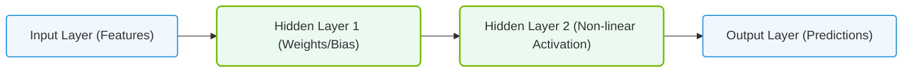

# 7.1c Deep Learning (DL): ML using multi-layer artificial neural networks

#### 🏷️ The Mathematical Imperative — Why AI Demands Specialized Hardware > 7 Deconstructing Artificial Intelligence Workloads > 7.1 The AI Umbrella — Defining the Terms Precisely

---

## 📘 Context Introduction

Deep Learning (DL) is a specialized subset of Machine Learning (ML) that uses **multi-layer artificial neural networks** to learn from data. Think of it as a stack of mathematical layers — each layer extracts increasingly complex patterns from raw input. For example, in image recognition, the first layer might detect edges, the next layer detects shapes, and deeper layers recognize objects like faces or cars.

For new engineers, understanding DL is critical because it drives modern AI workloads — from natural language processing (like ChatGPT) to autonomous driving. DL requires significant computational power, which is why specialized hardware (GPUs, TPUs) and optimized infrastructure are essential.

---

## ⚙️ What Makes Deep Learning "Deep"?

- **Traditional ML** uses algorithms like decision trees or linear regression with limited layers of computation.
- **Deep Learning** uses **neural networks with many hidden layers** (typically 3 to hundreds).
- Each layer applies a mathematical transformation (weights + activation functions) to the data.
- The "depth" refers to the number of layers — more layers allow the network to learn more abstract and complex features.

---

## 🧠 Core Components of a Deep Neural Network

| Component | Description | Analogy |
|-----------|-------------|---------|
| **Input Layer** | Receives raw data (e.g., pixels, text tokens) | Like the eyes receiving light |
| **Hidden Layers** | Perform computations using weights and biases | Like the brain processing information |
| **Output Layer** | Produces the final prediction (e.g., cat vs. dog) | Like the mouth speaking the answer |
| **Weights & Biases** | Learnable parameters adjusted during training | Like volume knobs on a stereo |
| **Activation Function** | Introduces non-linearity (e.g., ReLU, Sigmoid) | Like a switch that turns on/off signals |
| **Loss Function** | Measures prediction error | Like a scorecard for mistakes |

---

## 🛠️ How Training Works (Simplified)

1. **Forward Pass** — Data flows from input to output through all layers.
2. **Loss Calculation** — Compare prediction to actual label using a loss function.
3. **Backpropagation** — Calculate how much each weight contributed to the error.
4. **Weight Update** — Adjust weights using an optimizer (e.g., SGD, Adam) to reduce error.
5. **Repeat** — Iterate over the dataset many times (epochs) until the model converges.

---

## 📊 Key Differences: Traditional ML vs. Deep Learning

| Aspect | Traditional ML | Deep Learning |
|--------|---------------|---------------|
| **Feature Engineering** | Manual — engineers must select features | Automatic — network learns features from raw data |
| **Data Requirements** | Works with smaller datasets | Requires large datasets (thousands to millions of samples) |
| **Hardware Needs** | Runs on CPUs | Requires GPUs or TPUs for practical training |
| **Training Time** | Minutes to hours | Hours to weeks |
| **Interpretability** | Easier to understand | Often a "black box" |
| **Performance on Complex Tasks** | Plateaus quickly | Continues improving with more data and layers |

---

### 📊 Visual Representation: Multi-Layer Neural Network Architecture
This diagram displays the forward signal flow through input, hidden, and output layers in a deep neural network.

## 🕵️ Common Deep Learning Architectures

- **Convolutional Neural Networks (CNNs)** — Best for images, video, and spatial data. Uses filters to detect patterns like edges and textures.
- **Recurrent Neural Networks (RNNs)** — Designed for sequential data like time series, text, or speech. Remembers previous inputs via hidden states.
- **Transformers** — Modern architecture for NLP (e.g., BERT, GPT). Uses attention mechanisms to process entire sequences simultaneously.
- **Generative Adversarial Networks (GANs)** — Two networks (generator + discriminator) compete to create realistic synthetic data (e.g., deepfakes).
- **Autoencoders** — Used for dimensionality reduction, anomaly detection, and denoising.

---

## 🔧 Practical Considerations for Engineers

- **Data Preparation** — DL models require clean, normalized, and often augmented data. Expect to spend 60-80% of time on data pipelines.
- **Hardware Selection** — Training deep networks demands high memory bandwidth and parallel compute. GPUs with large VRAM (16GB+) are standard.
- **Frameworks** — Common tools include **TensorFlow**, **PyTorch**, and **Keras**. These handle automatic differentiation and GPU acceleration.
- **Hyperparameter Tuning** — Learning rate, batch size, number of layers, and neurons per layer significantly impact performance. Use tools like **Optuna** or **Ray Tune**.
- **Monitoring** — Track loss curves, accuracy, and resource utilization (GPU memory, temperature) during training.

---

## 🚀 Real-World Example: Image Classification

**Input**: 224x224 pixel image (RGB — 3 color channels)  
**Network**: ResNet-50 (50 layers deep)  
**Training Data**: 1.2 million labeled images from ImageNet  
**Hardware**: 8x NVIDIA V100 GPUs  
**Training Time**: ~29 hours  
**Output**: Probability distribution over 1000 classes (e.g., "golden retriever": 0.95, "Labrador": 0.03)

---

## ✅ Key Takeaways for New Engineers

- Deep Learning is **ML with many layers** — each layer learns increasingly abstract features.
- It requires **large datasets** and **specialized hardware** (GPUs) to be practical.
- Training involves **forward pass, loss calculation, backpropagation, and weight updates**.
- Common architectures include **CNNs, RNNs, Transformers, GANs, and Autoencoders**.
- As an engineer, focus on **data pipelines, hardware selection, framework proficiency, and monitoring** to succeed in DL operations.

---

## 📚 Further Learning Path

1. Understand basic neural networks (single layer perceptron)
2. Build a simple CNN using PyTorch or TensorFlow
3. Experiment with pre-trained models (transfer learning)
4. Learn about distributed training across multiple GPUs
5. Explore model optimization techniques (quantization, pruning)

---

*Deep Learning is the engine behind modern AI — mastering its fundamentals will empower you to build, deploy, and scale intelligent systems effectively.*