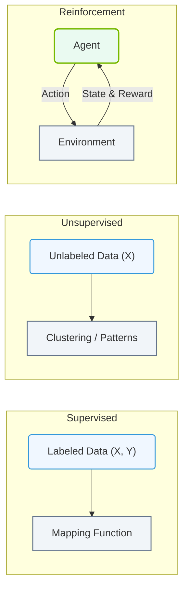

# 7.1e Supervised, Unsupervised, and Reinforcement Learning — the three paradigms

#### 🏷️ The Mathematical Imperative — Why AI Demands Specialized Hardware > 7 Deconstructing Artificial Intelligence Workloads > 7.1 The AI Umbrella — Defining the Terms Precisely

## 📘 Context Introduction

When you start working with AI infrastructure, you'll quickly hear about three main ways machines learn from data. Think of these as different "training styles" — each one requires different data, different compute resources, and different operational considerations. Understanding these three paradigms helps you plan storage, GPU allocation, and data pipelines more effectively.

---

## ⚙️ Supervised Learning — Learning with Labels

Supervised learning is like teaching someone with a **flashcard answer key**. The model is given input data *and* the correct output (label), then learns to map inputs to outputs.

**Key characteristics:**
- Requires **labeled datasets** (e.g., images tagged "cat" or "dog")
- Most common for **classification** (spam/not spam) and **regression** (predicting house prices)
- Training is **compute-intensive** — often uses GPUs for matrix operations
- Data pipelines must ensure **label accuracy** and **balanced classes**

**Infrastructure considerations:**
- Storage needs: large labeled datasets (often terabytes)
- GPU memory: larger batch sizes require more VRAM
- Validation: requires holdout datasets for testing accuracy

**Real-world example:** A model trained on thousands of X-ray images labeled "healthy" or "pneumonia" to diagnose new scans.

---

## 🕵️ Unsupervised Learning — Finding Patterns Without Labels

Unsupervised learning is like giving someone a pile of puzzle pieces with **no picture on the box**. The model discovers hidden structures or groupings in data on its own.

**Key characteristics:**
- Uses **unlabeled data** — no correct answers provided
- Common for **clustering** (customer segments), **anomaly detection** (fraud), and **dimensionality reduction**
- Training can be **less compute-heavy** per sample, but often runs on **larger datasets**
- Results require **human interpretation** to validate

**Infrastructure considerations:**
- Storage: can ingest massive raw datasets (logs, sensor data, images)
- Compute: often benefits from **distributed processing** (multiple nodes)
- Monitoring: output quality is harder to measure — requires custom metrics

**Real-world example:** A recommendation engine grouping users by browsing behavior without knowing their preferences upfront.

---

### 📊 Visual Representation: Supervised, Unsupervised, and Reinforcement Learning
This diagram contrasts the three primary learning paradigms based on data supervision type and feedback loops.

## 🎮 Reinforcement Learning — Learning Through Trial and Error

Reinforcement learning is like **training a dog with treats**. An agent learns by taking actions in an environment, receiving rewards or penalties, and optimizing its behavior over time.

**Key characteristics:**
- No fixed dataset — the model **generates its own experience** through interaction
- Used for **game playing** (AlphaGo), **robotics**, and **autonomous driving**
- Training is **extremely compute-intensive** — requires millions of simulated episodes
- Often needs **specialized simulation environments** (e.g., NVIDIA Isaac Sim)

**Infrastructure considerations:**
- Compute: requires **massive parallel simulation** — often hundreds of GPUs
- Storage: stores **experience replay buffers** (large memory, fast I/O)
- Networking: low-latency communication between simulation and training nodes

**Real-world example:** A robot arm learning to pick up objects by trying thousands of grasps in a virtual environment.

---

## 📊 Comparison Table — At a Glance

| Feature | Supervised | Unsupervised | Reinforcement |
|---------|-----------|-------------|---------------|
| **Data type** | Labeled (input + output) | Unlabeled (input only) | No fixed dataset (agent + environment) |
| **Goal** | Predict correct output | Discover hidden patterns | Maximize cumulative reward |
| **Compute intensity** | High (GPU-heavy) | Medium to high | Very high (simulation + training) |
| **Storage pattern** | Large labeled datasets | Massive raw datasets | Experience replay buffers |
| **Validation method** | Holdout test set | Human inspection / metrics | Reward score over time |
| **Common use case** | Image classification | Customer segmentation | Game AI / robotics |

---

## 🛠️ Practical Tips for Engineers

**When planning infrastructure for each paradigm:**

- **Supervised:** Prioritize **GPU memory** and **fast storage** for labeled datasets. Use data loaders that shuffle and batch efficiently.

- **Unsupervised:** Focus on **scalable storage** (object storage like S3) and **distributed compute** frameworks (Spark, Dask). Monitor for **concept drift** in production.

- **Reinforcement:** Invest in **high-throughput networking** (InfiniBand or NVLink) between simulation and training nodes. Plan for **long training runs** (days to weeks).

**Common mistake to avoid:** Don't assume one paradigm fits all workloads. A single AI pipeline may combine all three — for example, using unsupervised learning to preprocess data, supervised learning for initial predictions, and reinforcement learning to fine-tune decisions in real time.

---

## ✅ Summary

- **Supervised learning** = learning from labeled examples (most common in enterprise)
- **Unsupervised learning** = finding patterns in unlabeled data (great for exploration)
- **Reinforcement learning** = learning through interaction and rewards (most complex infrastructure)

Each paradigm places different demands on your AI infrastructure. Understanding these differences helps you choose the right hardware, storage, and networking for your specific workload.