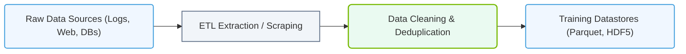

# 7.2a Data Ingestion: collecting, labeling, and versioning training datasets

#### 🏷️ The Mathematical Imperative — Why AI Demands Specialized Hardware > 7 Deconstructing Artificial Intelligence Workloads > 7.2 The AI Model Lifecycle — From Raw Data to Production Deployment

Before an AI model can learn anything, it needs data — and lots of it. Data ingestion is the first critical step in the AI model lifecycle. It involves three core activities: **collecting** raw data from various sources, **labeling** that data so the model knows what to learn, and **versioning** the dataset so you can track changes over time. Think of it as preparing ingredients before cooking a meal — the quality of your input directly determines the quality of your output.

---

## 📥 What Is Data Ingestion?

Data ingestion is the process of moving data from its source (databases, sensors, files, APIs) into a storage system where it can be processed and used for training AI models. For new engineers, imagine it as a pipeline: raw data flows in, gets cleaned and organized, and then becomes ready for model training.

**Key characteristics of data ingestion:**
- **Batch ingestion** — data is collected and processed in large chunks at scheduled intervals (e.g., nightly uploads)
- **Streaming ingestion** — data flows continuously in real-time (e.g., live sensor readings or social media feeds)
- **Hybrid ingestion** — a combination of both batch and streaming approaches

---

## 🗂️ Collecting Training Datasets

Collecting data is the first hands-on task. You need to gather information that represents the real-world problem your AI model will solve.

**Common data sources:**
- **Databases** — SQL or NoSQL systems storing structured records
- **APIs** — web services that provide data (e.g., weather data, stock prices)
- **Files** — CSV, JSON, images, audio, or video files on local storage or cloud buckets
- **Sensors/IoT devices** — real-time measurements from hardware
- **Web scraping** — extracting data from websites (use with caution and respect terms of service)

**Best practices for collecting data:**
- Ensure data is **representative** of the real-world scenarios the model will encounter
- Collect **enough** data — more data usually leads to better model performance, but quality matters more than quantity
- Check for **bias** — if your data only represents one group or condition, the model will fail on others
- Store raw data **immutably** — never modify the original; always create copies for processing

---

## 🏷️ Labeling Training Datasets

Labeling is the process of adding meaningful tags or annotations to your raw data so the model can learn patterns. For supervised learning (the most common type), labels are the "correct answers" the model tries to predict.

**Types of labeling:**
- **Classification labels** — assigning a category (e.g., "cat" vs "dog" for images)
- **Regression labels** — assigning a continuous value (e.g., house price in dollars)
- **Bounding boxes** — drawing rectangles around objects in images (common in computer vision)
- **Semantic segmentation** — labeling every pixel in an image (e.g., road, car, pedestrian)
- **Text annotations** — named entity recognition, sentiment labels, or translation pairs

**Labeling approaches:**

| Approach | Description | When to Use |
|----------|-------------|-------------|
| Manual labeling | Humans annotate data by hand | Small datasets, high accuracy needed |
| Automated labeling | Software or rules generate labels | Large datasets, simple patterns |
| Semi-automated | Humans review and correct automated labels | Balance of speed and quality |
| Crowdsourcing | Many people label via platforms (e.g., Amazon Mechanical Turk) | Large scale, lower budget |

**Common pitfalls:**
- **Label inconsistency** — different labelers interpret the same data differently
- **Label noise** — incorrect labels that confuse the model
- **Class imbalance** — some categories have far fewer examples than others

---

### 📊 Visual Representation: Data Ingestion and Pipeline Staging
This flowchart maps out how raw source data is collected, cleaned, structured, and staged for model training workloads.

## 🔖 Versioning Training Datasets

Dataset versioning is like using Git for code, but for data. It tracks changes to your dataset over time, allowing you to reproduce experiments, roll back to previous versions, and collaborate with team members.

**Why versioning matters:**
- **Reproducibility** — you can exactly recreate a model's training data months later
- **Collaboration** — multiple engineers can work on the same dataset without conflicts
- **Experimentation** — you can compare model performance across different data versions
- **Auditing** — track who changed what and when

**Common versioning tools and concepts:**
- **DVC (Data Version Control)** — works like Git but for large data files
- **Dolt** — a SQL database with version control built in
- **Hugging Face Datasets** — versioned dataset hosting for NLP and vision
- **Simple file naming conventions** — e.g., dataset_v1.0, dataset_v2.1

**Versioning workflow example:**
1. Start with raw data in a folder called raw_data_v1
2. After cleaning and labeling, create a new folder called processed_data_v1
3. Use a manifest file (e.g., CSV or JSON) that lists all files and their metadata
4. When you add more data or fix labels, create processed_data_v2
5. Always document what changed between versions (e.g., "Added 500 new images, fixed 20 mislabeled cats")

---

## 🛠️ Practical Workflow for New Engineers

Here is a simple step-by-step workflow you can follow for your first data ingestion task:

**Step 1: Define your data requirements**
- What problem is the model solving?
- What data do you need (type, format, quantity)?
- Where will the data come from?

**Step 2: Set up storage**
- Create a folder structure: raw_data/, labeled_data/, versioned_data/
- Use cloud storage (AWS S3, Google Cloud Storage, Azure Blob) for large datasets
- Ensure you have permissions to read and write

**Step 3: Collect data**
- Write a script to pull data from your source (API call, database query, file copy)
- Save the raw data in the raw_data/ folder with a timestamp

**Step 4: Label data**
- Choose a labeling tool (e.g., Label Studio, CVAT, or a simple spreadsheet)
- Define clear labeling guidelines for consistency
- Have at least two people label a sample to check agreement

**Step 5: Version the dataset**
- Use a tool like DVC or a simple naming convention
- Create a README file describing the dataset version, date, and changes
- Store the versioned dataset in a shared location accessible to your team

**Step 6: Validate the dataset**
- Check for missing values, duplicates, and label errors
- Visualize a sample of the data to ensure it looks correct
- Run a quick statistical summary (mean, min, max, class distribution)

---

## 🕵️ Common Challenges and How to Avoid Them

| Challenge | Solution |
|-----------|----------|
| Data is too large to move | Use streaming ingestion or incremental loading |
| Labels are inconsistent | Create a labeling guide and run inter-annotator agreement checks |
| Dataset keeps changing | Use versioning and freeze a specific version for each experiment |
| Data is biased | Analyze demographic or condition distributions; collect more diverse data |
| Storage costs are high | Compress data, use tiered storage, or delete unused versions |

---

## ✅ Key Takeaways for New Engineers

- **Data ingestion is the foundation** — garbage in, garbage out. Spend time getting this right.
- **Labeling is expensive** — plan for it in your timeline and budget. Automated tools can help but need human oversight.
- **Version everything** — you will thank yourself later when you need to debug a model or reproduce results.
- **Start small** — collect a tiny dataset first, label it, version it, and test your pipeline before scaling up.
- **Document everything** — write down your data sources, labeling rules, and version history. Your future self (and your teammates) will appreciate it.

Remember: a well-prepared dataset is worth more than a clever model. Master data ingestion, and you will build better AI systems with less frustration.